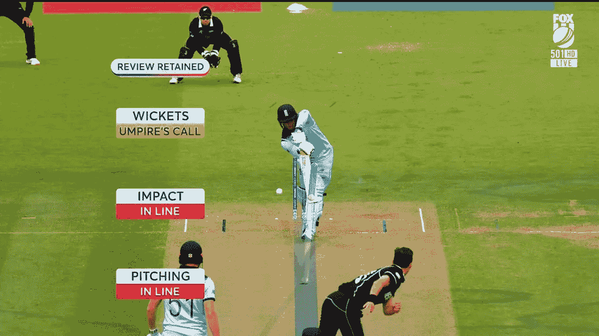
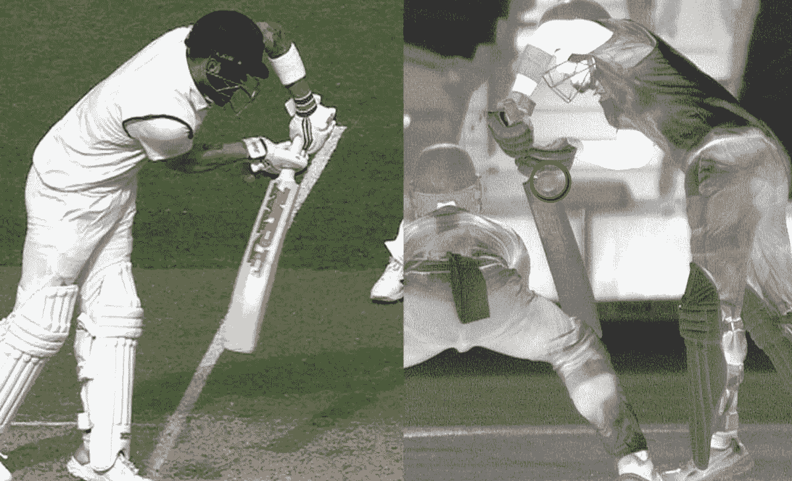
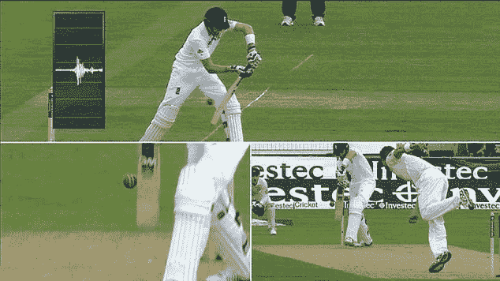
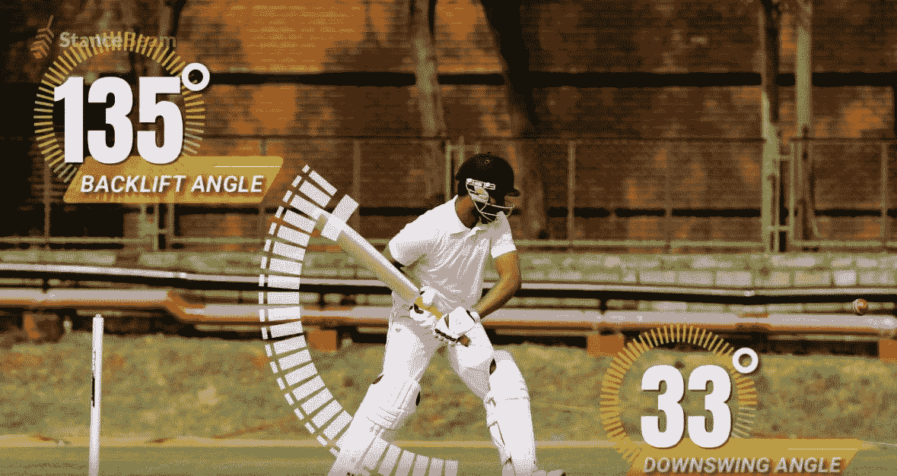

# 板球中迷人的技术——我们最喜爱的运动🏏🤩

> 原文：<https://medium.com/nerd-for-tech/fascinating-technology-in-cricket-sport-we-loved-the-most-cc4c52a0f680?source=collection_archive---------11----------------------->

> “很明显，我们的技术超越了我们的人性”——阿尔伯特·爱因斯坦

[阿克什·亚达夫](https://unsplash.com/@aksh1802?utm_source=medium&utm_medium=referral)在 [Unsplash](https://unsplash.com?utm_source=medium&utm_medium=referral) 上的照片

与其他运动相比，板球在我国有一种独特的兴奋感。不管人们是在玩还是在讨论，他们都完全被板球迷住了。我们崇敬我们敬爱的板球运动员，视他们为巴关的英雄。让我们凝视板球技术的世界，以便更好地理解这项运动。

世界已经从听收音机里的板球解说或在老式黑白电视机上观看变成了使用手机。今天，我们大多数人通过智能电视、个人电脑、手机等观看板球直播。但是你知道整个体育场将会有多少台摄像机用于现场直播吗？每当直播一场比赛时，根据比赛或事件的重要性，会使用 30 到 40 台摄像机。因此，让我们来看看这些相机以及其他设备是如何提供帮助的。

## 1.击球手和裁判摄像机

HelmetCam — [Sportskeeda](https://www.google.com/url?sa=i&url=https%3A%2F%2Fwww.sportskeeda.com%2Fcricket%2Fipl-2017-reports-helmet-cam-to-be-introduced-for-cricketers&psig=AOvVaw1LTiHU9cwXz6jCmUzY12oz&ust=1631425810646000&source=images&cd=vfe&ved=0CAkQjRxqFwoTCIiEvaed9vICFQAAAAAdAAAAABAD)

在蝙蝠侠头盔上安装摄像头的想法是在 2012 年的大型派对上提出的:谢恩·沃森使用了它。这个视频对球迷来说非常令人兴奋，因为他们可以看到投球手在击球手后面。此外，视频摄影有助于击球手看到投球时的即时反应。看直拍视频，要注意不是慢动作。保镖可能会攻击你，所以要做好准备。事实上，击球手也会喜欢看他们的录像，这也有助于他们提高分析能力。摄像头重量不到 100g，均匀分布在头盔上，击球手不用担心负重问题。同样，裁判摄像头也给了我们另一个维度。我们可以看到他们在击球手击球时的反应，当球向他们飞来时的反应，以及在出局时的反应。

## 2.鹰眼/球跟踪

鹰眼— [狐狸蟋蟀](https://www.google.com/url?sa=i&url=https%3A%2F%2Ftwitter.com%2Ffoxcricket%2Fstatus%2F1150408463069011968&psig=AOvVaw0eLYQfrT3feJGC8pWwWRJC&ust=1631430300878000&source=images&cd=vfe&ved=0CAkQjRxqFwoTCNDUqtOt9vICFQAAAAAdAAAAABAo)

鹰眼是板球运动中最突出的发明之一。如果你想验证蝙蝠侠给出的 LBW 是否正确，那么它就进场了。最近，每当击球手或守备队长对裁判的决定不满意时，利用 DRS[决定审查系统]时，球跟踪就派上了用场。鹰眼技术使用遍布体育场的六个摄像头来预测球的轨迹。这项技术基于 3D 建模、物理规则、图像处理和不同的可视化方法，定期预测球的位置。使用所有这些技术，球的音高地图和在地面上的冲击点被分析。物理定律允许我们想象球的下一步动作。此外，它也有助于展示击球手的马车轮子。

## 3.热点

热点— [纳夫巴拉特时报](https://www.google.com/url?sa=i&url=https%3A%2F%2Fnavbharattimes.indiatimes.com%2Fsports%2Fcricket%2Findia-tour-of-australia%2Faustralia-vs-india-did-tim-paine-miss-a-trick-by-not-taking-drs-as-hot-spot-shows-mark-on-virat-kohli-glove%2Farticleshow%2F79778437.cms&psig=AOvVaw0QwCaJXo9FxJDbmFCFwRXm&ust=1631440753746000&source=images&cd=vfe&ved=0CAkQjRxqFwoTCPjY0tXU9vICFQAAAAAdAAAAABAL)

热点是板球中使用的最昂贵的技术之一，并不是在每场比赛中都可以看到。它于 2016 年在骨灰系列中首次推出。它测量球的冲击力，确定球是否被击球手的球棒、垫子、手套、身体或头盔击中，或者是否根本没有击中。这里他们使用红外摄像机。因此，当球撞击上述位置时，会产生摩擦和热量。随后，这些信息通过计算机发送，并显示为白点。如果无论何时使用 DRS，热点都是可用的，那么这绝对是一个优势。对体育迷来说，重要的是真相胜于雄辩。

## 4.SnickoMeter 或边缘检测

斯尼克— [体育新闻](https://www.google.com/url?sa=i&url=https%3A%2F%2Fwww.sportskeeda.com%2Fcricket%2Ftechnologies-that-changed-cricket-over-the-years%2F5&psig=AOvVaw38VGrFklffYAUs4_VHl2IM&ust=1631441468483000&source=images&cd=vfe&ved=0CAkQjRxqFwoTCIjkn5_X9vICFQAAAAAdAAAAABAK)

Snicko 是用来抓老鼠的，也是用来检查在 LBW 期间是否有蝙蝠接触。使用 Snicko 测量仪，我们可以通过图形波形看到击球手是否用球棒触球。这项技术背后的原理是利用声波。其中一个树桩将嵌入一个敏感的麦克风，它将连接到一个示波器。当球碰到球棒时，示波器从麦克风接收信号。此外，将使用高速摄像机以慢动作捕捉这些时刻，以供回放和回顾。裁判使用这项技术使被抓的裁判更加准确。

## 5.柱

英国广播公司

随着人群的情绪和声音高涨，任何人都很难始终保持完全集中，即使是裁判员也可能会分心。树桩和球可以完全扭转比赛，自从 2013 年 led 球出现以来，在出局期间做出裁判的决定非常简单。LED bails 是电气工程的杰作；由微处理器组成的提环在与树桩失去接触时会发光。一些麦克风也被放置在门柱上，用于守门员、球队的策略以及球员之间有时愚蠢的玩笑。拥有这些让我们更加紧张和投入，这是我们作为粉丝所需要的。

## 6.球棒和球

SmartbeamStriker — [物联网中心](https://www.google.com/url?sa=i&url=https%3A%2F%2Fwww.iothub.com.au%2Fnews%2Fkookaburra-claims-world-first-with-cricket-bat-sensor-517151&psig=AOvVaw2Qy7M-iAR5gG_2dXjH5L90&ust=1631441576637000&source=images&cd=vfe&ved=0CAkQjRxqFwoTCMiwr9DX9vICFQAAAAAdAAAAABAD)

由于物联网的兴起，我们可能有一天会在国际板球比赛中看到智能蝙蝠。虽然目前他们只能进入少数地区，但在某些时候这也是一种选择。然而，一家名为 StanceBeam 的公司设计了一种适合蝙蝠的前锋。使用该设备，您可以计算 3D 蝙蝠挥杆、蝙蝠速度、发电角度和方向，并直接在移动设备上查看分析报告。根据一些传言，智能球将配备芯片。一个特殊的应用程序使用户能够在手表、平板电脑或电脑上实时查看速度、旋转和功率等信息。

> 感谢我所有亲爱的读者，请随时留下反馈或建议&虚拟鼓掌不会让你筋疲力尽😇— [纳伦德拉·贾纳帕提](https://linkedin.com/in/narendraj3)