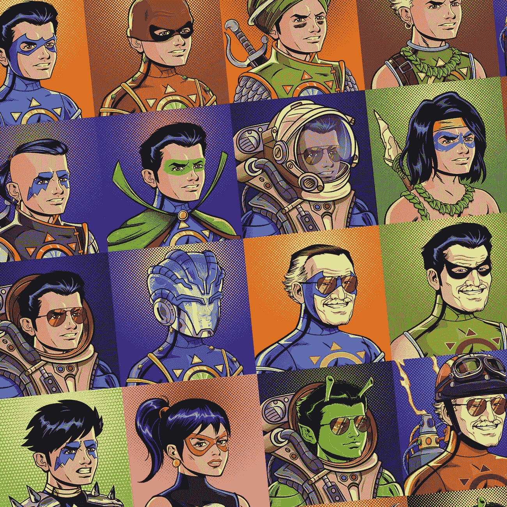

# 2021 年销量最快的非功能性测试|斯坦·李的查克拉 NFT

> 原文：<https://medium.com/nerd-for-tech/fastest-selling-nfts-in-2021-stan-lees-chakra-nft-a3684a2fa084?source=collection_archive---------8----------------------->

查克拉 NFT 战利品盒

NFT 在 2021 年表现出色。它们从一个小众话题变成了每个人都可以谈论的唯一话题。对 NFTs 的大肆宣传在 2021 年中期达到了高潮，此后一直没有下降。几乎每个人都想购买和拥有 NFT，每天我们都看到新的 NFT 进入数字领域。

公司理解这种收集 NFT 的需要，并创造了几个 NFT 事件来满足这种需要。每个月都有 NFT 滴产生炒作，让人们兴奋。今年 12 月也不例外，NFT 最热门的**之一将在这里举行。那个事件就是脉轮宇宙。**

****什么是查克拉维事件？****

**这项活动是为了庆祝令人惊讶的漫画人物查克拉。无敌查克拉是一个超级英雄，由传奇的漫威漫画创作者斯坦·李共同创作。超级英雄是一个受欢迎的角色，在独立系列中首次亮相。查克拉立即成为漫画迷和普通观众的热门话题。许多人称赞了角色的创新能力，并喜欢这个新概念。**

**查克拉的知名度使他出现在几部动画视频和一部电视剧中。现在，这个角色从漫画行业过渡到了数字世界。**

**脉轮宇宙事件由几个 NFT 滴组成。每一滴都为用户提供了一个购买和拥有这位著名漫画人物的稀有 NFT 的独特机会。**

****查克拉维成功****

**该活动于 12 月 27 日开始，面向热切期待的人群。对这一事件的大肆宣传足以使一瓶 NFT 滴剂在不到一分钟内销售一空。Chakra Artpunks Loot Box 活动包括 6000 多个独特的数字代币，在不到 60 秒的时间内销售一空。对于任何一次 NFT 降落来说，这都是一个不可思议的里程碑，凸显了观众对这一事件的兴趣。**

**这一活动的成功和快速销售背后有几个原因。第一个也是最明显的原因是它有漫威斯坦·李的支持。李安在让几个漫画人物栩栩如生方面发挥了重要作用，而漫威电影也让他成为了主流话题。人们喜欢在屏幕上看到他，并乐意以任何形式或方式支持他的工作。**

**成功背后的另一个原因是营销。BeyondLife 是这个项目背后的公司，他们从第一天开始就不断地推广它。持续的营销确保了每个人都知道这件事。这一点和斯坦·李的支持产生了足够的观众兴趣和善意。因此，当发布会开始时，两种最大的 NFT 滴剂在创纪录的时间内销售一空。**

****接下来是什么？****

**这一事件并没有结束，现在转移到下一个最大的发布。查克拉 [**巨型点唱机活动**](https://accounts.beyondlife.club/signup?fsz=home) 将于 12 月 28 日举行，并承诺为买家提供难以置信的奖励。在这里，用户可以获得限量版的漫画人物封面或 NFT 动画视频。这些视频直接来自漫画，给角色注入了新的生命。**

**而且，我们不要忘记迷人的宝箱事件。参与这项活动的唯一方法是购买五个或更多的查克拉 NFT。这项活动承诺给参与者难以置信的丰厚回报。该活动在 Chakraverse 活动结束后举行，旨在利用该项目产生的善意。**

****结论****

**Chakraverse NFT 活动为 NFT 爱好者、数字收藏家和漫画迷提供了几个有益的机会。如前所述，一个 NFT 滴在几秒钟内销售一空，这表明了该项目产生了多大的兴趣。现在，每个人都在关注点唱机事件，想知道这是否会延续这一趋势。唯一确定的方法是今天注册您的个人资料并保持更新。**