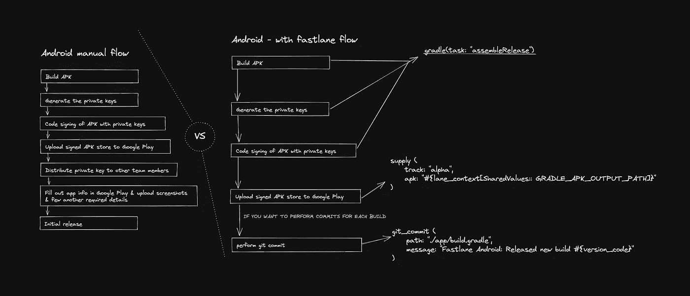

# 浪子与 React Native —第 2 部分

> 原文：<https://medium.com/nerd-for-tech/fastlane-with-react-native-part-2-a1adea3321aa?source=collection_archive---------0----------------------->

S o，在第一部分中，我们确实谈到了 fastlane 如何与 iOS 协同工作，以及它如何帮助自动化构建过程。

在第二部分中，我们将看到如何手动构建 android，以及 fastlane 如何帮助实现 android 构建过程的自动化。

## 在初始设置中，

我们通常建造 APK，即:我们的应用程序(就像我们上传到 Google play 控制台的可执行文件)。这和我们为 iOS 打造的 IPA 是一样的。
我们接下来要做的是在本地机器上生成一个私钥，稍后在初始上传和持续部署时会用到它。
完成上述工作后，我们在代码签名过程中使用 APK 和私钥。我们可以把它看作是用私钥加密某种代码。
代码签名流程主要是为了让谷歌知道，我是上传初始 APK 的人，也是通过持续部署策略推动后续更新的人。

**重要:** *不要丢失私钥，否则我们将无法进行连续部署。*

# **如果我们丢失或泄露了私钥，该怎么办？**

如果您丢失了您的私钥，或者它已经被破坏，您可以 [*创建一个新的*](https://support.google.com/googleplay/android-developer/answer/9842756#create) ，然后要求您的帐户所有者 [*联系支持人员以重置密钥*](https://support.google.com/googleplay/android-developer/contact/key) *。*联系支持人员时，请确保您的帐户所有者附上了`upload_certificate.pem`文件。在我们的支持团队注册新的上传密钥后，您会收到一封电子邮件，然后您可以更新您的密钥库并向 API 提供商注册您的密钥。

**重要提示:** *重置您的上传密钥不会影响 Google Play 在将 apk 交付给用户之前用于重新签名 apk 的应用签名密钥。*

## 在下一步中，

我们需要通过 Google 开发者控制台将签名的 APK 上传到谷歌 Play 商店，这是一个极其简单的过程。

完成所有这些过程后，我们将私钥分发给所有不同的成员，并在一些安全的地方保存备份，如 Google Drive、Dropbox 或任何存储备份文件的地方。

现在，这一步只针对初始部署，我们需要在 Google Play 中填写所有的应用程序信息(包括内容、评级、定价信息-只有在应用程序付费的情况下，应用程序的描述和一些预览截图)。

完成上述所有设置后，我们就可以发布初始版本了。现在就看你是想直接进入 ***量产*** 还是 ***beta 发布*** 还是 ***内测发布*** 还是 ***alpha 发布。***

## **现在让我们看看 fastlane 是如何简化上述流程的！**

在完成初始阶段后，我们现在准备使用 fastlane 进行持续部署。

浪子有一个叫做 lane 的组件，它是一个 ruby 脚本。Lane 包含一系列执行所需任务的命令。为此，我们有一个命令**Gradle**(参考下图)。

使用 fastlane 的手动与自动流程

当我们运行它时，它从 Android 的角度自动设置。它会创建一个 APK 文件，自动获取我们的私钥，并为我们的应用程序进行代码签名。

还有一个名为 **supply、**的命令，它主要是获取 gradle 生成的 APK，并将它上传到 ***谷歌 Play 商店。***

它包含两个参数— track: alpha，beta，production— apk:目录中我们的 apk 文件的位置。

如果我们想在浪子为每个构建添加 git commit，这也是可选的。

现在，我们不需要做所有的左侧操作*(参考上图)*每次我们必须将更新推送到商店，我们只需要运行一个命令，它就会为我们完成所有的*(构建、签名和上传)*过程，这对于基于生产的应用程序来说非常重要。

因此，这就是如何优化可以做的 android 构建过程与浪子。现在进行设置，只需一个命令。:)