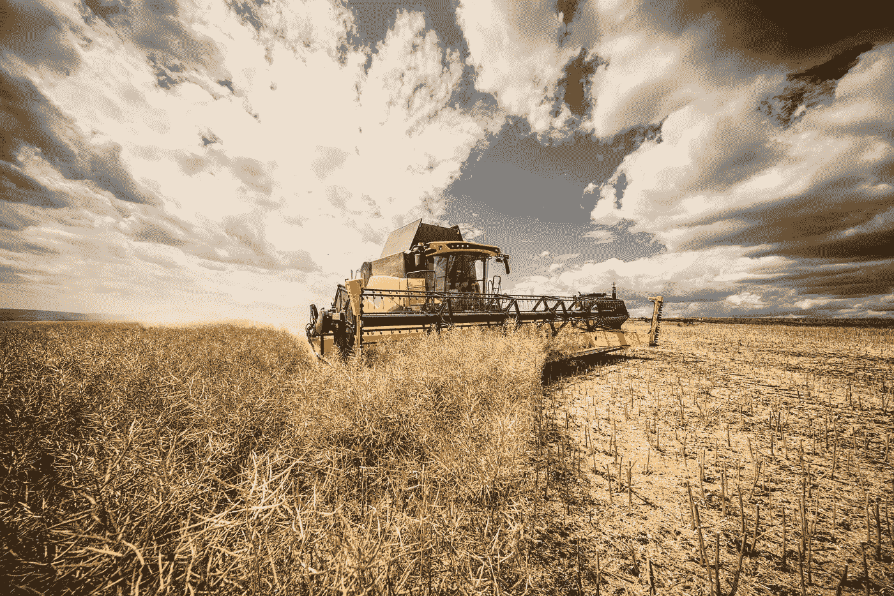

# 联邦调查局提醒农场:网络风险不仅仅是理论上的

> 原文：<https://medium.com/nerd-for-tech/fbi-puts-farms-on-notice-cyber-attack-risks-are-more-than-theoretical-9ba922ead716?source=collection_archive---------8----------------------->

没有比食物更基本的东西了。没有它，其他一切——现代生活的小玩意、玩具、安全和便利——都变得无关紧要。粮食不安全就是健康和生活不安全。

这就是为什么美国的农业被认为是至关重要的基础设施。这也是为什么该行业越来越依赖软件和互联网连接，它越来越成为网络罪犯的目标。

犯罪分子需要杠杆来让他们的“生意”成功，因此有一句刻薄的谚语是正确的，“一句好话和一把枪比一句好话能让你得到更多。”

对于数字世界中的勒索软件攻击者来说，这支“枪”就是勒索:付钱，否则你所有的数据和文件都将永远加密——而且毫无用处。或者，您正在使用的硬件将被禁用。在过去的几年里，这种杠杆作用已经开始包括其他形式的勒索。攻击者在对数据进行加密之前先对数据进行渗透，这些数据通常包括知识产权和个人身份信息，如果受害者拒绝付费，攻击者就威胁要公布这些数据。

最近， [Ragnar Locker 勒索软件集团](https://www.bleepingcomputer.com/news/security/ransomware-gang-threatens-to-leak-data-if-victim-contacts-fbi-police/)威胁要公布其数据。如果受害者向联邦调查局或数据恢复公司等执法机构寻求帮助。

另一种形式的杠杆是目标对社会的价值。尽管对任何组织的威胁对运营者来说都是至关重要的，但并非所有威胁都是关键基础架构。搞垮提供电力、水、下水道服务、燃料和食品的组织，影响的不仅仅是一家公司——它可能让数百万人处于危险之中。

网络犯罪分子和任何人一样清楚这一点，因此对关键基础设施的勒索软件攻击越来越多，包括 5 月份的肉类供应商 [JBS](https://www.nbcnews.com/tech/security/meat-supplier-jbs-paid-ransomware-hackers-11-million-n1270271) ，导致价格大幅飙升。

**破解源码**

有迹象表明，JBS 并不是一个例外——该国的食品供应正吸引着网络犯罪分子的更多兴趣，因为对有价值的东西的威胁会产生重大影响。这包括食品供应链的起点——种植和收获农作物的农场。

现代农业系统的脆弱性引起了安全研究人员的注意。8 月份，一个名叫 Sick Codes 的道德黑客在 [DEF CON 29](https://defcon.org/) 上的[演讲](https://www.youtube.com/watch?v=zpouLO-GXLo)中说，他和他的黑客伙伴发现了“全球食品供应链中一大堆漏洞”，特别是在农业机械方面，他说这些漏洞可以让攻击者在种植或收获等关键时刻关闭它们。

该演示没有包括任何影响农场的实际黑客的记录报告。但是根据联邦调查局，至少有一起发生在今年早些时候。

该机构在本月早些时候的一份私人行业通知中表示，针对一家已确认的美国农场(尽管通知中没有指明)的勒索软件攻击“由于他们的农业运营暂时停止，导致了大约 900 万美元的损失。身份不明的威胁参与者能够通过泄露的凭据获得管理员级别的访问权限，从而锁定其内部服务器。”

这并不意味着美国整个食品生产行业都面临直接风险。全国有成千上万的小农场没有使用联网的机器。但是事情正朝着那个方向发展。

因此，国家食品供应在源头被中断的风险，虽然还没有广泛传播，但也不仅仅是理论上的。它们强调了这样一个事实:数据以及管理这些数据的软件是大多数现代企业的命脉。这意味着软件的风险就是业务的风险。

通知列举了除 JBS 之外的其他食品供应勒索软件攻击。一次是在 7 月份，一家面包店的生产、运输和收货停止了一周。该机构表示，面包店是 Sodinokibi/REvil 勒索软件的受害者，该软件是通过 IT 支持管理服务提供商使用的软件部署的。

今年 3 月，该公司表示，对一家美国饮料公司的勒索软件攻击“对其业务运营造成了重大干扰，包括其运营、生产和运输。”

但是在源头的重大破坏——种植、生长和收获作物——可能是最具破坏性的。没有粮食生产，分配者就没有东西可分配。

虽然将农场视为高科技、软件驱动的企业似乎有悖常理，但它们正朝着这个方向发展。因此，这些企业的所有者和经营者必须面对与网络世界的联系所带来的风险。

**纵深防御**

幸运的是，有很多行之有效的方法可以最小化这些风险。FBI 的通知提供了一个缓解措施列表，基本上总结了已经存在了几十年但仍然有效的标准。

这些措施包括备份数据并保持这些备份离线，保持软件最新，多因素身份认证，网络分段，强密码，要求管理凭据安装软件，以及培训员工如何识别网络钓鱼攻击。

事实上，最后一个缓解措施可能是最重要的措施之一，因为不管是好是坏，人为因素都可能胜过最好的技术。攻击者经常通过诱骗员工点击电子邮件中的恶意链接来成功攻破公司。

美国联邦调查局表示，一家总部位于美国的国际食品和农业企业在 2020 年 11 月遭受了 OnePercent Group 的勒索软件攻击，“该公司使用了一封带有恶意 zip 文件附件的钓鱼电子邮件。在数百个文件夹加密之前，网络犯罪分子通过他们指定的云服务提供商下载了数 TB 的数据。”

Synopsys 软件完整性小组的高级安全顾问 Jamie Boote 表示，维护值得信赖的软件需要所谓的“CIA 三角”的每个组成部分，即机密性、完整性和可用性。对农业来说，可用性也许是这个三角关系中最重要的一条。

“勒索软件是对供应链可用性的威胁，”他说。“传统上不属于软件行业的行业现在越来越依赖网络、服务器和软件。因此，这些通过软件对物理世界的攻击会影响整个行业，而不仅仅是单个企业。即使一家企业不消费一个农场的产品，关闭也可能导致商品价格上涨，因为其他农场难以满足需求。”

如何面对并最小化这种威胁？Boote 说，农业总是不得不应对可用性的物理威胁，从干旱到洪水，土壤耗竭，昆虫，疾病，自然灾害，坏季节，以及许多其他问题。因此，农业行业管理网络威胁的一个方法是使用他们几代人以来应用于物理威胁的相同原则。

**将物理应用到虚拟**

“农民传统上是根据需要来认识和解决问题的，”他说。“是时候让他们认识到他们所依赖的软件面临的威胁是另一个问题，他们可以通过将良好的农业实践转变为良好的软件安全实践来解决这个问题。”

在现实世界中，Boote 说，“当离开一个农场或进入另一个农场时，可以在农场之间跟踪污染土壤和疾病的设备，装置，甚至靴子经常被检查和清洗。”其数字版本是在允许电子邮件、软件安装和 u 盘进入网络之前对其进行检查和清理。他说，这可以防止勒索软件、蠕虫和病毒的“感染”。

然后是员工意识培训。“通常，有经验的农场工人是发现农场问题或疾病的第一道防线，他们经常在正确的时间出现在正确的地方来预防疾病，”Boote 说。“因此，训练员工检查他们点击的链接、他们安装的软件和他们收到的电子邮件，以防止问题的发生。”

他在 Synopsys 的同事，应用工程师 Antoine Benoit 同意这一观点，他指出“终端用户教育”在任何由软件驱动的企业中都是必不可少的。“许多攻击是通过社会工程而不是利用本身发生的，”他说。

威胁情报也有价值——农民通过天气预报和即将到来的昆虫或疾病侵扰的指标在现实世界中收集了几代人的信息。Boote 的另一位同事，Synopsys 的安全顾问 Rory Sheldon 说，这意味着收集在线系统在哪里和如何容易受到攻击的信息，攻击者有什么样的工具，并准备一个事件响应计划。

“假设你会受到损害，最好有能力尽快做出反应，将影响降至最低，”他说。

另一个相似之处是，尽管农民可能非常独立，但大多数人知道何时需要外部帮助。“当普通的农场工人不够用时，农民会请兽医和其他专家来诊断和治疗问题，”Boote 说。“网络也是如此。也许是时候引入专门的网络安全评估人员来检查网络的弱点和潜在问题了。”

然而，另一个重要的数字安全实践，网络分段，可以反映良好的农场布局的物理方式。他说:“庄稼和围栏可能有隔离和分隔来控制疾病。”“网络隔离和分段可能有助于防止勒索病毒的传播，勒索病毒无法传播到它无法与之通信的网络。”

最后是后备计划。“筒仓和粮食储备的使用有助于农民度过艰难时期，并在歉收后有足够的种子在春天重新种植，”Boote 说。“同样，一个良好的信息备份策略可以让公司通过恢复丢失的数据和系统来度过一次糟糕的勒索软件攻击。”

底线是，如果网络攻击者能够关闭机器或其他操作，损失可能就像设备被盗或被破坏，或者农作物被洪水摧毁一样严重。数字可以产生物理结果。

“最终，随着软件继续驱动更多的农业日常活动，这些软件系统的风险将威胁到更多的相同活动，”Boote 说。“现在是 21 世纪的农民应对 21 世纪风险的时候了。”