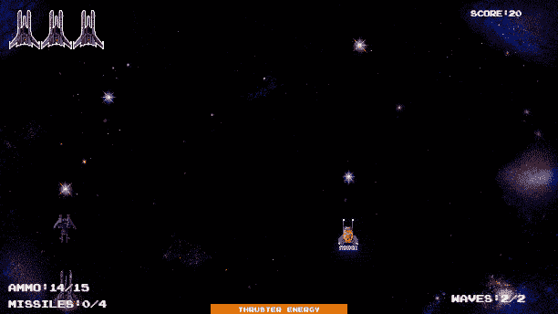
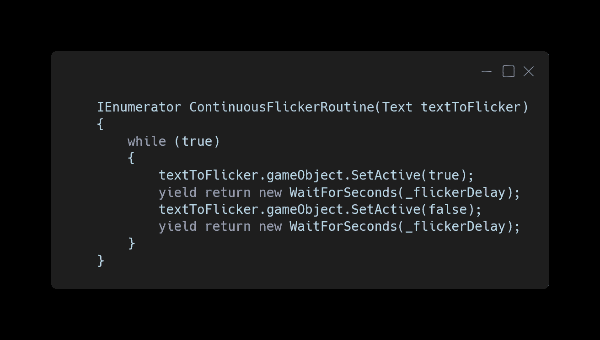
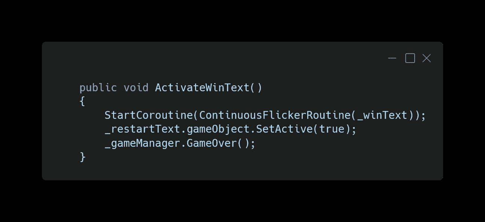
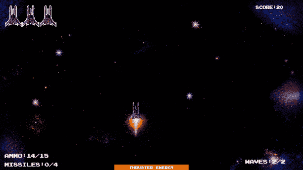
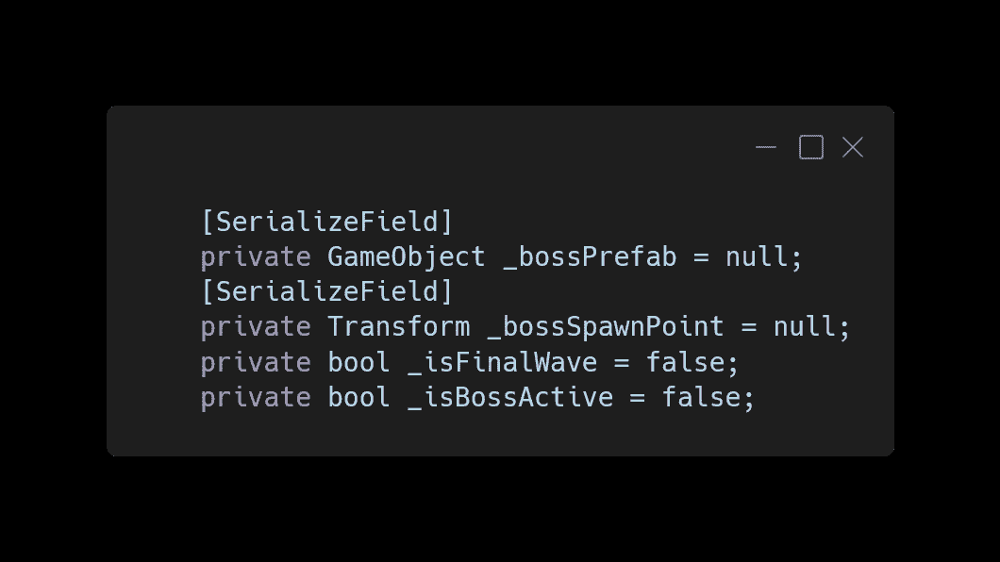
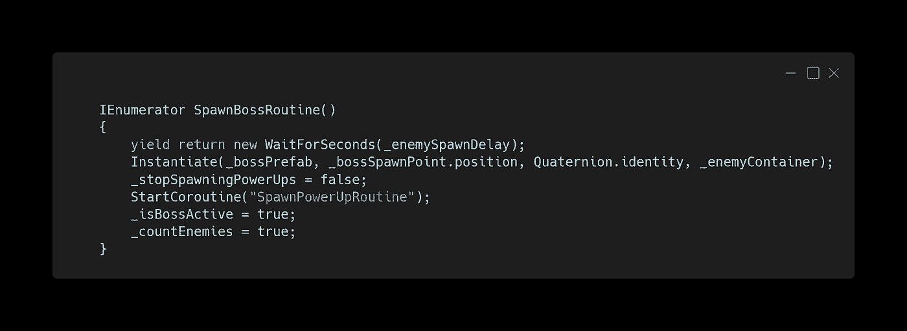
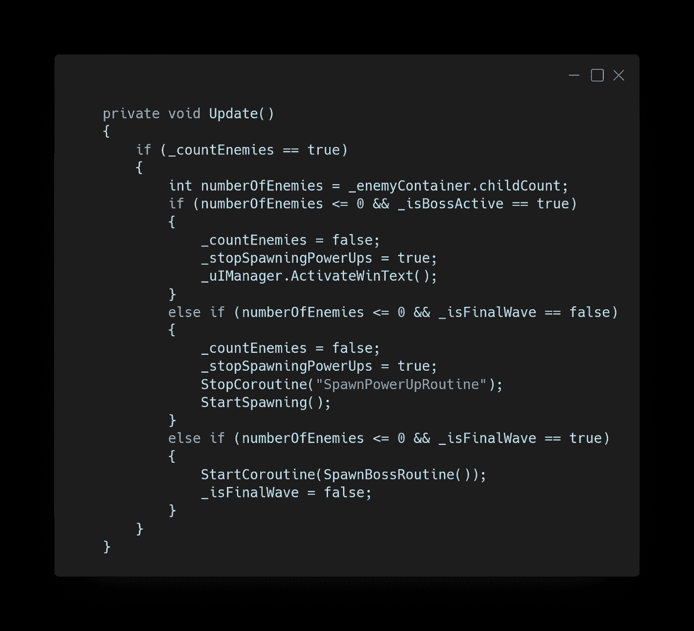
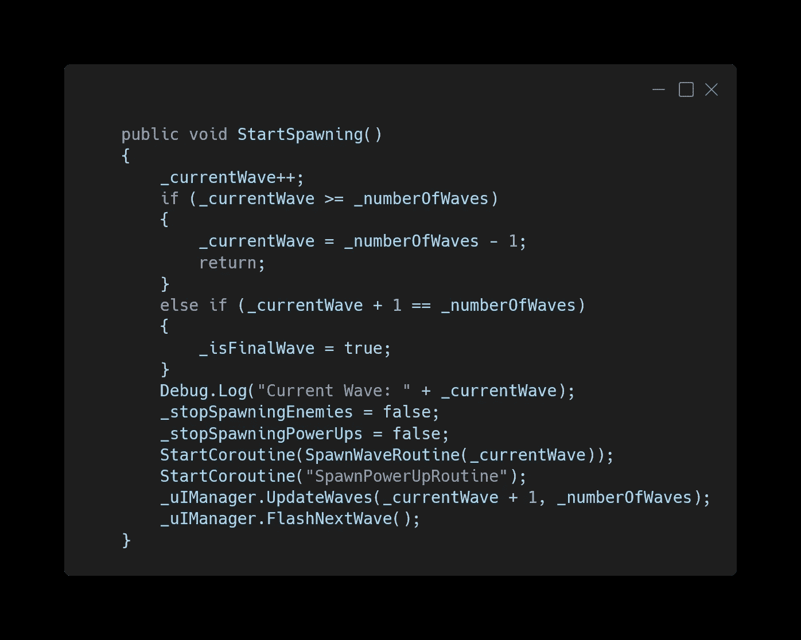

# 专题:Boss 敌人—第 3 部分

> 原文：<https://medium.com/nerd-for-tech/feature-boss-enemy-part-3-6aaf256a2845?source=collection_archive---------29----------------------->

这篇文章将从上一篇文章看最后一波后 [Boss 敌人的制造。还有，我们会在玩家打败 Boss 的时候更新 UIManager。](https://kwpowers.medium.com/feature-boss-enemy-part-2-2aec9663711b)

## UI 管理器

对于 UIManager 脚本，我们将为 Win 文本添加一个文本变量，并在 Start 中禁用它。

我们将改变[gameofflickerroutine](https://kwpowers.medium.com/creating-game-over-behavior-7134d8853bf6)以用于任何传入的文本对象。

现在我们需要一个名为的方法，用传入的 Win 文本启动协程，打开重启文本，并告诉游戏管理器游戏结束了。

## 产卵管理器

我们需要添加到 SpawnManager 中的变量是一个 Boss 预置的 GameObject，一个 Boss 将在屏幕外生成的 Transform，一个知道这是否是最后一波的 bool，一个告诉 Boss 是否活动的 bool。

这个协程将在延迟后在 Boss 产卵点产卵 Boss 预置，启用能量的产卵，启动能量产卵协程，将 isBossActive bool 设置为 true，并告诉脚本再次计算敌人。

在更新中，当检查留在场景中的敌人时，我们也会检查 isFinalWave 是否为 false。当剩下零个敌人和最后一波时，我们启动 spawnboss 例程并将 isFinalWave bool 改为 false。然后，当老板死了，我们将停止计算敌人，停止发电产卵，并激活胜利文本。

在 StartSpawning 方法中，我们将检查当前波加 1 是否等于波的总数，并将 isFinalWave 设置为 true。此外，我们将确保当前波形不会超出索引范围。

在 SpawnPowerUpRoutine 中，我们将改变它，这样如果老板是活跃的，罕见的加电次数是不受限制的。

Boss 在最后一波后产卵，当被摧毁时，会出现胜利的文字，这样玩家就可以重新开始游戏。

下面这篇文章将是重构空间射手代码的开始。