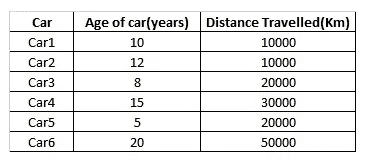
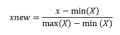
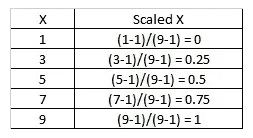
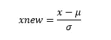
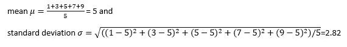
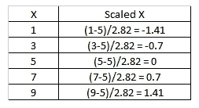

# 特征缩放

> 原文：<https://medium.com/nerd-for-tech/feature-scaling-1a7439374e92?source=collection_archive---------16----------------------->


特征缩放是一种将数据集中的数字特征转换为标准范围的方法，以便提高机器学习算法的性能。这可以通过规范化或标准化数据值来实现。当使用机器学习算法时，这种缩放通常在数据预处理步骤中执行。

例如，如果数据集中一个人的体重值在 15 千克到 100 千克之间，那么要素缩放会将所有值转换到 0 到 1 的范围内，其中 0 表示最低体重，1 表示最高体重，而不是以千克为单位表示体重。

在特征缩放中，我们将数据缩放到可比较的范围，以获得合适的模型并改进模型的学习。我们选择的比例并不重要，但是数据集中的每个要素都应该使用相同的比例。例如，如果一个要素被选择在 0 到 1 的范围内，则同一数据集中的所有其余要素也应在 0 到 1 的范围内。

# **为什么要进行功能缩放**

如果我们考虑具有以下值的汽车数据集:



作者图片

这里的车龄从 5 年到 20 年不等，而行驶里程从 10000 公里到 50000 公里不等。当我们比较这两个距离时，它们相距很远。机器学习算法认为具有较高范围值的特征在预测输出时是最重要的，并且倾向于忽略具有较小范围值的特征。这种方法会给出错误的预测。

为了避免这种错误的预测，所有要素的范围都进行了缩放，以便每个要素都按比例做出贡献，从而显著提高模型性能。

进行要素缩放的另一个原因是，如果数据集的值很小，那么与未缩放的数据相比，模型学习得更快。例如，在梯度下降中，为了最小化成本函数，如果值的范围小，则算法收敛得更快。

# 哪些算法需要特征缩放？

> 作为算法的一部分，计算某种距离的模型需要对数据进行缩放。

例如:线性回归、逻辑回归、SVM、KNN、K 均值聚类、主成分分析等。

# 哪些算法不需要特征缩放？

> 基于树的模型(其中每个结点根据条件进行分割)不需要缩放要素，因为模型精度不依赖于范围。此外，如果我们将这里的特征缩放到范围 0 到 1，那么许多值是彼此接近的十进制值，并且构建树需要更多的时间。

例如:决策树、随机森林、XGBoost 等。

# 常见特征缩放方法

**正常化:**

这也称为最小-最大缩放。它将数据缩放到 0 和 1 之间的范围。这种缩放是基于下面的公式执行的。



作者图片

其中 X 是要缩放的当前值，min(X)是值列表中的最小值，max(X)是值列表中的最大值

示例:如果 X= [1，3，5，7，9]，则 min(X) = 1，max(X) = 9，则比例值为:



作者图片

这里我们可以观察到 min(X) 1 表示为 0，max(X) 9 表示为 1。

**规范化的 Python 实现:**

Scikit-learn 对象 MinMaxScaler 用于规范化数据集。为此，首先从 sklearn 导入 MinMaxScaler，并用默认的超参数定义一个实例。然后对输入数据调用 fit_transform()函数来创建数据的转换版本。

```
from sklearn.preprocessing import MinMaxScaler 
trans = MinMaxScaler() 
data_trans = trans.fit_transform(data)
```

**标准化:**

它代表平均值的标准偏差。



作者图片

其中 x 是要缩放的当前值，是值列表的平均值，σ是值列表的标准偏差。

缩放后的值分布为平均值为 0，标准偏差为 1。

如果 X= [1，3，5，7，9]那么



作者图片

那么比例值将是:



作者图片

这里的值范围从-1.41 到 1.41。这个范围根据 x 的值而变化。

**Python 实现标准化:**

sci kit-learn object standard scaler 用于标准化数据集。为此，首先从 sklearn 导入 StandardScaler，并用默认的超参数定义一个实例。然后对输入数据调用 fit_transform()函数来创建数据的转换版本。

```
from sklearn.preprocessing import StandardScaler 
scaled = StandardScaler() 
data_scaled = scaled.fit_transform(data)
```

# 规范化与标准化

当要素值呈正态分布时(即值遵循钟形曲线)，标准化非常有用。否则(如果值不是正态分布的)归一化是有用的。

对于复杂的模型，哪种方法对输入数据执行得好是未知的。在这种情况下，使用标准化、规范化以及两者的组合对数据进行建模，并比较所得模型的性能。

当值包含异常值时，这两种方法都不能很好地执行。要解决此问题，请事先检查超出范围的值，并将它们的值更改为已知的最小值和最大值。

# **总结**

特征缩放是通过在机器学习算法的预处理步骤中归一化或标准化数据来实现的。它提高了算法的性能。

*原载于 2021 年 3 月 14 日 https://www.numpyninja.com**的* [*。*](https://www.numpyninja.com/post/feature-scaling)