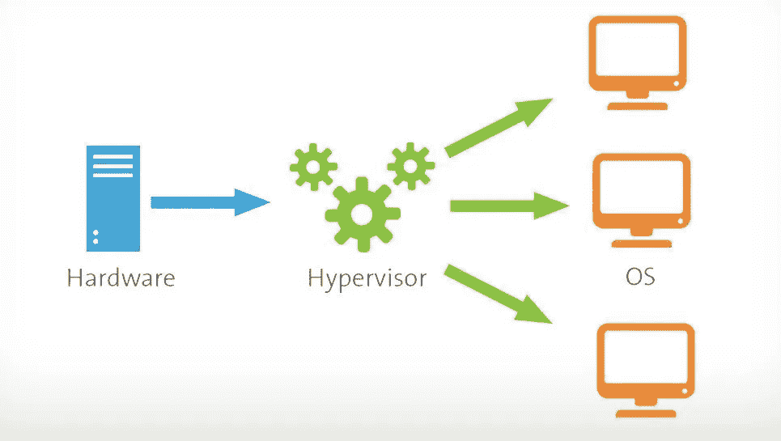
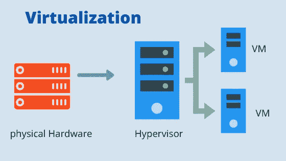

# 想要创建虚拟化和虚拟机管理程序吗

> 原文：<https://medium.com/nerd-for-tech/feel-like-creating-virtualization-and-hypervisors-4876fef6408?source=collection_archive---------6----------------------->

而不是直接定义像虚拟化和 T2 这样的术语，这些基本上都是技术术语。我们将创建一个需要虚拟化和虚拟机管理程序的场景。

假设我们在自己的笔记本电脑上创建了一个应用程序。让我们在这里打开东西。

我们有一台笔记本电脑——一台物理机，这台机器基本上由物理组件组成，包括 **CPU** 、 **RAM** 、**存储器**、**网络**等，以及软件，如**操作系统**、**依赖关系**等

让我们假设我们使用 **CPU-40%，RAM-50%** 用于这个应用程序，我们将暂时离开存储和网络。

让我们坐下来看看我们在这里做什么。我们本质上是在一台**单个**机器上运行我们的应用程序，这台机器有**单个**操作系统，而 **CPU** 和 **RAM** 未被**充分利用**。如果只是个人使用，这是可以的。但是每一种未被充分利用的资源都有潜在的商业收益，而且资源是有限的和昂贵的。

在这种情况下，我们需要找到一种方法来使用剩余的 60% CPU 和剩余的 50% RAM，以便我的资源得到最大限度的利用。让我们看看这方面的出路。

约束将是我们不能直接划分物理组件，即 CPU 分裂，RAM 分裂(lol)。所以只能在软件方面做。

这个软件将虚拟地分割资源，而不是物理地分割资源。这个软件叫做**虚拟机管理程序**

来源:谷歌

> 虚拟机管理程序，也称为虚拟机监视器或 VMM，是创建和运行虚拟机的软件。虚拟机管理程序允许一台主机通过虚拟共享其资源(如内存和处理)来支持多个来宾虚拟机。

虚拟机管理程序从单个物理硬件创建许多虚拟的机器，称为**虚拟机**。硬件资源在虚拟机之间共享。请记住，每个虚拟机都是相互独立的，并且可以联网。

这整个概念被称为虚拟化。

来源:谷歌

> 虚拟化是一种**技术，可以让您使用传统上绑定到硬件的资源来创建有用的 IT 服务**。它允许您通过在许多用户或环境中分配物理机的功能来使用其全部容量。…同样的硬件，您只是更高效地使用了更多的硬件

因此**虚拟化**是一种**技术**，而**虚拟机管理程序**是支持它们的**软件**。

当你理解了问题，你就解决了问题的一半。这里的问题是**资源利用率和效率**，解决方案是**虚拟化**