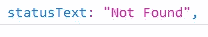
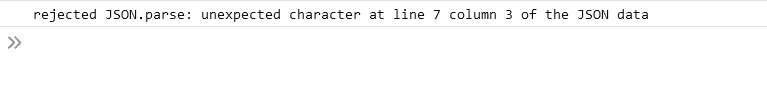

# 几分钟后获取 API、Async/Await

> 原文：<https://medium.com/nerd-for-tech/fetch-api-async-await-in-a-few-bites-6b4f19f7db9e?source=collection_archive---------2----------------------->


# 获取 API

Fetch 允许通过编写比使用 XMLHttpRequest 更少的代码来执行网络请求，并且它在幕后实现了 promise API。

使用 fetch 的代码示例:

```
fetch("./data/list.json")
  .then((response) => {
    console.log("resolved", response);
  })
  .catch((err) => {
    console.log("error retrieving data", err);
  });
```

1.  Fetch 将获取数据的 URL 端点作为参数。这可以是内部或外部资源。
2.  **Fetch 返回一个可以用**处理的承诺**。那么方法**我们已经在[以前的博文](https://alicemoretti.medium.com/xmlhttprequest-callbacks-and-promises-257a4e63fe9a)中看到了。
3.  如果承诺被**解决**，则回调函数。然后被开除。如果承诺被**拒绝**(例如检索数据时出现问题)，的回调函数。catch 被解雇了。

**URL 端点出错**

需要强调的一件有趣的事情是，如果我们拼错了 URL 端点，承诺仍然会被解析，但是响应对象 statusText 属性将为空。



响应对象的 statusText 属性

为了确保获得包含实际数据的对象，我们可以检查请求状态值，如果该值不同于 200，则突出显示一个错误(下面我们将看到如何抛出一个错误，以便捕获错误对象)。

```
fetch("./data/listsssss.json")
  .then((response) => {
    if (response.status !== 200) {
      console.log("there is an error");
    }
    console.log("resolved", response);
  })
  .catch((err) => {
    console.log("error retrieving data", err);
  });
```

**我的数据在哪里？**

假设端点拼写正确，并且我们获得了数据对象，如果您 console.log 响应，您会注意到实际的数据并不在那里。为了能够看到和使用这些数据，我们需要应用**。json 方法**解析数据字符串并返回一个 js 对象。这个方法是我们通过使用 fetch API 得到的响应对象的一部分，并且**返回一个承诺。**这意味着我们不能将它的值存储在如下所示的变量中:

```
let myData = response.json() THIS IS WROOOOOONG!
```

相反，我们可以退回承诺，然后再锁住另一个。then 方法将实际解析的数据作为参数:

```
fetch("./data/list.json")
  .then((response) => {
    console.log("resolved", response);return response.json();
  })
  .then((data) => {
    console.log(data);
  })
  .catch((err) => {
    console.log("error retrieving data", err);
  });
```

有一件事可能超级简单，但我不想想当然:“响应”和“数据”都是任意的词。是的，我把“response”改成了“MarioRossi”，这样代码就工作了(然后我想恢复文本可能是明智的，特别是当我知道有一些约定可以使代码更可读和更容易理解时:-))。

**分三步获取 API**

总结一下，当我们使用 fetch 时:

1.  我们通过提供 URL 端点来获取数据
2.  我们返回 response.json 承诺
3.  我们链接了一个. then 方法，最终可以访问数据

最重要的是，代码比编写一个 [XMLHttpRequest](https://alicemoretti.medium.com/xmlhttprequest-callbacks-and-promises-257a4e63fe9a) 要简单得多！

# 异步/等待

async 和 await 语法允许我们更容易、更干净地链接承诺。要使用 async 创建异步函数，我们编写:

```
let myAsyncFunction = async () => {
...here we write all the asynchronous code...
}
```

**通过添加“async”关键字，整个函数返回一个承诺**。我们可以通过将该函数放入一个变量中来证明这一点，然后 console.log 它:

```
let newVariable = myAsyncFunction()
console.log(newVariable)
```


承诺

async/await 与 fetch 配合得很好，因为它允许以一种超级简单的方式处理承诺。让我们来看看:

Fetch 返回一个承诺，因此我们不能将结果对象存储在变量中。**为了解决这个问题，async 附带了一个有用的关键字“await”**:

```
let myAsyncFunction = async () => {
  let response = await fetch("./data/list.json");
  console.log(response);
};
```

**通过添加“await”关键字，响应对象不会存储在响应变量中，直到承诺被解析。**

继续，通过 console.log 响应，我们将看到实际的数据是不可见的，如上所述，我们需要应用。返回承诺的 json 方法。同样，我们可以通过使用“await”关键字来处理这个承诺:

```
let myAsyncFunction = async () => {
  let response = await fetch("./data/list.json");
  let data = await response.json;
  console.log(data);
  return data;};
```

调用 myAsyncFunction()返回一个承诺，由于函数内部的代码返回数据，我们可以应用。然后，将数据作为参数的方法(我们将在下一段描述错误情况下会发生什么):

```
myAsyncFunction().then((data) => {
  console.log("resolved", data);
});
```

由于是一个异步函数， **myAsyncFunction()不会阻止其余代码运行**，我们可以用下面的代码来证明这一点:

```
console.log("1");
console.log("2");
console.log("3");
myAsyncFunction()
  .then((data) => {
    console.log("resolved", data);
  })
  .catch((err) => {
    console.log("rejected", err);
  });
console.log("4");
```

在控制台中，我们将看到 1、2、3、4，最后是响应对象。

**async/await 语法不仅允许我们用 await 关键字更清晰地链接承诺，还允许我们在变量中存储一个异步函数，这使得调用函数更容易。**

# 投掷错误

如果 json 文件的语法有问题(假设我们忘记在键上加双引号)，那么 response.json 返回的承诺将被拒绝，整个异步函数的承诺也将被拒绝。这意味着我们可以捕捉错误。在下面的示例中，我们访问 err 对象的 error 属性:

```
.catch((err) => {
    console.log("rejected", err.message);
  });
```



我们在控制台上看到的。

我想谈的另一个错误场景稍微有点难以处理。如果 ULR 端点拼写错误，该承诺仍将被解析。json 方法仍然会解析响应，结果将是一个错误。

为了防止这种情况发生，我们需要手动检查响应的状态，如果这与 200 **不同，我们将抛出一个错误**。这将防止。来自“踢进”的 json 方法。

```
let myAsyncFunction = async () => {
  const response = await fetch("./data/lists.json");
  if (response.status !== 200) {
    throw new Error("cannot fetch data");
  }
  let data = await response.json();
  return data;
};myAsyncFunction()
  .then((data) => {
    console.log("resolved", data);
  })
  .catch((err) => {
    console.log("rejected", err.message);
  });
```

通过编写“抛出新错误”,我们创建了一个新的错误对象。每当我们在一个异步函数中抛出一个错误，那么它返回的承诺就会被拒绝，这样我们就可以捕捉到这个错误。

错误消息现在将是“无法获取数据”。

我希望这篇博文和前一篇有助于理解更多关于网络请求的话题。

如果你认为文章的某些部分可以改进，或者你有任何想法想分享，请在下面留下评论。