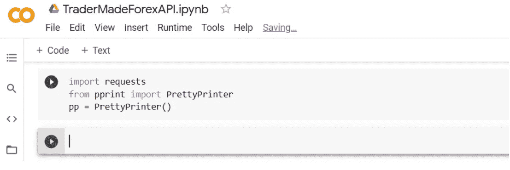
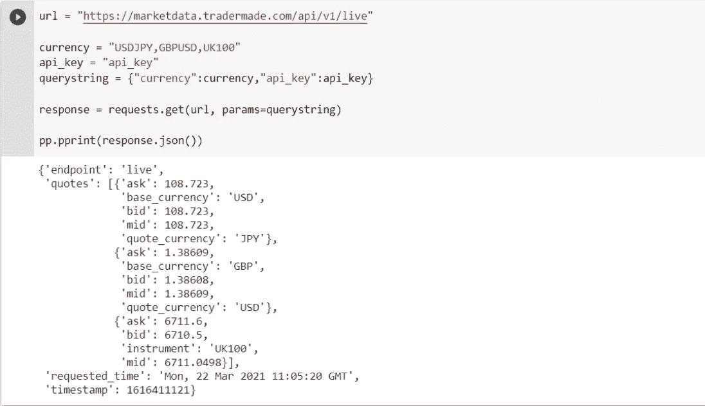
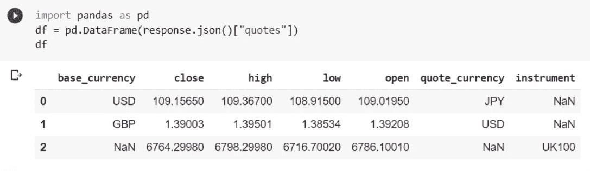
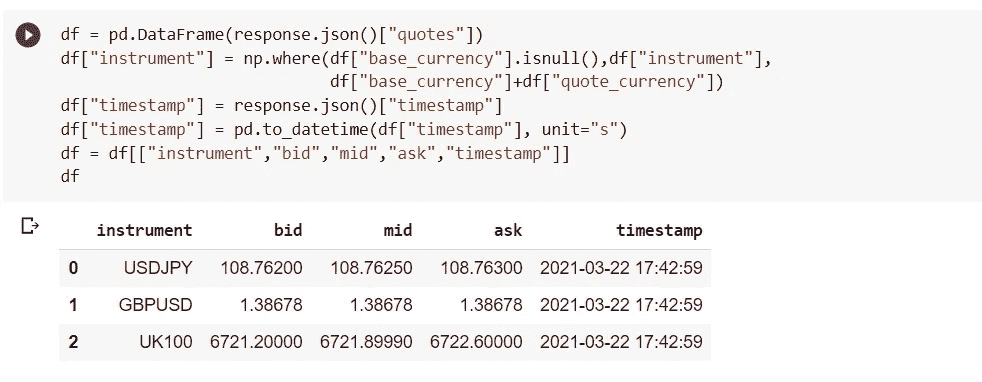
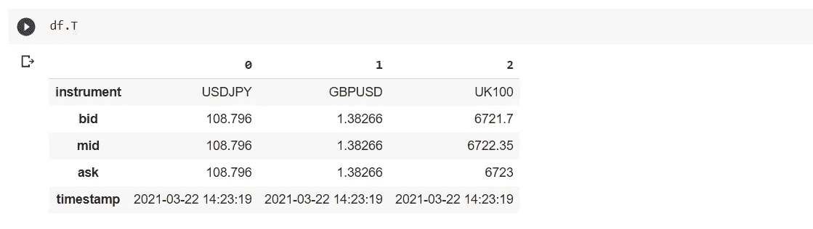
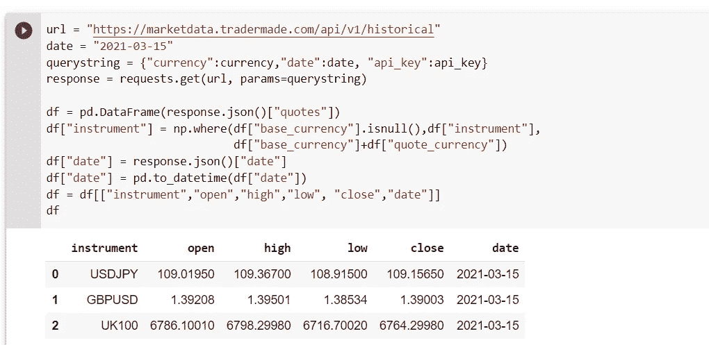
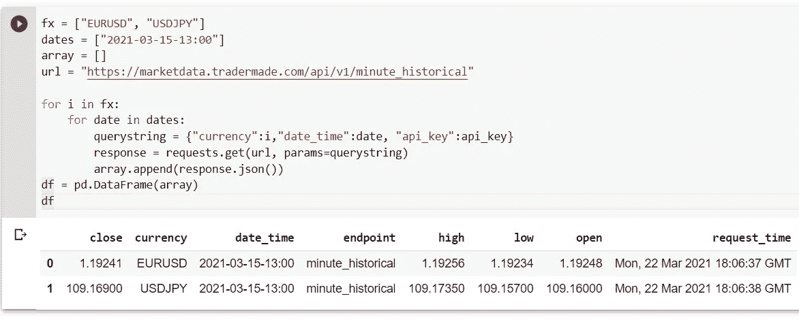
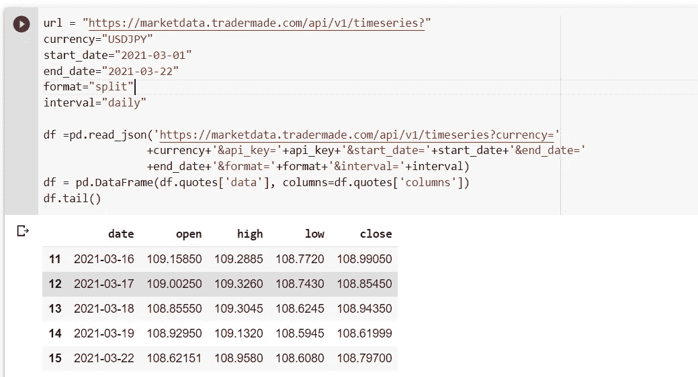
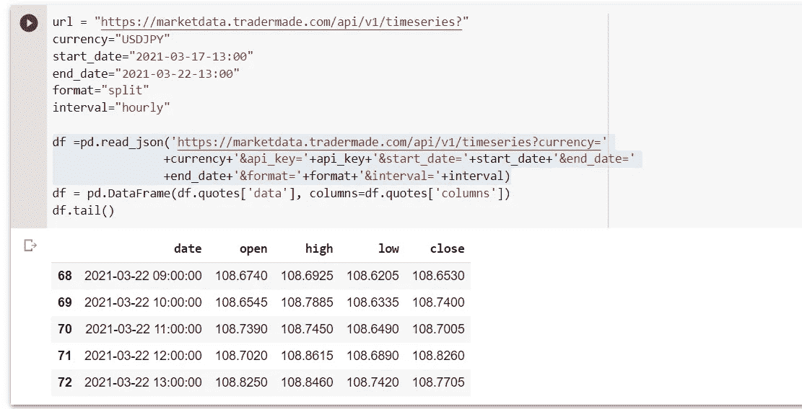
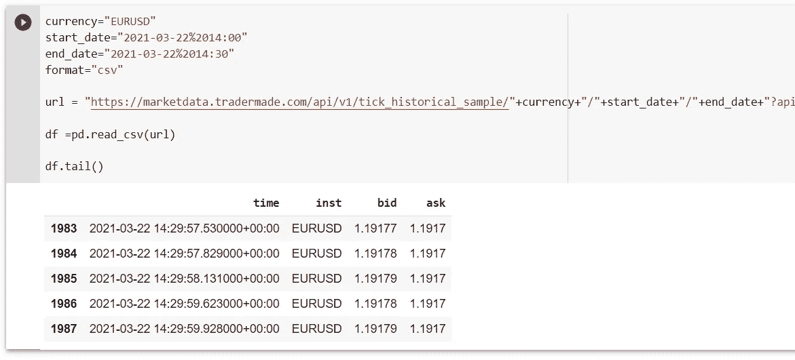

# 用 Python 和 Pandas 获取外汇 API

> 原文：<https://medium.com/nerd-for-tech/fetch-forex-api-with-python-and-pandas-c9ed95207186?source=collection_archive---------0----------------------->


在编写了实时外汇数据的更复杂的实现之后，我突然想到我错过了一个针对 python 用户的 REST API 的简单实现。因此，在这里，我们试图学习使用 python 和 pandas 来消费当前和历史外汇数据。如果您正在寻找快速实现，请参阅我们关于 Python SDK 的文章。

在我们开始解释之前，你需要对 python 有一个基本的了解，我指的是像看“10 分钟之内学会 Python”视频中那样的基础。也就是说，本教程应该对有其他编程语言经验的人和想使用我们的 Forex REST API 的人有所帮助。

**那么让我们开始**

你需要注册我们的 API，只需点击[免费加入 API](https://marketdata.tradermade.com/signup)。一旦你有了钥匙，请妥善保管。这和 Python 环境是你学习本教程所需要的。为了简单起见，我会推荐没有设置 python 的用户使用 [Google Colab](http://colab.research.google.com/) 并启动一个 Jupyter 笔记本。对于安装了 Python 的人来说，这些程序可以在本地运行。

您将需要安装一些库，但对于 Colab，您不需要安装只需导入。如果你是 Python 的初学者或者想快速测试一小段代码，google 的 Collaboratory 非常好。

## 使用实时端点调用实时外汇汇率

```
import requests
from pprint import PrettyPrinter
pp = PrettyPrinter()
```

你可以将上面的代码复制粘贴到 Google Colab Notebook 的一个单元格中，然后按 shift+enter 或者点击 play 按钮。



我们可以看到这个单元已经运行了，我们有了一个新的单元来写下一段代码。在运行下面的代码之前，我们需要理解它的含义。url 是我们正在调用的端点，货币是逗号分隔的字符串，api_key 是您通过注册获得的密钥。要调用 forex REST API，我们需要我们在前面的单元格中导入的请求库，请求库有一个 get 函数，它接受一个 URL 和一个 JSON 参数，在本例中是“querystring”。响应是我们从 API 得到的，然后我们用 PrettyPrinter 打印响应，这样看起来很好。

```
url = "https://marketdata.tradermade.com/api/v1/live"currency = "USDJPY,GBPUSD,UK100"
api_key = "api_key"
querystring = {"currency":currency,"api_key":api_key}response = requests.get(url, params=querystring)pp.pprint(response.json())
```



如您所见，我们在不超过 6 行的代码中获得了美元兑日元、GBPUSD 和富时 100 的实时汇率。然而，为了做一些数据分析或者以一种更直观的方式来查看比率，我们需要将它们放在一个表格中，或者如我们在 pandas 中所说的 DataFrame。

所以在这里我们将介绍 pandas，它是一个为数据分析而创建的扩展库。pandas 使得迭代、制表、修改和计算数据的工作变得相当容易，但是对于本教程，我将把范围限制在从 API 获取、保存和制表数据。所以让我们继续

```
import pandas as pd
df = pd.DataFrame(response.json()["quotes"])
df
```

熊猫也可以从 API 获取数据，但是为了更好地理解，我们使用了请求。如果您请求的数据不是一个精确的数据帧，那么最好使用请求。我们将在 response.json 中收到的引用传递给 pandas 函数，该函数将数据转换成数据帧，瞧！我们现在用一行代码将数据制成表格。



上面熊猫的数据框更易读，但我们仍然没有。我们将做一些调整，使其更具可读性。我们可以看到仪器列中有 NaN，并询问，bid、mid 不符合顺序，并且我们没有时间戳，因此让我们快速解决这个问题。

```
# if all instruments are currencies just write a # in front of line 1 and take # off line 2 in the below code. If all instruments are CFDs just write # in line 1 and 2.Import numpy as np
df["instrument"] = np.where(df["base_currency"].isnull(),df["instrument"],df["base_currency"]+df["quote_currency"])
#df["instrument"] = df["base_currency"]+df["quote_currency"]
df["timestamp"] = response.json()["timestamp"]
df["timestamp"] = pd.to_datetime(df["timestamp"], unit="s")
df = df[["instrument","bid","mid","ask","timestamp"]]
df
```

我们将导入 numpy，这是另一个与 pandas 密切配合的库，然后将使用“np.where”函数更改 instrument 列，该函数接受(条件，如果为假，则为真)，然后将创建一个名为 timestamp 的新列，并写入我们从 API response.json 收到的时间戳，并将其转换为可读的时间戳。



现在您可以看到为什么 Pandas 如此受欢迎，Python 如此多产。所有这些代码都执行得非常快。您也可以这样做:



您可以使用如下所示的单一命令保存您的工作，并通过 CSV 文件共享您的工作。

```
df.to_csv('live_rates.csv')
```

要深入了解我们的端点，请查看我们的 [rest API 数据文档页面](https://marketdata.tradermade.com/docs/restful-api)。

## 使用历史端点调用历史外汇数据

**每日历史**

每日历史数据端点与实时端点非常相似，唯一的区别是响应 JSON 有日期而不是时间戳，报价中有开盘价、最高价、最低价和收盘价。我们已经定义了 currency 和 api_key，所以我们需要提供的只是我们需要数据的日期。

```
url = "https://marketdata.tradermade.com/api/v1/historical"
date = "2021-03-15"
querystring = {"currency":currency,"date":date, "api_key":api_key}
response = requests.get(url, params=querystring)

df = pd.DataFrame.from_dict(response.json()["quotes"], orient='columns', dtype=None, columns=None)
df["instrument"] = np.where(df["base_currency"].isnull(),df["instrument"],df["base_currency"]+df["quote_currency"])
df["date"] = response.json()["date"]
df["date"] = pd.to_datetime(df["date"])
df = df[["instrument","bid","mid","ask","date"]]
df
```



你可以看到用数据制作表格是很容易的，并且不难想象，用一点熊猫的魔力，你就可以随心所欲地分割数据。您还可以循环访问请求，请求不同日期的数据，这种可能性是无穷无尽的。对于另外两个数据历史端点:minute_historical 和 hour historical，您一次只能调用每种货币的一个汇率，因此需要遍历数据。

**分钟和小时历史**

两个端点的调用几乎相同，因此将仅使用一个分钟历史示例，如下所示:

```
fx = ["EURUSD", "USDJPY"]
dates = ["2021-03-15-13:00"]
array = []
url = "https://marketdata.tradermade.com/api/v1/minute_historical"for i in fx:
    for date in dates: 
          querystring = {"currency":i,"date_time":date, "api_key":api_key}
          response = requests.get(url, params=querystring)
          array.append(response.json())
df = pd.DataFrame(array)
df
```



到目前为止，我们可以看到，要求不同的日期和不同的货币并不十分困难，只要做一点工作，就可以创建一个系统来检查利率，并根据我们预设的一些条件突出显示某些警报。然而，这超出了本文的范围，我们建议探索 pandas，它是一个非常方便的数据分析库。

## 使用 timeseries 端点调用时序外汇数据

如果您请求历史端点，请求通常是某个时间点的价格。我们现在来看看用于趋势分析和图表的时间序列，并获取数据。然而，我们不需要请求库，因为我们可以只用熊猫来做所有的事情。是时候加快我们获取数据的速度了。

```
url = "https://marketdata.tradermade.com/api/v1/timeseries?"
currency="USDJPY"
start_date="2021-03-01"
end_date="2021-03-22"
format="split"
interval="daily"df=pd.read_json('https://marketdata.tradermade.com/api/v1/timeseries?currency='+currency+'&api_key='+api_key+'&start_date='+start_date+'&end_date='+end_date+'&format='+format+'&interval='+interval)
df = pd.DataFrame(df.quotes['data'], columns=df.quotes['columns'])
df.tail()
```

熊猫可以使用 read_json 或 read_csv 等函数从 API 请求数据。我们的 forex API timeseries 端点接受一个名为 format 的参数，当该格式设置为“split”时，很容易将其转换为 pandas 数据帧。然后，我们读取从 API 传入的列，然后使用命令 df.tail()打印我们收到的最后五行数据，如果您想查看前五个数据点，只需执行 df.head()。



数据已经以一种易于播放的方式进行了格式化，我们也可以对每小时和粒度数据提出类似的请求，我们需要做的只是添加一些小的更改，如将 start date 和 end_date 更改为“YYYY-mm-dd-HH:MM ”,将 interval 更改为 hourly。你可以看到下面:



我们可以用上面的数据框架做很多事情，比如为范围、变化百分比、滚动相关性和波动性做一个额外的列。然而，这超出了本文的范围。你可以看看我们的[数据可视化文章](https://tradermade.com/tutorials/data-visualisation-python/)，它展示了基本的熊猫相关性和波动性命令。

## 使用分笔成交点样本端点调用分笔成交点历史汇率

最后，我们将查看 tick 历史数据，如果您正在进行任何严肃的数据分析，包括交易算法和机器学习，这些数据将非常有用。然而，分笔成交点数据可用于许多目的。我们将能够从 rest API 的一行代码中获取 pandas 数据框中的数据。在我们运行我们的代码之前，提醒一下，tick 数据仅对过去四天的免费用户可用，不包括今天，您不能在免费计划上一次请求超过三十分钟，并且每次调用将花费 20 个 API 请求。所以我建议使用 df . to _ CSV(“example . CSV”)在本地保存文件，然后通过 df . read _ CSV(“example . CSV”)读入。此外，对 Google Colab 用户的一个提醒是，因为我们的分笔成交点数据端点的开始日期和结束日期格式中有一个缺口，我们需要用“%20”来填充这个缺口。这是我在谷歌协作笔记本中注意到的，你不需要在 Jupyter 笔记本或 Python 脚本中做。

```
# start date is 2021-03-22 14:00 but %20 is added to the gap as url dont like empty spaces (this is added automatically but Google Colab doesnt seem to like this)currency="EURUSD"
start_date="2021-03-22%2014:00"
end_date="2021-03-22%2014:30"
format="csv"url = "https://marketdata.tradermade.com/api/v1/tick_historical_sample/"+currency+"/"+start_date+"/"+end_date+"?api_key="+api_key+"&format="+formatdf =pd.read_csv(url)df.tail()
```



如您所见，您刚刚获得了欧元兑美元近 2000 个基点的历史数据。你可以从我们的 [Tradermade Github 页面](https://github.com/tradermade/Forex-REST-API/blob/main/tradermade.ipynb)获得 Jupyter 笔记本文件。希望这篇文章能够帮助初学者和有经验的程序员使用 Python 和 pandas 从 Forex REST API 获取数据。请留下您的意见和建议。