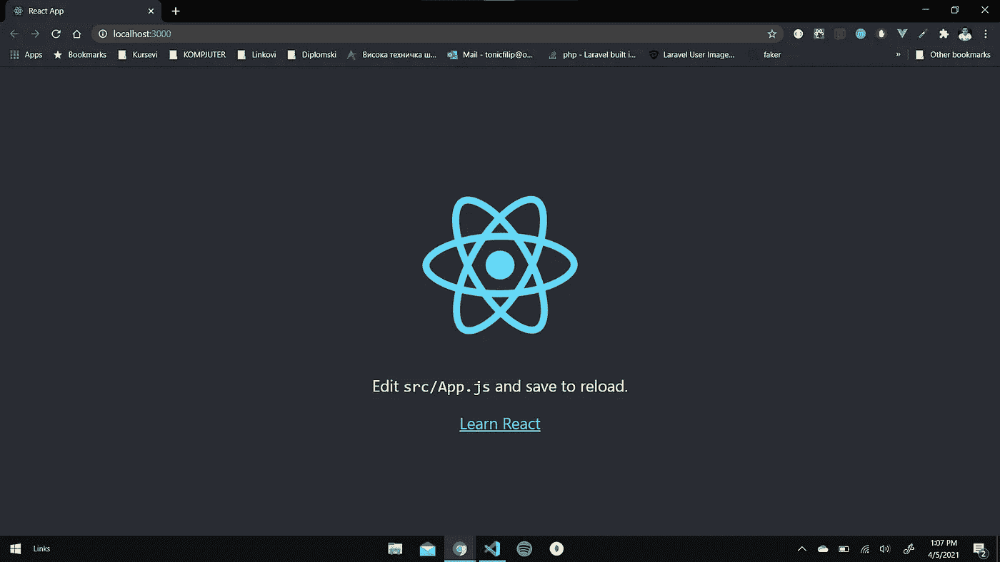
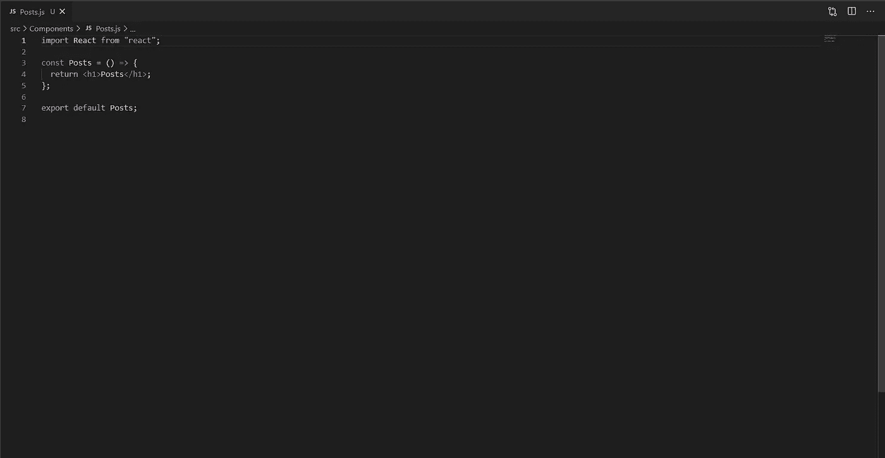
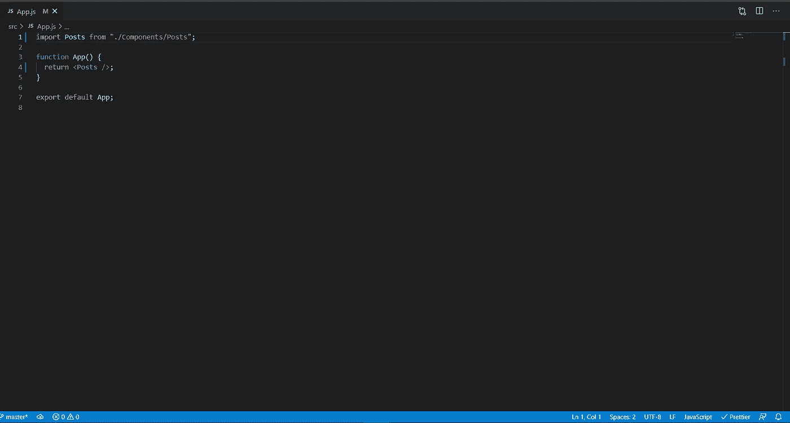
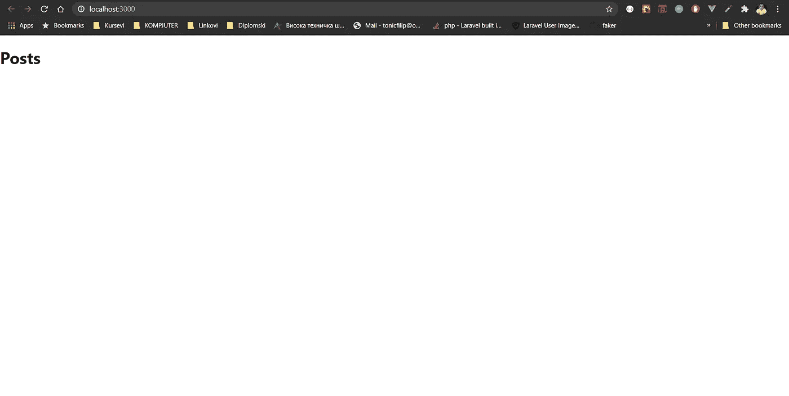
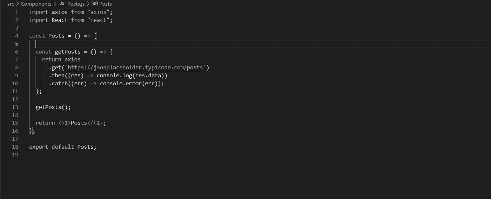
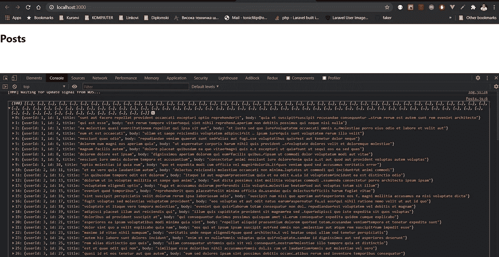
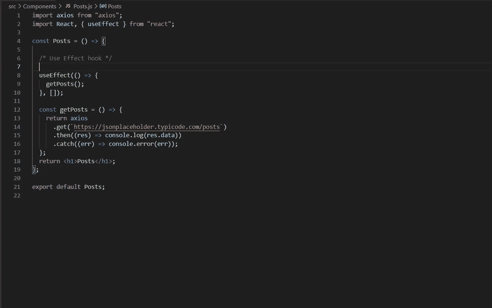
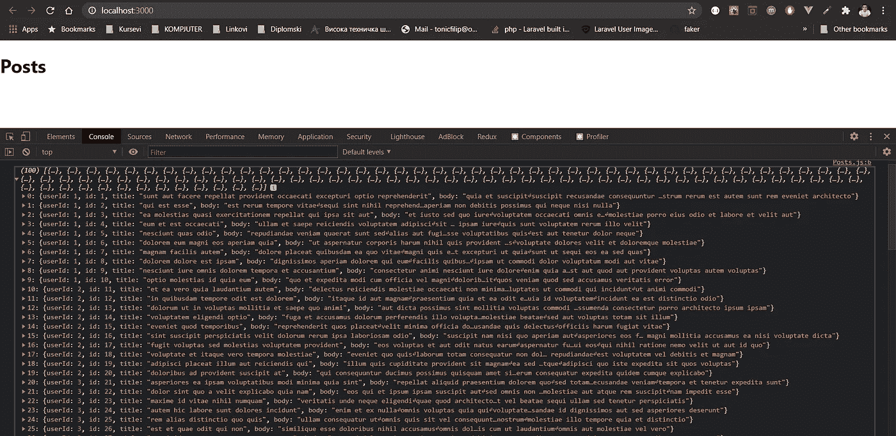
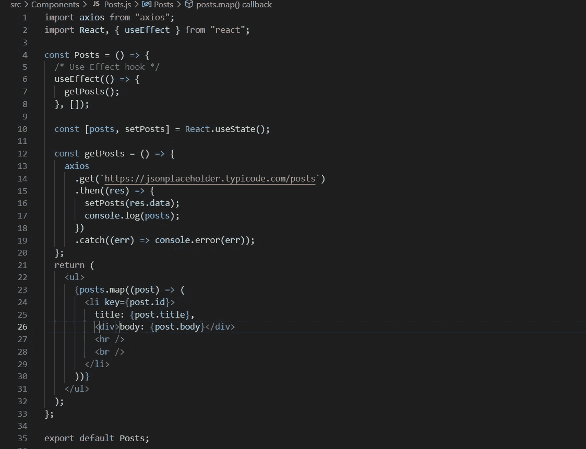
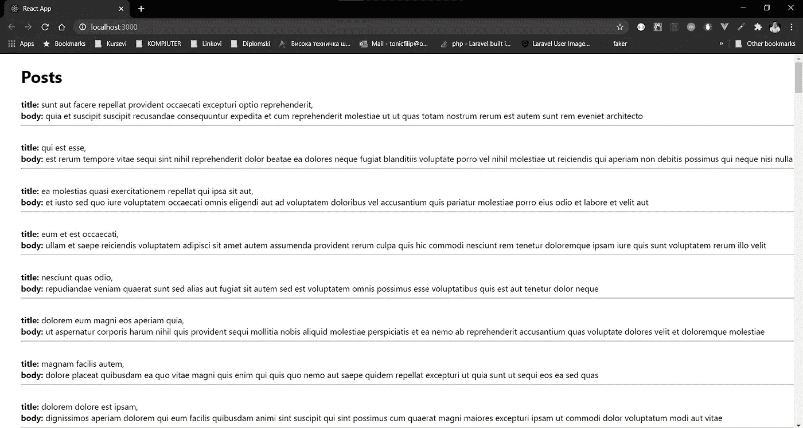

# 使用 React.js 中的 useEffect 挂钩提取 API

> 原文：<https://medium.com/nerd-for-tech/fetching-api-using-useeffect-hook-in-react-js-7b9b34e427ca?source=collection_archive---------2----------------------->

# 介绍

各位读者好！在本教程中，我们将了解如何使用 React.js 应用程序内部执行 API 调用。为此我们将使用 **useEffect()** 钩子和 **Axios** 库。

## 先决条件

像往常一样，我们需要安装**节点**和 **NPM 或纱线**。我的版本为 **NPM -v** (6.14.11)和**节点-v** (14.16.0)

说到这里，我们可以创建新的 React 应用程序。
**npx create-react-app“your-app-name”。**现在让我们用 **npm start 开始我们的新应用程序。**我们应该看到这一点:

我们都准备好了，现在开始吃吧。我们将安装前面提到的 **Axios** 库，包括:

**npm 安装 axios**

我们现在准备创建一个 React 组件，并在其中使用我们的钩子。
创建名为**组件**的文件夹，在里面放入文件 **Posts.js** ，像这样:

非常基本的组件，只有简单的 h1，所以我们可以确保我们在正确的轨道上！我们必须将我们的**帖子**组件插入到 **App.js** 文件中。这是我们有的。我们去掉了 **App.js** 中的所有启动代码，现在我们只有 **Posts** 组件。

回到浏览器，果然我们得到了我们的**帖子标题。**

好了，现在我们准备继续前进。我将使用来自 **jsonplaceholder、**的 Posts api，现在，如果你使用自己的 api，完全相同的事情将会发生。
我们将从向【https://jsonplaceholder.typicode.com/posts】**`、**发出 get 请求开始，我们将记录结果以查看我们得到了什么。

返回 **axios get 请求**的简单函数，之后我们只是调用函数本身，这样我们就可以看到结果。因为我在单独的函数中有这个逻辑，所以你可以猜测这将来自单独的文件，如服务或类似的东西。果然，我们在控制台中看到了 100 个帖子。

由于我们不喜欢调用函数，我们将利用 **useEffect()** hook，并以这种方式发出 http 请求。

我们首先从 **react** 中导入 **useEffect** ，然后在我们的组件中使用它。就像我之前说的，**我把**函数留在里面的唯一原因是，我试图在我们的应用程序中模拟服务。
无论如何，我们正在调用 useEffect 中的函数，我们将依赖列表数组留空，因为此时我们不依赖任何东西。如果我们使用基于类的组件，这种特殊情况基本上与**componentdimount()**方法完全相同。

当然，我们的帖子和以前一样。

现在让我们把它们显示在屏幕上，这样我们就能看到全貌了。我将在一个变量中保存帖子，然后映射槽并在屏幕上显示它们。

为此，我们将使用我们在上一篇文章中学到的钩子，那就是 **useState()** 钩子。这是我们将拥有的:

以及它在页面上的外观:

没什么特别的，我们没有使用任何 css 库或编写自定义 css，因为这不是本文的目的。

这就是 it 伙计们，我们已经看到了如何制作一个组件，并使用 **useEffect()** 钩子来加载一些数据，结合 **Axios** http 请求和 **useState()** 钩子，这样我们就可以在我们的组件中存储数据。接下来，我们通过数据映射，并将其渲染到页面上。

希望你喜欢它，一定要看看我以前的文章:

[**。Net 与 JWT 认证**](/nerd-for-tech/net-jwt-authentication-with-mongodb-9bca4a33d3f0) 和 [**反应 SPA 与。净芯 5**](/nerd-for-tech/react-js-spa-with-net-core-5-8e419834e48)

分享并留下评论。
你可以一直用一杯 [☕](https://www.buymeacoffee.com/tonicfilip) 支持我

**LinkedIn**:[www.linkedin.com/in/filip-tonic](http://www.linkedin.com/in/filip-tonic)
**邮箱**:tonicfilip@outlook.com