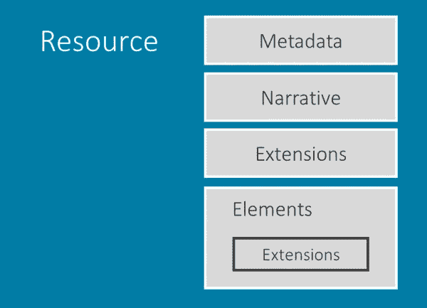
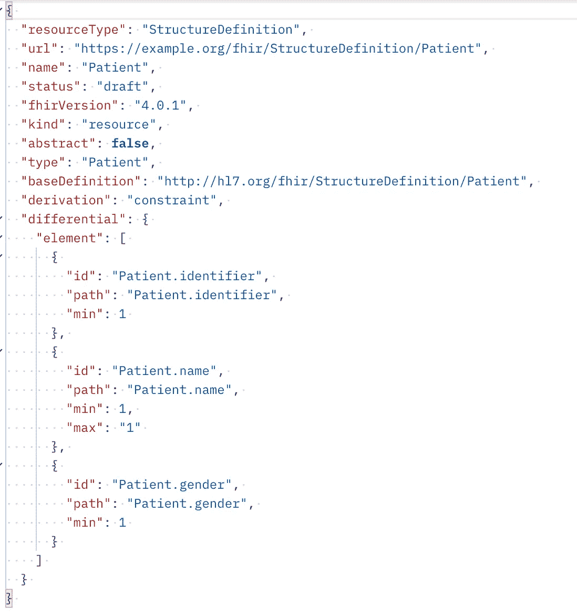

# 面向开发人员的 FHIR:第 2 部分

> 原文：<https://medium.com/nerd-for-tech/fhir-for-developers-part-2-b52a620f5f99?source=collection_archive---------1----------------------->

## 有关 FHIR 规范的更多信息(资源和配置文件)

# 数据模型/资源:

正如我们在[第 1 部分](/@jaideeppahwa1/fhir-for-java-developers-part-1-17fdfc34c437)中已经讨论过的，资源是 FHIR 规范的构建模块。每个资源代表一个为特定目的而制作的特定数据模型。FHIR 中大约有 150 个数据模型/资源。邪恶的笑（Evil Grin 的缩写）

1.**患者**:接受医疗保健服务的人。

2.**状态**:表示患者的状态。

3.**观察值**:代表患者的诊断报告。

4.**预约**:代表患者就诊。

[患者资源](https://www.hl7.org/fhir/patient.html)

1.  **名称**:资源中元素的名称
2.  **Flags** :关于元素的一组信息，影响实现者如何处理它们。例如:σ表示该元素包含在摘要搜索中。
3.  **基数**:这个元素被允许在资源中出现的次数的下限和上限
4.  **类型**:元素的数据类型。这些可能是简单类型，如字符串，也可能是复杂类型，如对其他资源的引用。
5.  **描述&约束**:元素的描述，以及应用于它的约束的细节。

FHIR 中的每个资源可能由以下部分组成:

1.  **元数据**:提供一些关于资源的额外信息，例如:ResourceId、资源版本、配置文件和标签。
2.  **叙述**:内容的人类可读版本。
3.  **扩展**:用于实现[第 1 部分](/@jaideeppahwa1/fhir-for-java-developers-part-1-17fdfc34c437)中讨论的所有 20%用例。
4.  **元素/主体**:表示实际的内容资源。

# FHIR 配置文件

我们知道 FHIR 的基本概念是一切都被表示为资源。这些资源可能非常广泛，资源中的一个事物可以用多种方式表示。

因此，为了鼓励互操作性，我们可能希望根据我们自己的规范和约束来约束资源。这就是侧写的用武之地。

**FHIR 配置文件**是约束 FHIR 资源以满足特定定义标准的方式。它是 FHIR 资源的一种数据模式。

**实施指南:**是一组如何解决特定互操作性或标准问题的规则——通常通过使用 FHIR 资源。它由我们想要限制的资源的**结构定义**组成。

扩展和限制资源(统称为“分析资源”)是通过一个“**结构定义**”资源来完成的，它是关于如何使用资源中的元素以及在资源中何处使用扩展的规则声明。

例如，病人资源的结构定义

说得轻松一点:

如果你喜欢我的作品，请**喜欢并分享**这篇文章(**免费:)**)。还有，做 [**关注**](/@jaideeppahwa1) me 更多这样的文章。

另外，看看我的其他文章:

[贾迪普·帕瓦](/@jaideeppahwa1?source=post_page-----b52a620f5f99--------------------------------)

## 5 分钟技术

[View list](/@jaideeppahwa1/list/5-minutes-tech-c6f26ea4a89c?source=post_page-----b52a620f5f99--------------------------------)3 stories

杰迪普·帕瓦

## 面向开发人员的 FHIR

[View list](/@jaideeppahwa1/list/fhir-for-developers-ea551cc4840c?source=post_page-----b52a620f5f99--------------------------------)9 stories

[杰迪普·帕瓦](/@jaideeppahwa1?source=post_page-----b52a620f5f99--------------------------------)

## 自助救助

[View list](/@jaideeppahwa1/list/self-help-942c66816c1d?source=post_page-----b52a620f5f99--------------------------------)2 stories

[杰迪普·帕瓦](/@jaideeppahwa1?source=post_page-----b52a620f5f99--------------------------------)

## 通用技术公司

[View list](/@jaideeppahwa1/list/general-tech-e702a6db69b5?source=post_page-----b52a620f5f99--------------------------------)2 stories