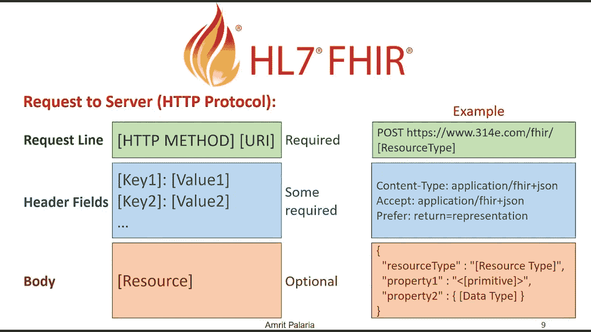

# 面向开发人员的 FHIR:第 3 部分

> 原文：<https://medium.com/nerd-for-tech/fhir-for-developers-part-3-c88112d7ccb7?source=collection_archive---------2----------------------->

## FHIR 交换模块和 RESTful API

# FHIR 交换模块

FHIR 是一种接口规范，它规定了医疗保健应用程序之间交换的数据内容，以及如何实施和管理交换。FHIR 定义了以下在系统间交换数据的方法。每种方法都有特定的用例，各有利弊。可能使用的方法将取决于用例。

1.  **RESTful API** :大多数实现者专注于 RESTful API。这是一个客户端/服务器 API，旨在遵循 RESTful 设计原则，用于**C**create、 **R** ead、 **U** pdate 和 **D** elete 操作，以及 **S** earch 和**E**x execute(Operations)支持。
2.  **消息传递**:通过在系统间发送路由消息来支持系统间的交换。这种交换可以在 RESTful API 上实现，也可以使用其他消息传递技术来实现。
3.  **文档**:在这种情况下，要交换的内容被一个组合所包装，该组合提供了内容的上下文，并为人类读者提供了固定的表示。提供文档框架是为了帮助计算机辅助的人与人之间的交流——这在医疗保健中并不少见。
4.  **数据库/持久存储:**利用 FHIR 定义的资源的另一种方式是将它们本地存储在数据库或持久存储中，其中不同的应用程序或模块写入和读取资源作为其实现的一部分。



# FHIR RESTful API

REST API(也称为 RESTful API)是一个应用程序编程接口(API 或 web API)，它符合 REST 架构风格的约束，并允许与 RESTful web 服务进行交互。FHIR 被描述为一个“RESTful”规范，它基于 REST 这个术语的常见行业级用法。

FHIR 为不同类型的资源事务提供不同的 API。在我们到达那里并开始查看不同的操作之前，我们先来看看 URL 的结构。

```
[base]/[type]/[id]
```

**Base:** 服务基本 URL 是这个接口定义的所有资源的地址。服务基础 URL 采用以下形式

```
http{s}://server{/path}
```

**类型:**它是您想要访问的资源或者您想要对其执行操作的资源。

C **reate** :用于在 FHIR 服务器上创建新的资源。它是 **HTTP Post** 请求。它将接受 RequestBody，作为回报，它将创建一个新资源。响应将包含新生成的资源 id。

例如:https://myserver.com/Patient(HTTP Post)

READ:用于获取 FHIR 服务器的资源。这是一个 HTTP Get 请求。我们需要传递我们想要检索的资源的类型和 id，如果它存在，我们将得到完整的资源作为响应。以下 API 将返回 id 为 example 的患者资源。

https://myserver.com/Patient/example(HTTP Get)

Update:用于更新 FHIR 中已有的资源。它是 HTTP Put 请求。我们将需要传递一个 id 为的资源，如果它存在，服务器将返回更新的资源，如果它不存在，服务器将创建一个具有给定 id 的新资源。此操作也可用于创建具有自定义 id 而不是服务器生成的 id 的资源。

https://myserver.com/Patient(HTTP Put)

D **elete:** 用于从 FHIR 服务器上删除资源。对 delete 的调用类似于 get，唯一的区别是它是一个 HTTP Delete 请求。我们需要理解的一点是，这里执行的删除是逻辑删除，而不是实际删除。这意味着资源不会出现在搜索结果中。

例如:https://myserver.com/Patient/example(HTTP 删除)

# 搜索操作

开发任何医疗保健应用程序搜索都是我们需要对健康记录执行的重要操作之一。FHIR 提供了广泛的搜索 API 功能，以从 FHIR 服务器获取准确的数据。我们将进一步研究 FHIR 提供的一些搜索功能。

```
[base]/[type]/[parameter]
```

[参数](https://myserver.com/Patient/):这些是我们要搜索的搜索参数。例如:

https://myserver.com/Patient**(返回所有病人)**

https://myserver.com/Patient?name =史密斯

https://myserver.com/Patient?出生日期=1970 年 1 月 1 日

其他示例:

1.  **用给定系统的标识符****(https:foo . com)****(1234)**搜索资源。

> https://myserver.com/Patient?identifier = https:foo . com | 1234**(两者)**
> 
> https://myserver.com/Patient?标识符=1234 **(唯一值)**
> 
> https://myserver.com/Patient?identifier=https:foo.com| **(仅限系统)**

2 **。日期作为参数和前缀** : gt(大于)，ge(大于等于)等。

> https://myserver.com/Patient?出生日期= ge 1970–01–01
> 
> https://myserver.com/Patient?出生日期= gt 1970–01–01

3.**参数链接:**

> https://myserver.com/Encounter?病人姓名=史密斯
> 
> https://myserver.com/Encounter?patient . birth date = 1970–01–01

在这里，我们只是触及了 FHIR 在搜索功能中所提供的一些皮毛。我肯定会推荐更多地查看 FHIR [这里](https://www.hl7.org/fhir/search.html)提供的不同搜索参数。

如果你喜欢我的作品，请**喜欢并分享**这篇文章(**免费:)**)。还有，do [**关注**](/@jaideeppahwa1) me 更多这样的文章。

另外，看看我的其他文章:


[贾迪普·帕瓦](/@jaideeppahwa1?source=post_page-----c88112d7ccb7--------------------------------)

## 5 分钟技术

[View list](/@jaideeppahwa1/list/5-minutes-tech-c6f26ea4a89c?source=post_page-----c88112d7ccb7--------------------------------)3 stories

[贾迪普·帕瓦](/@jaideeppahwa1?source=post_page-----c88112d7ccb7--------------------------------)

## 面向开发人员的 FHIR

[View list](/@jaideeppahwa1/list/fhir-for-developers-ea551cc4840c?source=post_page-----c88112d7ccb7--------------------------------)9 stories

[贾迪普·帕瓦](/@jaideeppahwa1?source=post_page-----c88112d7ccb7--------------------------------)

## 自助救助

[View list](/@jaideeppahwa1/list/self-help-942c66816c1d?source=post_page-----c88112d7ccb7--------------------------------)2 stories

杰迪普·帕瓦

## 通用技术公司

[View list](/@jaideeppahwa1/list/general-tech-e702a6db69b5?source=post_page-----c88112d7ccb7--------------------------------)2 stories