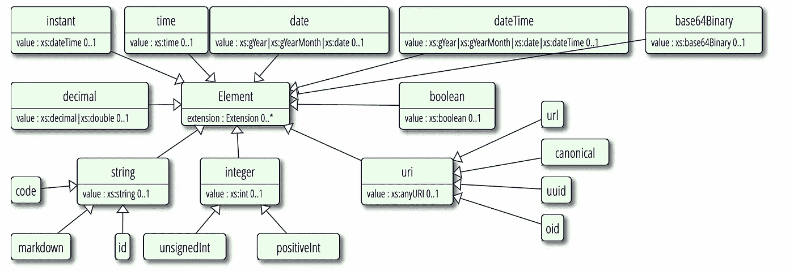
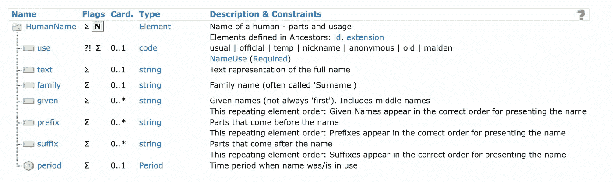
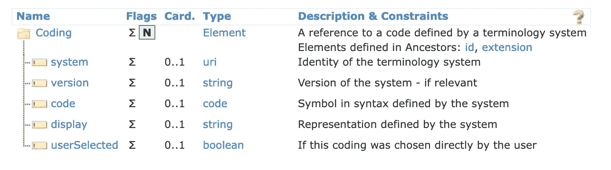
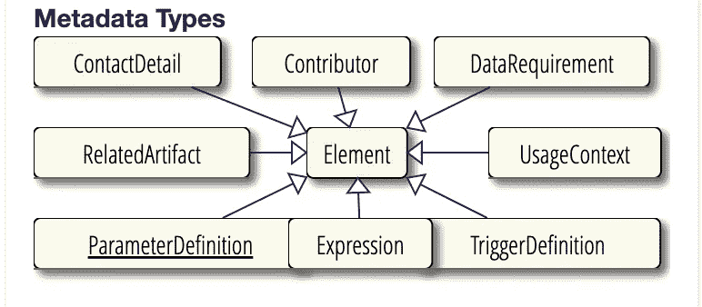
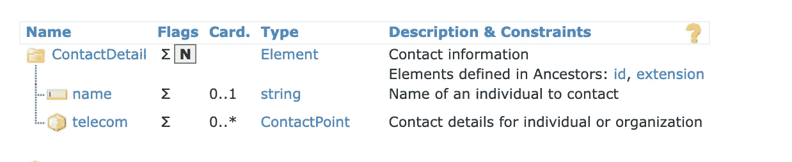
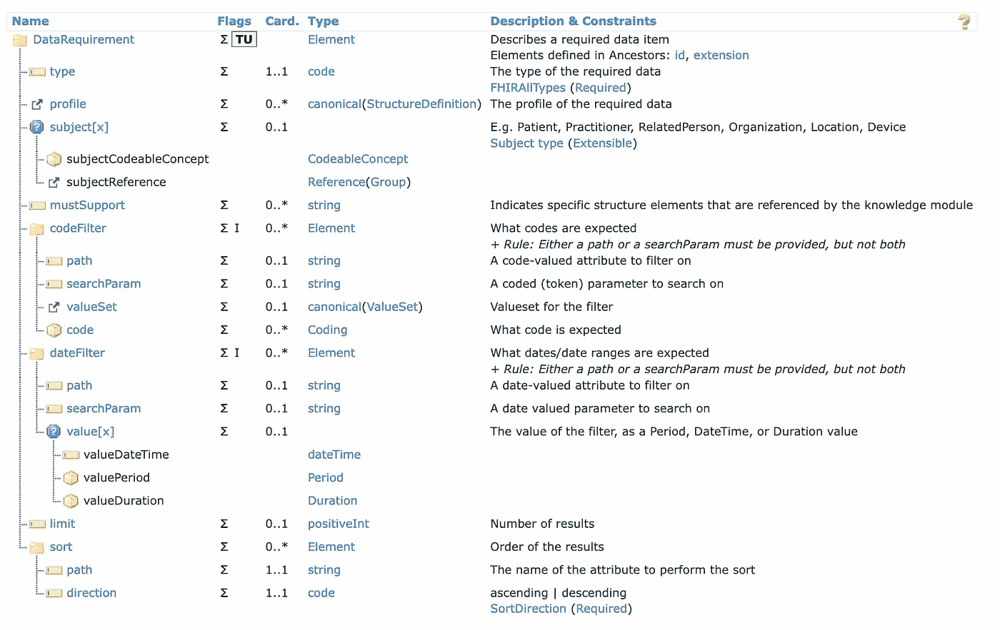
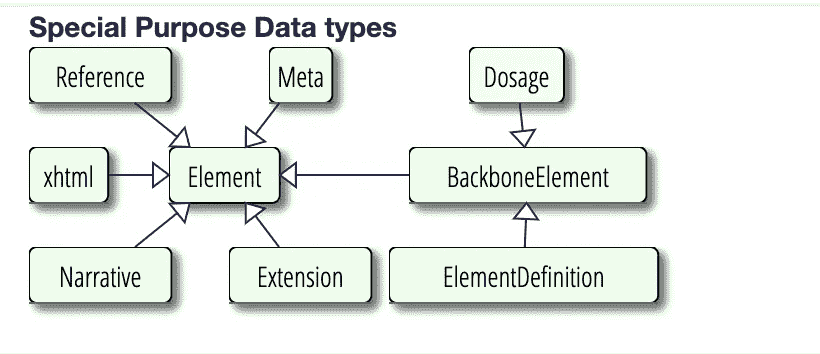
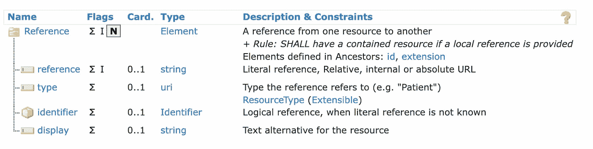
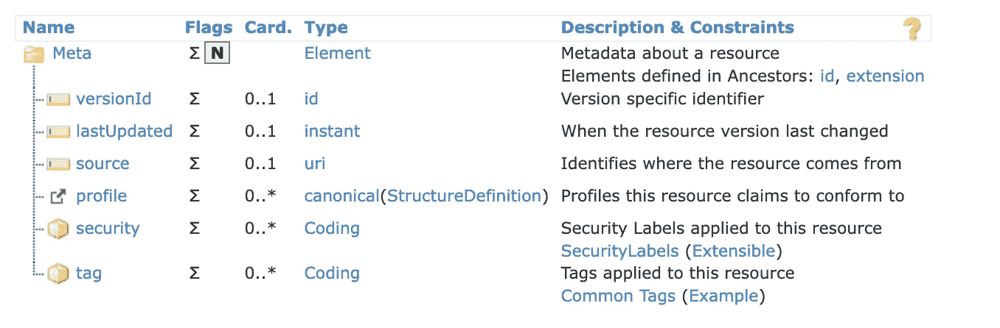

# 面向开发人员的 FHIR:第 4 部分

> 原文：<https://medium.com/nerd-for-tech/fhir-for-developers-part-4-f1f45d232579?source=collection_archive---------1----------------------->

FHIR 中的数据类型

与任何其他语言或规范一样，FHIR 有一组数据类型用于定义资源元素。大多数数据类型与任何其他编程语言都非常相似，但与 FHIR 中定义的这些基本数据类型一起，它们将服务于医疗保健领域中一些特殊而令人兴奋的用例。

本文将深入探讨 FHIR 中的不同数据类型及其背后的用例。

在 FHIR 中，基本上有四类数据类型:

**原始类型**:简单/原始类型，是具有原始值的单个元素。其中包括许多其他编程语言中使用的常见数据类型。下面是一些可用的原始数据类型的例子。

**串串**:“病人做得好”

**布尔**:真/假

**日期**:2019–02–09

**十进制** : 1234.00001

**整数** : 1234

**uri**:https:/medi . info/set**(是！由于在 FHIR 数据集中广泛使用 URI/URL，FHIR 为 URI/URL 提供了单独的数据类型)**

**base64 binary**:bhg 6868 KC 989..**(以二进制存储图像和文档)**

**日期时间**:2013–06–08t 10:57:34+01:00

**瞬间**:2013–06–08t 10:57:34.099+01:00

> 日期时间和瞬间之间的差异是精确的。dateTime 通常用于人类时间，与用于机器时间的 instant 相比，它的精度较低。此外，日期时间的精度是可变的，例如，医生会给你日期时间格式的处方。

原始数据类型

**通用类型:**通用复杂类型，是可重用的元素簇。这些是在规范的不同部分和地方重用的微型结构。通用数据类型的一个很好的例子是人名。

通用数据类型

**在 FHIR 规范中的多个地方使用了 HumanNames** 来定义不同角色的名字，如病人、医生等。

人类名称数据类型

每当我们需要存储遵循某些特定术语的值时，就会使用 CodeableConcept。存储病人的疾病或药物。我们可以使用术语服务器来为我们提供这些值。

可编码概念

> 您可能已经注意到 0..1, 1..1, 0..*上图中。这代表了**基数。简单地说，基数告诉你一个特定的字段可以容纳多少个值。0..1 代表 0 或 1 类似地代表 0..*表示 0 或更多。**

**元数据类型:**一组用于元数据资源的类型。

元数据数据类型

**ContactDetail** :用于存储任何人的联系方式。

'联系人详细信息'

**数据需求:**数据需求结构定义了知识资产的一般数据需求，例如决策支持规则或质量度量。

数据需求

**特殊用途类型**:这些类型是在规范中为某些特定用途而定义的。

特殊用途数据类型

**引用**:一个资源中的许多已定义元素都是对其他资源的引用。引用总是在一个方向上定义和表示——从一个资源(源)到另一个资源(目标)。从目标到源的对应反向关系存在于逻辑意义上，但通常不会在目标资源中明确表示。

参考

**Meta:** 用于表示任何资源的信息。它包括关于资源的信息，如配置文件、版本、标识等。不要将这与元数据数据类型混淆，二者在 FHIR 中有不同的用途。

元

本文包括一些重要的数据类型。FHIR [文档](https://www.hl7.org/fhir/datatypes.html#Coding)中有许多其他数据类型。你可以查看[文档](https://www.hl7.org/fhir/datatypes.html#Coding)了解更多细节。

轻松点说:

如果你喜欢我的作品，请**喜欢并分享**这篇文章(**免费:)**)。还有，做 [**关注**](/@jaideeppahwa1) me 更多这样的文章。

另外，看看我的其他文章:

杰迪普·帕瓦

## 5 分钟技术

[View list](/@jaideeppahwa1/list/5-minutes-tech-c6f26ea4a89c?source=post_page-----f1f45d232579--------------------------------)3 stories

[贾迪普·帕瓦](/@jaideeppahwa1?source=post_page-----f1f45d232579--------------------------------)

## 面向开发人员的 FHIR

[View list](/@jaideeppahwa1/list/fhir-for-developers-ea551cc4840c?source=post_page-----f1f45d232579--------------------------------)9 stories

[贾迪普·帕瓦](/@jaideeppahwa1?source=post_page-----f1f45d232579--------------------------------)

## 自助救助

[View list](/@jaideeppahwa1/list/self-help-942c66816c1d?source=post_page-----f1f45d232579--------------------------------)2 stories

[贾迪普·帕瓦](/@jaideeppahwa1?source=post_page-----f1f45d232579--------------------------------)

## 通用技术公司

[View list](/@jaideeppahwa1/list/general-tech-e702a6db69b5?source=post_page-----f1f45d232579--------------------------------)2 stories