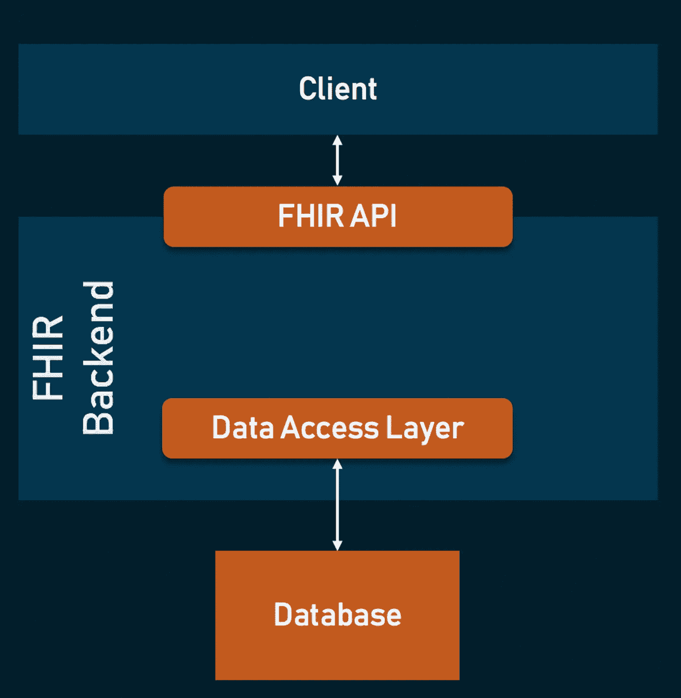
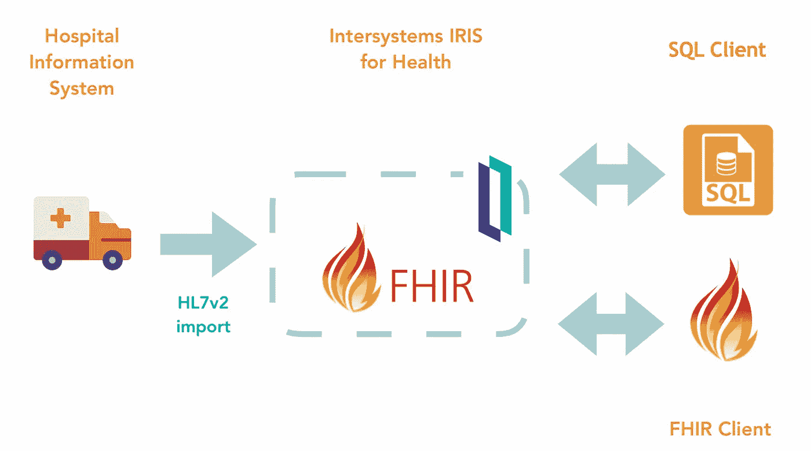

# 面向开发人员的 FHIR:第 5 部分

> 原文：<https://medium.com/nerd-for-tech/fhir-for-developers-part-5-d8f98939ab9f?source=collection_archive---------1----------------------->

## FHIR 服务器

在开发人员系列的 FHIR 的前几部分中，我们已经了解了什么是 FHIR，FHIR 的不同组件，如 FHIR 资源和配置文件、FHIR 交换模块和 Rest APIs，以及不同的 FHIR 数据类型。如果您还没有查看这些，我强烈建议您在进一步阅读 FHIR for Developer 系列之前查看这些。

> [系列介绍](/@jaideeppahwa1/fhir-for-java-developers-series-20ac91ed60b8)
> 
> [FHIR 简介](/@jaideeppahwa1/fhir-for-java-developers-part-1-17fdfc34c437)
> 
> [FHIR 资源和简介](/@jaideeppahwa1/fhir-for-developers-part-2-b52a620f5f99)
> 
> [FHIR 交换模块和 RESTful API](/@jaideeppahwa1/fhir-for-developers-part-3-c88112d7ccb7)
> 
> [FHIR 中的数据类型](/@jaideeppahwa1/fhir-for-developers-part-4-f1f45d232579)

## **FHIR 服务器**

FHIR 是医疗保健数据交换和共享的数据互操作性标准，但 FHIR 本身只是一个标准，并不能让我们开发互操作的应用程序。为了充分发挥 FHIR 的潜力，并使用 FHIR 开发应用程序，我们需要一些使能器，使我们能够使用 FHIR 并与之交互。如果没有使能器，FHIR 就像一种编程语言的文档，没有任何方法来实现或使用这种编程语言。FHIR 服务器是 FHIR 的一个这样的使能器。

FHIR 服务器是卫生数据互操作性的关键工具。FHIR 作为使能器，为使用 FHIR 开发应用程序提供了不同的功能。不同的 FHIR 服务器可能为您提供不同的功能，但基本功能包括:

> FHIR 资源的数据存储。
> 
> 用于与 FHIR 服务器交互的 FHIR Rest API
> 
> 使用配置文件在 POST 上验证 FHIR 资源
> 
> 用于存储在数据存储器中的不同资源的交互的 UI。

1.  **数据存储**:由于 FHIR 为您提供了定制的数据模型/资源，因此实现一个定制的数据存储来存储 FHIR 对象将会变得非常困难。因此，FHIR 服务器提供了 FHIR 数据存储的实现。不同的 FHIR 服务器可以为 FHIR 数据存储提供不同的实现，并且可以使用 SQL 或无 SQL 来实现底层实现。
2.  **FHIR Rest API** : FHIR 规范还定义了与 FHIR 资源交互的 Rest API 规范。我们已经在第三部分中详细讨论了 Rest API。FHIR 服务器提供了这些 FHIR Rest APIs 的实现，以及与底层 FHIR 数据存储交互的标准化方法。
3.  **概要验证**:大多数 FHIR 服务器提供的另一个重要特性是资源的概要验证。他们的资源本身是非常广泛的，我们需要约束这些资源来满足我们的需求，这是通过使用配置文件来实现的。查看[第一部分](/@jaideeppahwa1/fhir-for-developers-part-2-b52a620f5f99)了解更多资料。FHIR 服务器提供了在将 FHIR 资源添加到数据存储之前对其进行验证的功能。这样，我们可以确保每个 FHIR 资源都符合给定的配置文件。
4.  **用于交互的 UI:**大多数 FHIR 服务器还附带了一个简单的 UI，用于 FHIR 资源和 API 的轻松交互。这个 UI 提供了一种更好的方式来运行 FHIR APIS 和资源并与之交互，并在它们发生变化时查看它们。

对于不同的主要云提供商，有不同的 FHIR 服务器可用于开源和专有解决方案。

不同类型的 FHIR 服务器:

开源:这些是 FHIR 服务器的免费解决方案和实现。这些解决方案将为您提供基本功能，您可以基于这些功能开发自己的定制解决方案。这些被认为是使用 FHIR 规范开发自己的应用程序的良好起点。以下是几个例子:

> HAPI FHIR 服务器
> 
> IBM FHIR 服务器

**专有服务器:**与上述开源解决方案不同，这些解决方案不是开源或免费使用的，但作为回报，它们为您提供了比开源解决方案更多的功能，例如在 FHIR 商店上进行分析以生成未来预测的能力。这些对于开发支持 FHIR 规范的高级解决方案非常有用。以下是几个例子:

> 谷歌 FHIR 商店
> 
> Azure FHIR 服务
> 
> AWS FHIR APIs

## 摘要

在本文中，我们已经了解到 FHIR 是一个数据互操作性标准，FHIR 需要使用一些使能器并与之交互。FHIR 服务器是 FHIR 的使能器。FHIR 服务器为我们提供了不同的特性，如数据存储、Rest APIs、配置文件验证和用于交互的 UI。市场上有不同的 FHIR 服务器，既有开源解决方案，如 HAPI 和 IBM FHIR 服务器，也有来自不同云提供商 GCP、Azure、AWS 等的专有解决方案。

说得轻松一点:

如果你喜欢我的作品，请**喜欢并分享**这篇文章(**免费:)**)。还有，做 [**关注**](/@jaideeppahwa1) me 更多这样的文章。

另外，看看我的其他文章:

[贾迪普·帕瓦](/@jaideeppahwa1?source=post_page-----d8f98939ab9f--------------------------------)

## 5 分钟技术

[View list](/@jaideeppahwa1/list/5-minutes-tech-c6f26ea4a89c?source=post_page-----d8f98939ab9f--------------------------------)3 stories

[贾迪普·帕瓦](/@jaideeppahwa1?source=post_page-----d8f98939ab9f--------------------------------)

## 面向开发人员的 FHIR

[View list](/@jaideeppahwa1/list/fhir-for-developers-ea551cc4840c?source=post_page-----d8f98939ab9f--------------------------------)9 stories

[贾迪普·帕瓦](/@jaideeppahwa1?source=post_page-----d8f98939ab9f--------------------------------)

## 自助救助

[View list](/@jaideeppahwa1/list/self-help-942c66816c1d?source=post_page-----d8f98939ab9f--------------------------------)2 stories

[杰迪普·帕瓦](/@jaideeppahwa1?source=post_page-----d8f98939ab9f--------------------------------)

## 通用技术公司

[View list](/@jaideeppahwa1/list/general-tech-e702a6db69b5?source=post_page-----d8f98939ab9f--------------------------------)2 stories