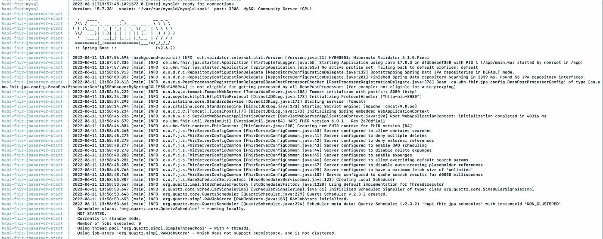
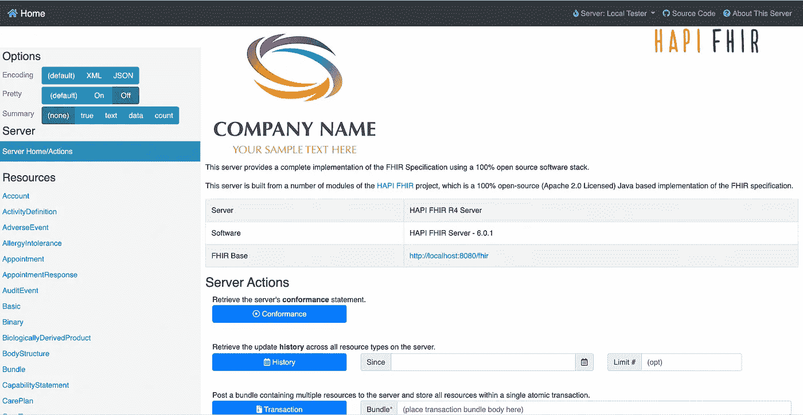

# 面向开发人员的 FHIR:第 6 部分

> 原文：<https://medium.com/nerd-for-tech/fhir-for-developers-part-6-969d9376df10?source=collection_archive---------1----------------------->

设置 HAPI FHIR 服务器

在开发人员系列的 FHIR 的前几部分中，我们已经了解了什么是 FHIR 服务器。我们还检查了可供我们使用的不同类型的 FHIR 服务器。总之，FHIR 服务器是卫生数据互操作性的关键工具。FHIR 作为使能器，为使用 FHIR 开发应用程序提供了不同的功能。不同类型的 FHIR 服务器有开源 FHIR 服务器和专有服务器。

Open FHIR 是一个免费使用的 FHIR 服务器解决方案和实现。这些解决方案将为您提供基本功能，您可以基于这些功能开发自己的定制解决方案。在现有的开源 FHIR 服务器中，HAPI FHIR 服务器是最著名的。在这篇文章的后面，我们将更深入地研究 HAPI FHIR 服务器，以及如何在你的机器上设置你自己的 HAPI FHIR 服务器。

# HAPI FHIR 服务器

HAPI FHIR 服务器是一个开源的 FHIR 服务器。HAPI FHIR 是针对医疗保健互操作性的 HL7 FHIR 标准的完整 Java 实现。HAPI 是一个开放的社区，在商业友好的 Apache 软件许可证 2.0 下开发软件。HAPI FHIR 是 Smile CDR 的产品。HAPI FHIR 服务器将为您提供您在任何专有 FHIR 服务器中可能获得的大多数功能，作为一个开源服务器意味着您可以免费使用 HAPI FHIR 服务器。这使得 HAPI FHIR 服务器成为您自己的 FHIR 实施的较好选择之一。

# 设置 HAPI FHIR 服务器

如果你按照给定的步骤，建立我们自己的 FHIR 服务器是一个简单的过程。有几种方法可以建立我们自己的 FHIR 服务器:

## 使用 Docker:

这是建立你自己的 FHIR 服务器的最简单的方法之一。

1.  在继续使用 docker 设置 HAPI FHIR 服务器的主要要求之前，第一步是在您的机器上安装 Docker Desktop/ Docker。安装 Docker 的步骤可以查看[这里](https://docs.docker.com/engine/install/)。
2.  安装 Docker 后，您需要从 [HAPI FHIR git repo](https://github.com/hapifhir/hapi-fhir-jpaserver-starter) 中克隆 HAPI FHIR 服务器的代码。
3.  克隆 HAPI FHIR repo 后，导航到您本地的 HAPI FHIR 文件夹。运行以下命令:

> 码头工人排版

这将下载哈比神 FHIR 服务器可能需要运行的所有依赖项，而不会用 JAVA 和 MySQL DB 之类的不必要的东西来扰乱你的系统。仅供参考，这可能需要一段时间才能完全建立，所以喝杯咖啡，或者你可以看看我的其他文章:)直到那时。

docker 映像下载并成功运行后，请记录日志。可能如下所示

它的日志看起来就像上面的一样，映像运行正常(你可以在 docker 桌面上检查这一点)意味着你的 HAPI FHIR 服务器已经启动并正在运行，可以在 [**访问 http://localhost:8080/**](http://localhost:8080/)**。**

恭喜你！！！

## 将 HAPI FHIR 服务器作为 JAVA 应用程序运行

如果你在你的机器上安装 Docker 时遇到一些问题，还有一种方法可以在你的机器上安装 HAPI FHIR 服务器。

1.  在执行这些步骤之前，您需要在您的机器上安装 JAVA 11 或更高版本。
2.  你还需要在你的机器上安装 maven。
3.  一旦安装了必备组件，您将需要使用以下命令来构建项目:

> mvn 全新安装

4.构建成功后，您可以使用

> mvn 码头:运行

这将运行您自己的 FHIR 服务器，您将获得与上面类似的日志，您可以在[**http://localhost:8080/**](http://localhost:8080/)**访问服务器。**

## 公共 HAPI FHIR 服务器

我们已经看到了安装 HAPI FHIR 服务器的几种方法。但是如果你仍然不能启动你自己的 FHIR 服务器，那就太不幸了！！！但是你不用担心，你仍然可以使用 FHIR 服务器。

HAPI FHIR 服务器确实提供了一个公共的 FHIR 服务器，你可以在那里试一试。你可以从[这里](http://hapi.fhir.org/)访问公共的 FHIR 服务器。在访问公共 FHIR 服务器之前，你可能需要注意一些事情。

1.  这是一个公共 FHIR 服务器，因此您不应该在此服务器上存储生产 FHIR 数据。
2.  这是一个公共的 FHIR 服务器，所以数据会定期清除，不保证数据的一致性。

摘要

在这篇文章中，我们研究了建立自己的 HAPI FHIR 服务器和公共 FHIR 服务器的不同方法。这将使您能够在 FHIR 服务器上执行操作，并与 **FHIR for Developers** 系列一起学习 FHIR。

如果你喜欢我的作品，请**喜欢并分享**这篇文章(**免费:)**)。还有，做 [**关注**](/@jaideeppahwa1) me 更多这样的文章。

另外，看看我的其他文章:

[贾迪普·帕瓦](/@jaideeppahwa1?source=post_page-----969d9376df10--------------------------------)

## 5 分钟技术

[View list](/@jaideeppahwa1/list/5-minutes-tech-c6f26ea4a89c?source=post_page-----969d9376df10--------------------------------)3 stories

[贾迪普·帕瓦](/@jaideeppahwa1?source=post_page-----969d9376df10--------------------------------)

## 面向开发人员的 FHIR

[View list](/@jaideeppahwa1/list/fhir-for-developers-ea551cc4840c?source=post_page-----969d9376df10--------------------------------)9 stories

[贾迪普·帕瓦](/@jaideeppahwa1?source=post_page-----969d9376df10--------------------------------)

## 自助救助

[View list](/@jaideeppahwa1/list/self-help-942c66816c1d?source=post_page-----969d9376df10--------------------------------)2 stories

[贾迪普·帕瓦](/@jaideeppahwa1?source=post_page-----969d9376df10--------------------------------)

## 通用技术公司

[View list](/@jaideeppahwa1/list/general-tech-e702a6db69b5?source=post_page-----969d9376df10--------------------------------)2 stories