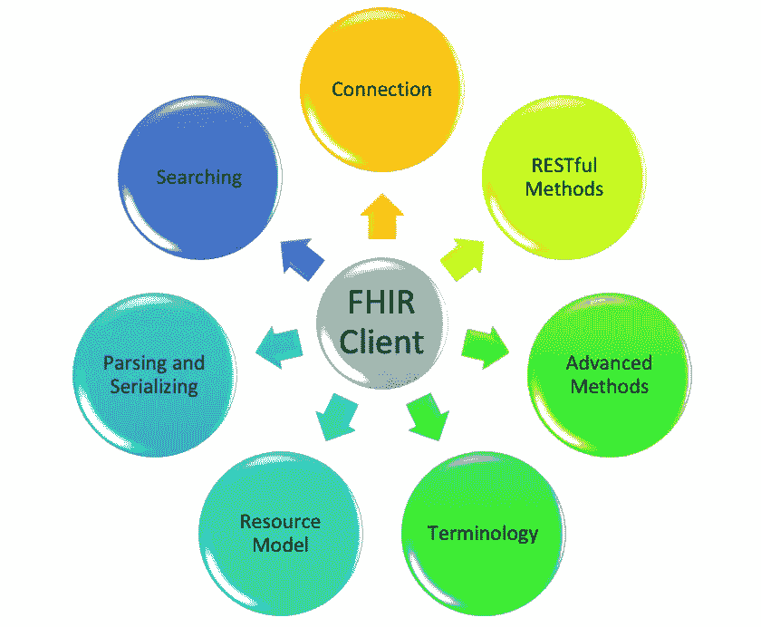
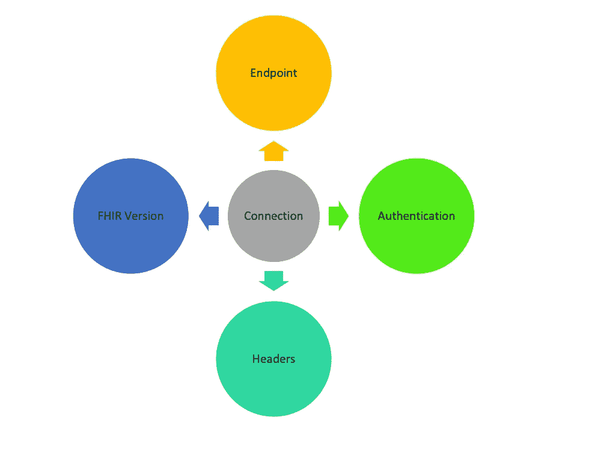
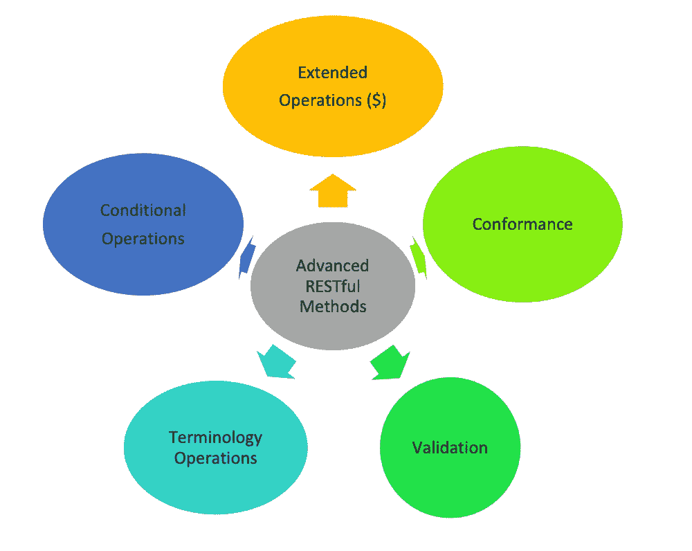
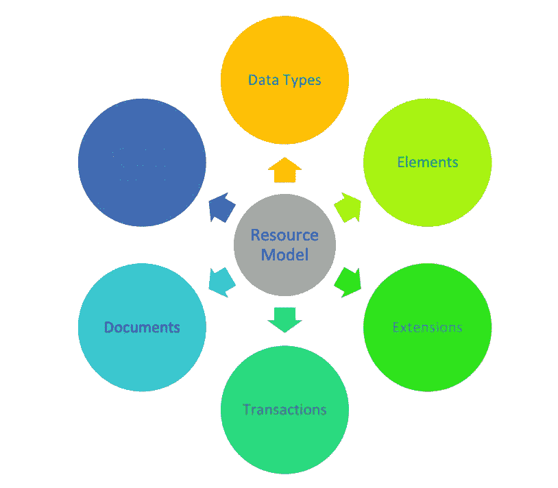

# 面向开发人员的 FHIR:第 7 部分

> 原文：<https://medium.com/nerd-for-tech/fhir-for-developers-part-7-7ae3ae38b44e?source=collection_archive---------3----------------------->

FHIR 客户端和 FHIR 客户端的主要功能

到目前为止，我们已经研究了 FHIR 的许多特性，从 FHIR 资源到 FHIR 配置文件，从 FHIR 数据类型到 FHIR 服务器，如果你还没有认真检查的话！！你还在等什么？我整理了一份可以在这里 查看的所有文章的列表 [**。现在回到主题，在本系列的最后一部分，我们已经检查了 FHIR 服务器，并建立了自己的 HAPI FHIR 服务器。如果您成功地设置了 HAPI FHIR 服务器(即使您无法设置，您也可以在此之前使用公共的 HAPI FHIR 服务器)，下一步将是与 FHIR 服务器进行交互，并使用 FHIR 服务器构建您的应用程序。**](/@jaideeppahwa1/list/fhir-for-developers-ea551cc4840c)

FHIR 客户端在与 FHIR 服务器交互时扮演着重要的角色。换句话说，如果 FHIR 服务器是使用 FHIR 规范的使能器，那么 FHIR 客户端就是使用 FHIR 服务器的使能器。在本文的后面，我们将更深入地研究 FHIR 客户端。

# FHIR 客户端

正如我们已经讨论过的，FHIR 客户端是在使用 FHIR 服务器时的使能器。虽然 FHIR 规范本身是完整的，因为它定义了资源、数据类型、配置文件、HTTP 请求等。因此，我们可以直接与 FHIR 服务器进行工作和交互，而无需将 FHIR 客户端带入画面中。但实际上，这将非常困难，而且可能不是最佳选择。我们需要注意与 FHIR 对象的交互、FHIR 对象的验证、HTTP 请求的授权等等。所有这些交叉操作都是必要的，但在 FHIR 规范的实际开发中造成了困难。这就是他们的客户来拯救我们的地方。

FHIR 客户端

FHIR 客户端位于 FHIR 服务器和应用程序之间，使开发人员能够轻松地与 FHIR 服务器进行交互，并专注于实际开发。FHIR 客户端不仅仅局限于与 FHIR 服务器交互，它还提供验证、授权、版本控制等功能。这不仅让开发人员在使用 FHIR 时更加轻松，还能帮助他们更高效地工作，创建更可靠、更稳定的 FHIR 应用。此外，我们将研究 FHIR 客户端的不同特性。

# FHIR 客户端的功能

FHIR 客户端为我们提供了许多功能，有助于我们开发 FHIR 应用程序。并非所有 FHIR 客户端都具备所有这些功能，但我们正在整理所有这些功能，以便您了解这些功能确实存在，并且可以在需要时实施。

## 以下是一些重要的功能:

*   **连接**:这是开发任何 FHIR 应用的第一步，将它连接到 FHIR 服务器。此功能有四部分组成**端点**、**认证**、**报头、**和**版本**。该连接可能是也可能不是 FHIR 版本(STU2、STU3、R4)专用的。FHIR 客户端将把一个基础端点(查看本系列的第 3 部分)带到 FHIR 服务器，这将有助于轻松地与 FHIR 服务器进行交互。不同的方法(基本、不记名令牌等。)也是内置的，用户可以根据需求提供输入。FHIR 客户端还允许用户选择要使用的 FHIR 版本。

FHIR 客户端:连接

*   **RESTful 方法:**创建连接后，现在有时间使用连接并在 FHIR 服务器上执行操作。FHIR 客户端提供了在 FHIR 服务器上执行不同 CRUD 操作的内置方法。用户只需要调用内置的方法来执行创建、读取、更新和删除等操作。当我们调用 execute 方法时，客户端将在内部创建 API 并调用。
*   **高级 Restful 方法:** FHIR 客户端支持执行高级 RESTful 操作。包括**一致性**、**验证**、**术语**、**操作**、**条件**、**操作、**等操作。**一致性操作**允许 FHIR 客户端第一次调用 FHIR 服务器，这将告诉您的 FHIR 服务器支持哪些操作，以及是否有任何特定的配置文件处于活动状态。**扩展操作**是特定于实例的操作，这些操作包括 operation _history 以获取资源的历史记录，$everything 以获取特定患者的所有相关资源。**术语操作**除了一般的 get 和 search 操作之外，还包括术语(词汇)服务特定的操作，这些操作包括类似于 **$validate-code** (验证给定代码)**、$expand** (获取概念的过滤列表)**、$lookup** (获取特定代码的细节)的操作。**验证**包括对照 FHIR 档案验证 FHIR 资源。许多 FHIR 服务器包括当 FHIR 对象与配置文件冲突时的验证操作，FHIR 客户端允许在发布资源之前验证这些资源，这扭转了时间和服务器负载。

FHIR 客户端:高级 Restful 方法

*   **资源模型**:这是 FHIR 客户端最重要的特性之一，因为对于 FHIR 客户端的其他特性，即使不使用 FHIR 客户端，我们也有办法实现(虽然不推荐)，但是没有办法。为了与 FHIR 资源进行交互，针对这些资源拥有各自的模型是很重要的，FHIR 客户端提供了这些资源模型，通过这些模型，我们可以在任何语言的本地环境中轻松地与 FHIR 资源进行交互。FHIR Resouces 模型是以这样一种方式实现的，即我们可以很容易地实现像资源引用这样的特性，而没有工作区的麻烦。资源还通过定义的枚举来维护元素的一致性和值的有效性。

FHIR 客户端:资源模型

*   **解析和序列化**:解析是将有效字符串转换成 FHIR 对象的过程，序列化是将 FHIR 对象转换成字符串形式的过程。当我们想用 FHIR 做一些跨平台的实现，并且 FHIR 可能不是本地支持的时候，这些操作变得非常方便和有用。默认设置可能会产生错误，或者可能无法使用 FHIR 客户端库中的 FHIR 资源，并且可能会产生错误，这就是为什么每个 FHIR 客户端都附带了内置的序列化程序和解析器来解决这个问题。

FHIR 客户端:解析

FHIR 客户端序列化

*   **搜索:**这是你可能在 FHIR 服务器上执行的最重要、最频繁的操作。不是每个组织都有自己的 FHIR 服务器，他们也不需要有，所以他们不需要像搜索操作那样频繁地执行其他操作。假设一家医院在工作和存储数据的方式上完全符合 FHIR 规范，并且有一个使用该系统的系统。当病人来医院检查时，医院要做的第一件事就是连接普通病历并**搜索**病人的记录。FHIR 本身支持非常强大的搜索操作。FHIR 客户端只是让这些搜索操作更简单、更快速、更高效。**区间搜索(base URL:/[Compartment class]/[id]/[resource class])**将用于搜索特殊的资源集。**包含资源**将允许在单个搜索调用中获取多个相关资源。例如:用药请求和参考患者(**【基本】/用药请求？_include=MedicationRequest:患者**。

# 摘要

在本文中，我们研究了什么是 FHIR 客户端。然后，我们深入了解了 FHIR 客户端的重要特性。总之，FHIR 客户端是使用 FHIR 服务器的使能器，帮助 FHIR 开发者轻松集成 FHIR 服务器。这不仅使 FHIR 开发者的生活变得容易，也帮助他们有效地开发 FHIR 应用。

说得轻松一点:

如果你喜欢我的作品，请**喜欢并分享**这篇文章(而且是免费的:)。还有，做 [**关注**](/@jaideeppahwa1) me 更多这样的文章。

另外，请查看我的完整 FHIR 开发者系列:

[贾迪普·帕瓦](/@jaideeppahwa1?source=post_page-----7ae3ae38b44e--------------------------------)

## 面向开发人员的 FHIR

[View list](/@jaideeppahwa1/list/fhir-for-developers-ea551cc4840c?source=post_page-----7ae3ae38b44e--------------------------------)9 stories