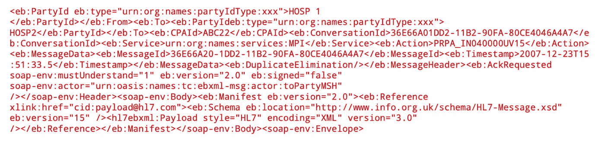
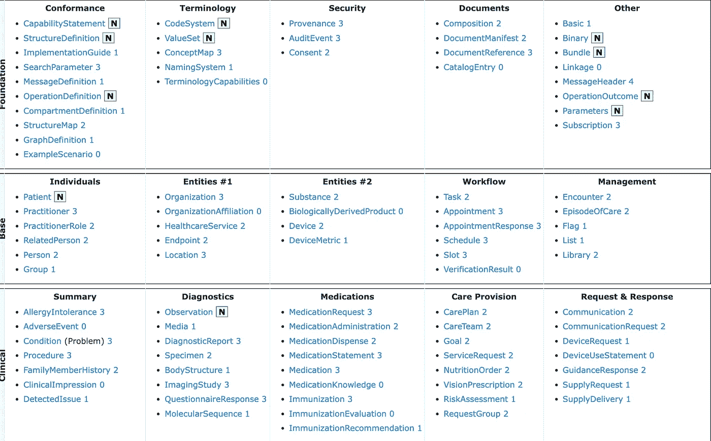

# 面向开发人员的 FHIR:第 1 部分

> 原文：<https://medium.com/nerd-for-tech/fhir-for-java-developers-part-1-17fdfc34c437?source=collection_archive---------1----------------------->

## **FHIR 简介**

FHIR(快速医疗保健互操作性资源)数据互操作性标准和规范，旨在交换医疗保健数据。在数字化时代，数据共享以及保持标准和互操作性的完整性变得越来越重要。

# 历史:

在 21 世纪初，存储和共享数据的简单任务是一项艰巨的任务。这个故事也是真实的医疗保健数据。在 FHIR 之前，HL7v2 和 HL7v3 是用于医疗保健的标准。HL7v2 是 HL7 开发的最初标准之一，但是它的信息过于密集和复杂的特性导致了一个新标准 HL7v3 的开发。虽然 HL7v3 是一个伟大的努力，并有许多整洁的功能，但它从未起飞，因为它无法跟上当时的技术。在 v2 和 v3 中，基础技术是实现任何互操作性的障碍。FHIR 是对这些旧技术的回应，以满足现代对数据和互操作性的需求。

HL7v2 消息

HL7v3 消息

> **FHIR 中的**Fast 并不代表数据在系统间传输的速度有多快，而是表示任何人学习和采用 FHIR 标准的速度和难易程度。

# 人力资源

资源是 FHIR 标准的基本构件。它基本上是从 HTTP 规范中挑选出来的，HTTP 规范基本上定义了一切和可寻址的资源。FHIR 基本上将健康记录定义为资源的集合。例如，健康记录可以存储患者的状况信息，在 FHIR 中，这可以存储为状况和患者资源。每种资源都可以用不同的形式表示，比如 XML 和 JSON。

FHIR 中的每个资源背后都有一些叙述和用例。FHIR 中的叙述可能代表一种情况、一些参与者和其他与医疗保健相关的实体。FHIR 首先定义了各种各样的资源。HL7 提供了非常棒的[文档](https://www.hl7.org/fhir/resourcelist.html)。

FHIR 资源列表

患者资源

# 80:20 法则

正如我们所讨论的，FHIR 提供的资源是 FHIR 的组成部分，Fhir 资源中的每个资源背后都有一些叙述。

**为什么选择这些资源？**

FHIR 规范仅涵盖了全球 80%系统的需求

FHIR 提供了扩展来覆盖这样的用例。

例如:患者的**眼睛颜色**可能为 20%,因为 80%的系统可能不要求患者提供他们的眼睛颜色，而患者的**姓名/地址**将低于 80 %,并且由 FHIR 本地支持。

如果你喜欢我的作品，请**喜欢并分享**这篇文章(**免费:)**)。还有，做 [**关注**](/@jaideeppahwa1) me 更多这样的文章。

另外，看看我的其他文章:

[贾迪普·帕瓦](/@jaideeppahwa1?source=post_page-----17fdfc34c437--------------------------------)

## 5 分钟技术

[View list](/@jaideeppahwa1/list/5-minutes-tech-c6f26ea4a89c?source=post_page-----17fdfc34c437--------------------------------)3 stories

[贾迪普·帕瓦](/@jaideeppahwa1?source=post_page-----17fdfc34c437--------------------------------)

## 面向开发人员的 FHIR

[View list](/@jaideeppahwa1/list/fhir-for-developers-ea551cc4840c?source=post_page-----17fdfc34c437--------------------------------)9 stories

[贾迪普·帕瓦](/@jaideeppahwa1?source=post_page-----17fdfc34c437--------------------------------)

## 自助救助

[View list](/@jaideeppahwa1/list/self-help-942c66816c1d?source=post_page-----17fdfc34c437--------------------------------)2 stories

[贾迪普·帕瓦](/@jaideeppahwa1?source=post_page-----17fdfc34c437--------------------------------)

## 通用技术公司

[View list](/@jaideeppahwa1/list/general-tech-e702a6db69b5?source=post_page-----17fdfc34c437--------------------------------)2 stories