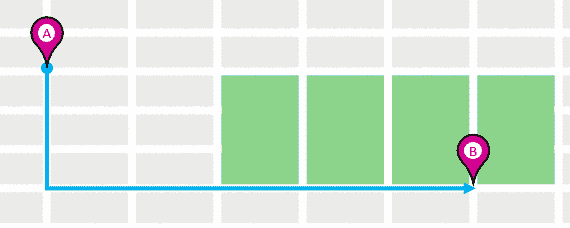
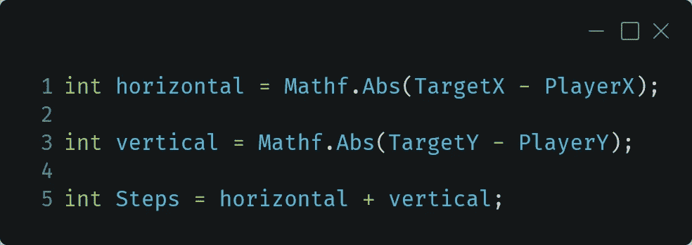
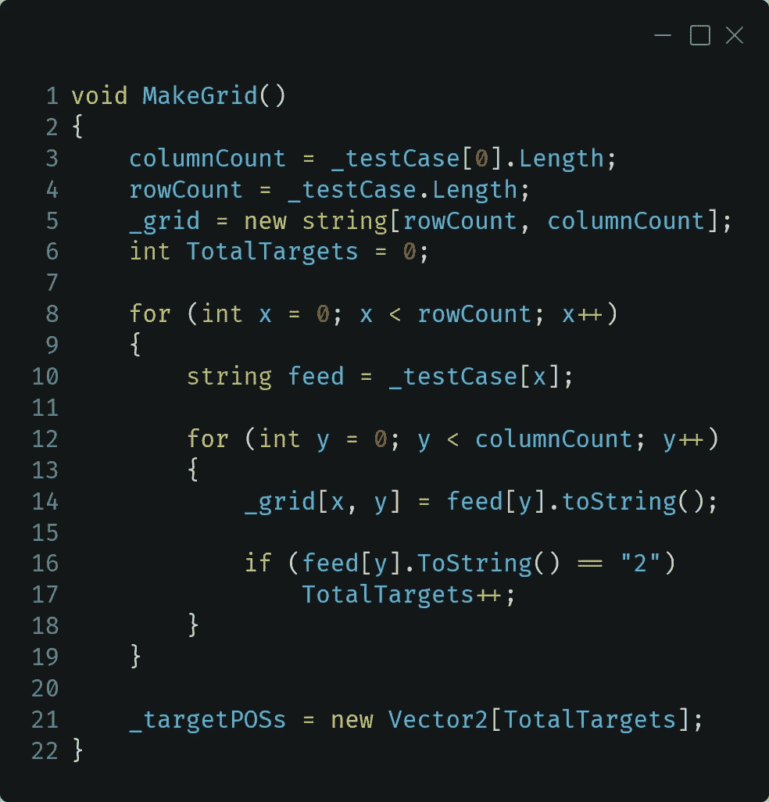
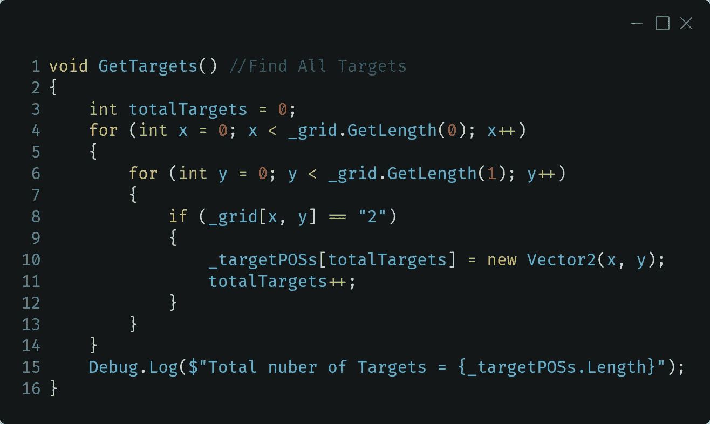
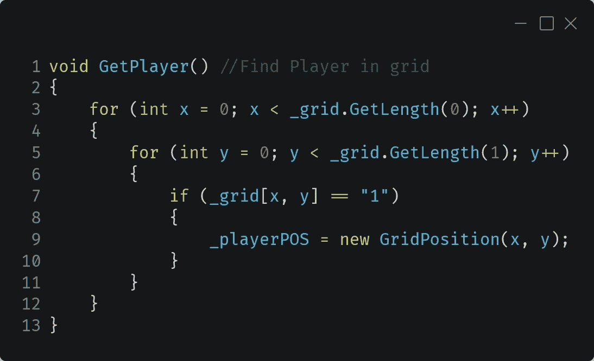
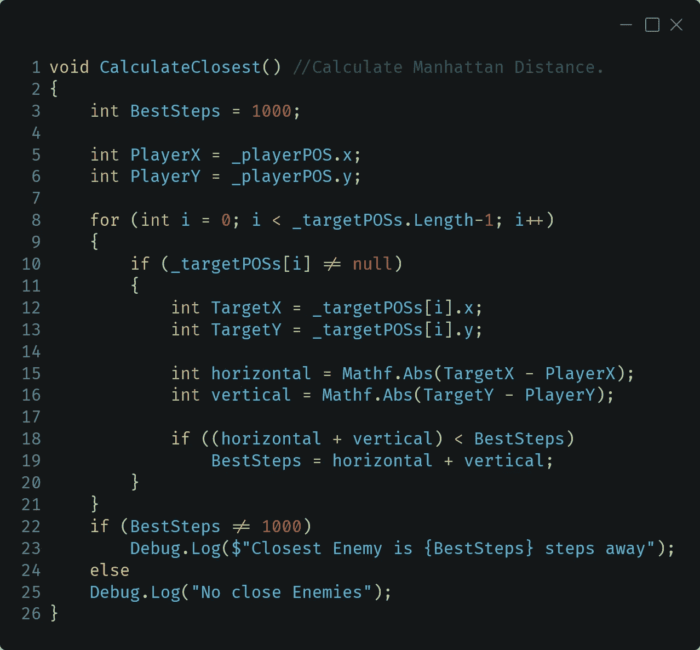
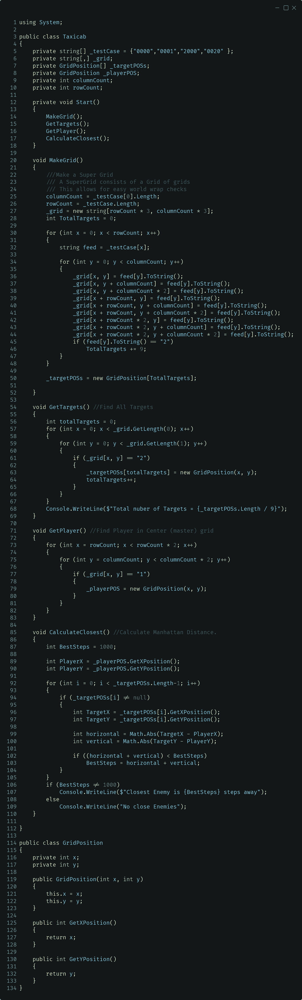

# 计算网格上的步骤

> 原文：<https://medium.com/nerd-for-tech/figuring-out-steps-on-a-grid-927c1c42bda6?source=collection_archive---------10----------------------->

当和一个学生一起复习时，我们遇到了一个难题，这个难题把他们难住了。

我们花了几分钟解开这个问题，但我很快就看出这是“出租车出租车”的问题(又名曼哈顿距离)。

出租车问题可以归结为“一辆出租车从 A 点到 B 点要经过多少个街区？”这是一个经典的距离问题。通常，在编码中，我们计算两点之间的直线距离，“直线距离”。但是这对于一辆不能在建筑物中行驶的出租车不起作用，因为它不得不像街道一样贴着格子行驶。那么“最短”路线就变成了几个相等的距离，加起来就是连接两点的直角三角形。正如你在上面的 GIF 中看到的，所有这些不同的路线都等于相同的行驶距离。

那么，我们如何将它分解成代码呢？

计算的核心是水平距离加上垂直距离等于曼哈顿距离。因为我们和不懂的计算机打交道，所以我们确保得到玩家 X 和目标 X 之差的绝对值，对于 Y 坐标也是如此。

至于设置网格，这需要更多的工作。让我们研究一下更简单的非包装版本。

访问字符串的方式与访问数组类似，可以提取单个字符。因此，我们使用矩阵数组长度中的第一项来找出新的二维数组将有多少列。和矩阵的长度来计算我们需要多少行。我们在第 5 行使用它们将 2D 数组初始化为正确的大小。

然后，在一个嵌套的 For 循环中，我们将对 X 行使用一个 Item，并用 Y 循环遍历它的字符以填充列。

因为我们已经循环通过每个字符，将它插入到我们的网格数组中，我们可以利用这个机会来计算网格中有多少敌人的 2。因为我们使用的是 Unity 库，我们可以初始化一个 Vector2s 的数组。如果你没有这个奢侈，你会想要创建一个结构或者类来控制敌人在网格中的位置。(我将在下面贴出我全部代码和修订版。)

至于那些目标，现在是时候获取它们的位置并存储它们以供以后检查。我们以前不能这样做，因为我们需要敌人的总数来初始化阵列。优化的一个选择是使用列表。

需要注意的一点是，当使用多维数组(比如 2D 数组)时，您需要使用 GetLength(x)来查找特定轴的长度。

我们使用了一个类似的方法来追踪玩家的位置。

现在来完整地实现一下计算曼哈顿距离的数学方法。

首先，我们需要设置一个大到不合理的数字作为我们的“最佳解决方案”。由于我们只有一个玩家，我们现在也可以为干净的代码分配他们的 X/Y。

然后我们可以循环我们发现了哪些敌人，并计算他们离玩家的距离。接下来，我们将组合距离与当前最佳距离进行比较。如果更好，我们将其分配到最佳步骤。

一旦我们完成了所有的敌人，我们检查最好的是否比之前的“太大”的数字更好。这让我们在没有敌人的情况下处理案件。

我发现如何快速简单地检查换行，是创建一个超级网格，而不是默认网格。超级网格是由九个较小的网格拼接而成的网格。然后当我们找到玩家时，我们只搜索中心网格。正如所承诺的，不使用 Unity 库检查包装网格的完整代码。

