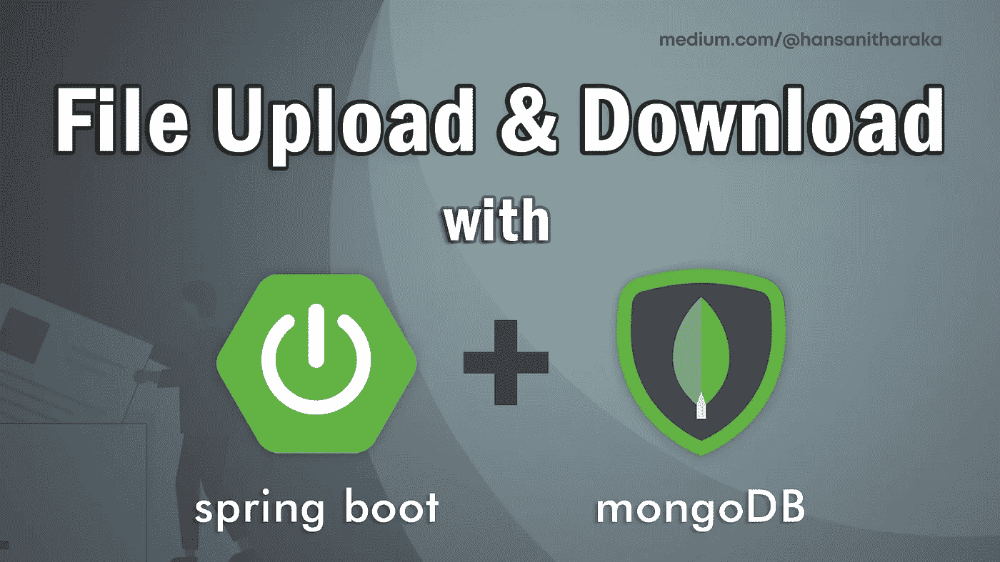
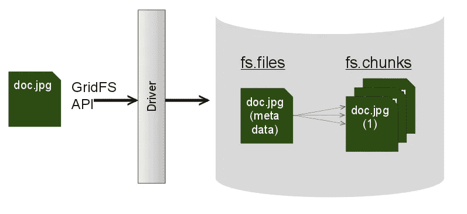
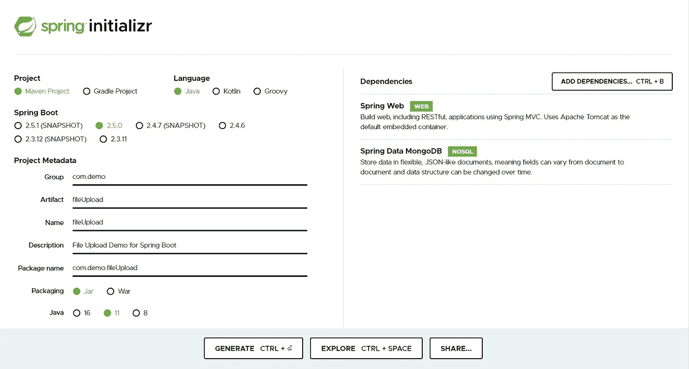
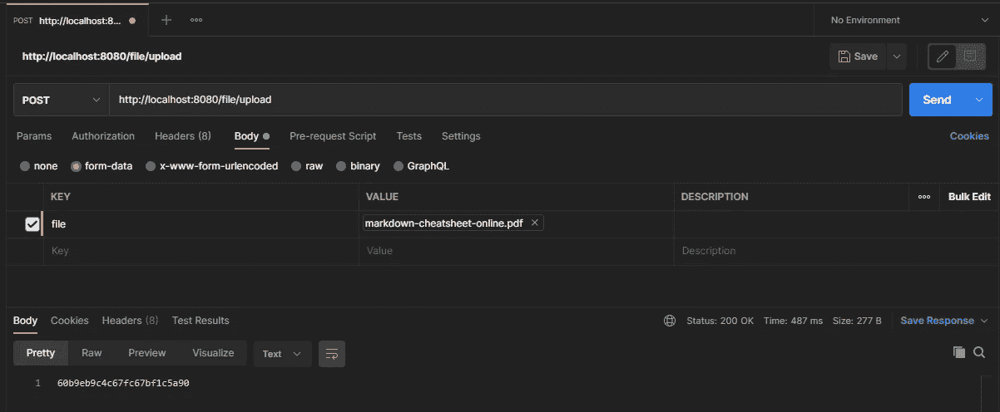
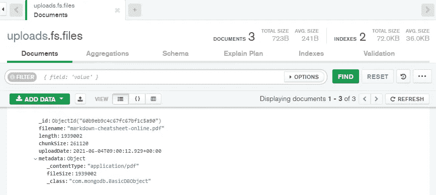
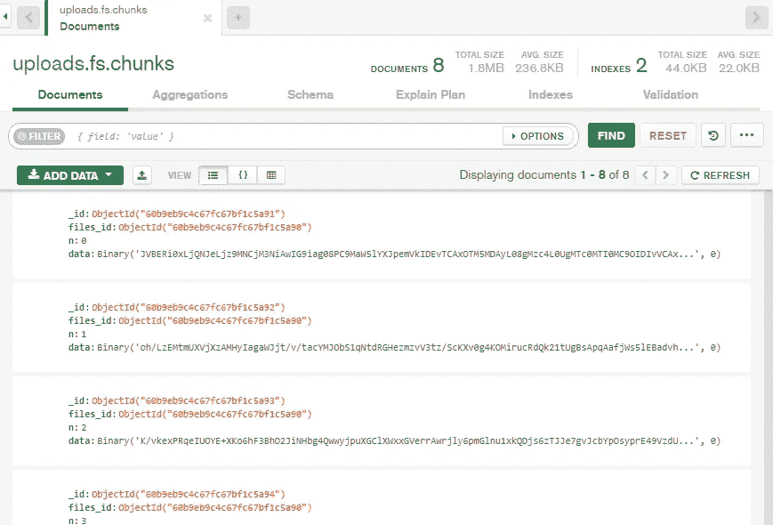
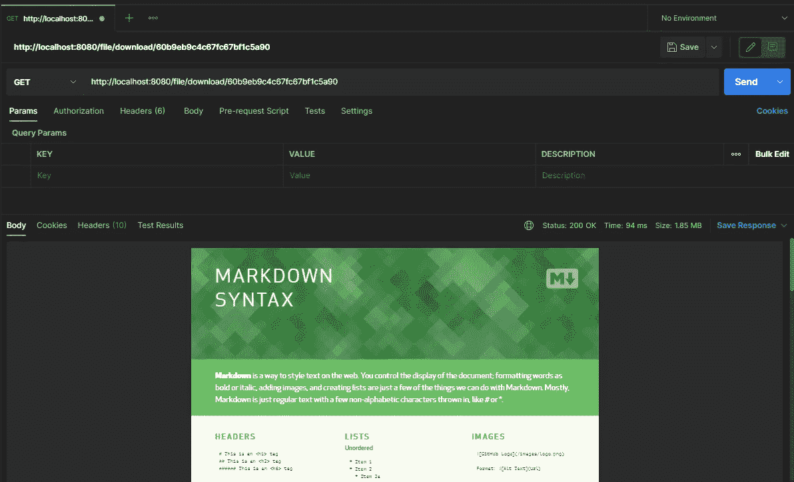

# 使用 SpringBoot 和 MongoDB 上传/下载文件

> 原文：<https://medium.com/nerd-for-tech/file-upload-with-springboot-and-mongodb-76a8f5b9f75d?source=collection_archive---------0----------------------->



在本文中，我们将使用 SpringBoot 和 MongoDB 创建一个简单的 RESTful web 服务。我们将使用 GridFS 来存储文件。

# 什么是 GridFS？

> GridFS 是一种用于存储和检索超过 BSON 文档大小限制(16MB)的文件的规范。(来源: [MongoDB 手册](https://docs.mongodb.com/manual/core/gridfs/))

GridFS 将文件分成称为**块**的小部分，并将它们存储为单独的文档。块的默认大小是 255KB。

GridFS 使用两个集合来存储文件。

*   **fs.files** -存储文件的元数据。
*   **fs . chunks**——存储文件的二进制块。



[grid fs 如何工作](https://www.mongodb.com/blog/post/building-mongodb-applications-binary-files-using-gridfs-part-2)

我们将从创建用于上传和下载的 REST APIs 开始，并使用 Postman 测试它们。好吧！我们开始吧。

# 1.创建项目

访问[https://start . Spring . io](https://start.spring.io/)通过 Spring Initializr 使用以下依赖项生成应用。这将下载一个 zip 文件，您需要在 IDE 中提取并打开该文件。



# 2.Spring Boot 房产

必须在“resources”文件夹的 **application.properties** 文件中提供以下配置。

以下是 MongoDB 属性:

```
spring.data.mongodb.port = 27017
spring.data.mongodb.host = localhost
spring.data.mongodb.database = uploads

server.port=8080
```

> *服务的默认端口是 8080。如果您愿意，可以更改端口。如果有的话，你也可以添加认证。*

也可以使用 MongoDB Atlas，而不是在 localhost 上运行 MongoDB。在应用程序中使用下列属性。

> 将 **< passsword >** 替换为管理员密码，将 **< database >** 替换为数据库名称。

```
spring.data.mongodb.uri=mongodb+srv://admin:**<password>**@cluster0.eypdh.mongodb.net/**<database>**?retryWrites=true&w=majority
```

此外，应该添加以下属性以允许文件上载。

```
spring.servlet.multipart.enabled = true
spring.servlet.multipart.max-file-size = 200MB
spring.servlet.multipart.max-request-size = 200MB
```

# 3.定义类别

注意，我们在这里没有定义文档类，因为我们将只上传一个文件，它将直接存储在 GridFS 集合中。

下面的类将用于在下载文件时返回必要的响应。

# 4.创建服务类

这个服务类包含从 GridFS 中存储和检索文件的服务。

## 存储文件

*   **addFile()** 方法将文件存储在数据库中并返回文件的对象 ID。
*   您可以将额外的信息作为元数据添加到文件中。例如，我添加了文件大小作为附加信息。但这不是必须的。
*   要存储该文件，您需要将以下数据传递给 GridFsTemplate 中的 store 方法。

```
template.store(Inputstream content, filename, ContentType, metadata)
```

## 检索文件

*   **downloadFile()** 方法用于从数据库中返回一个特定的文件。
*   **GridFSTemplate 中的 findOne** 方法将返回与查询匹配的文件。
*   然后，我们将响应及其内容设置为步骤 1 中创建的 LoadFile 类中的一个对象，并返回它。
*   我们需要将文件设置为一个字节数组。为了将 InputStream 转换成一个字节数组，我们使用了 [Apache Commons IO](http://commons.apache.org/proper/commons-io/) 。
*   为此，您需要在您的 ***pom.xml*** 文件中添加以下依赖项。

```
<dependency>
   <groupId>commons-io</groupId>
   <artifactId>commons-io</artifactId>
   <version>2.8.0</version>
</dependency>
```

# 5.创建控制器

控制器类由用于上传和下载文件的 REST APIs 组成。

## 邮政

*   为了上传文件，我们使用了 **POST** 方法。
*   **upload()** 方法在这里接受一个多文件类型的对象。

## 得到

*   **GET** 方法将 **{id}** 作为路径参数返回一个特定的文档。
*   通过 **download()** 方法，首先接收 LoadFile 对象，然后将必要的细节映射到响应头，使其可下载。

***注意*** *我们将数据作为 ByteArrayResource 返回。*

# 6.通过邮递员测试 REST 端点

一旦运行了应用程序，就可以在`[http://localhost:8080](http://localhost:8080)`访问它

## #上传文件



**fs.files** 包含上传文件元数据的集合



上传的文件将被分成几个块并存储在 **fs.chunks** 集合中

## #下载文件



# 7.开发前端

现在我们已经完成了我们的后端，它工作顺利，让我们添加一个前端。😃

我已经将所有的前端文件包含在了`src/main/resources/static`文件夹中。

## # index.html

## # main.css

让我们添加一些 CSS，让它看起来不那么无聊。😅

## # main.js

为了让一切工作，让我们添加一点 javascript。

# 结论

我在为我的第三年项目开发一个 web 应用程序时遇到了这个话题，当时我正在努力寻找合适的资源。

所以，我希望这篇教程对你有所帮助。😊

还有，你可以从我的 GitHub repo [*这里*](https://github.com/hansitharaka/springboot-mongodb-file-upload-download) 下载这个项目。

查看这些链接以了解更多关于 GridFS 的信息。

*   [https://docs.mongodb.com/manual/core/gridfs](https://docs.mongodb.com/manual/core/gridfs/)
*   [https://www.baeldung.com/spring-data-mongodb-gridfs](https://www.baeldung.com/spring-data-mongodb-gridfs)
*   [https://www.baeldung.com/spring-boot-mongodb-upload-file](https://www.baeldung.com/spring-boot-mongodb-upload-file)

直到下次，继续探索！！！🤓💪