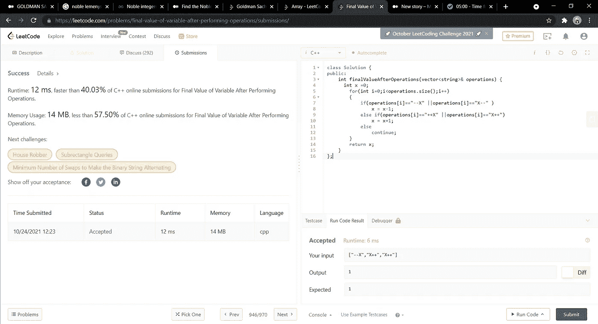

# 执行操作后变量的最终值

> 原文：<https://medium.com/nerd-for-tech/final-value-of-variable-after-performing-operations-1f2e2662a47e?source=collection_archive---------2----------------------->

(LeetCode 易题)


有一种编程语言只有**四个**运算和**一个**变量`X`:

*   `++X`和`X++`将变量`X`的值增加`1`。
*   `--X`和`X--` **将变量`X`的值减去`1`**。

最初，`X`的值是`0`。

给定包含操作列表的字符串数组`operations`，在执行完所有操作后，返回 `X` *的****最终*** *值。***

***例 1:***

```
***Input:** operations = ["--X","X++","X++"]
**Output:** 1
**Explanation:** The operations are performed as follows:
Initially, X = 0.
--X: X is decremented by 1, X =  0 - 1 = -1.
X++: X is incremented by 1, X = -1 + 1 =  0.
X++: X is incremented by 1, X =  0 + 1 =  1.*
```

***例 2:***

```
***Input:** operations = ["++X","++X","X++"]
**Output:** 3
**Explanation:** The operations are performed as follows:
Initially, X = 0.
++X: X is incremented by 1, X = 0 + 1 = 1.
++X: X is incremented by 1, X = 1 + 1 = 2.
X++: X is incremented by 1, X = 2 + 1 = 3.*
```

***例三:***

```
***Input:** operations = ["X++","++X","--X","X--"]
**Output:** 0
**Explanation:** The operations are performed as follows:
Initially, X = 0.
X++: X is incremented by 1, X = 0 + 1 = 1.
++X: X is incremented by 1, X = 1 + 1 = 2.
--X: X is decremented by 1, X = 2 - 1 = 1.
X--: X is decremented by 1, X = 1 - 1 = 0.*
```

***约束:***

*   *`1 <= operations.length <= 100`*
*   *`operations[i]`将是`"++X"`、`"X++"`、`"--X"`或`"X--"`。*

*我在这里使用的方法是最简单的，如果我遇到“++X”或“X++”，我将简单地增加 X 的值，如果我得到，或者`"X--"`我将简单地减少值。万一我遇到其他情况，我会继续下去。*

*代码如下所示:*

```
***class Solution {
public:
    int finalValueAfterOperations(vector<string>& operations) {
      int x =0;
        for(int i=0;i<operations.size();i++)
        {
            if(operations[i]=="--X" ||operations[i]=="X--" )
                x = x-1;
            else if(operations[i]=="++X" ||operations[i]=="X++")
                x = x+1;
            else
                continue;
        }
        return x;
    }
};***
```

***时间复杂度:O(n)***

***空间复杂度:O(1)***

**

*希望这有所帮助！！继续编码，继续学习！！！。💻🙌*

*既然你喜欢看我的博客，为什么不请我喝杯咖啡，支持我的工作呢！！[https://www.buymeacoffee.com/sukanyabharati](https://www.buymeacoffee.com/sukanyabharati)☕*