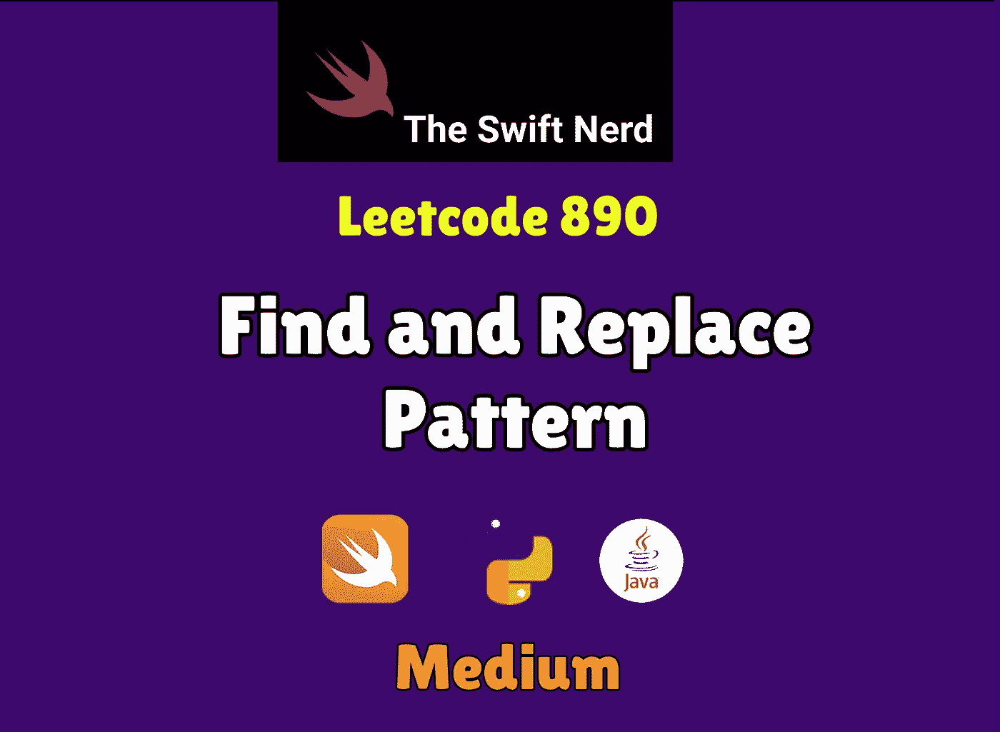

# 查找和替换模式

> 原文：<https://medium.com/nerd-for-tech/find-and-replace-pattern-25dc217846d1?source=collection_archive---------34----------------------->

## Swift +模式匹配= 🧠🛠️🚀

[](https://theswiftnerd.com/find-and-replace-pattern-leetcode/) [## 查找和替换模式(Leetcode 890)

### 难度:链接:第 21 天:May Leetcode 挑战给定一个字符串单词列表和一个字符串模式，返回一个…

theswiftnerd.com](https://theswiftnerd.com/find-and-replace-pattern-leetcode/) 

点击上面的链接查看 Swift Nerd 博客上的完整故事。

# 问题描述

给定一个字符串列表`words`和一个字符串`pattern`，返回*一个与* `pattern`匹配的 `words[i]` *列表。你可以按**任何顺序**返回答案。*

如果存在字母排列`p`，则一个单词匹配该模式，因此在用`p(x)`替换模式中的每个字母`x`后，我们得到想要的单词。

回想一下，字母排列是从字母到字母的双射:每个字母映射到另一个字母，没有两个字母映射到同一个字母。

# 例子

```
**Input:** words = ["abc","deq","mee","aqq","dkd","ccc"], pattern = "abb"
**Output:** ["mee","aqq"]
**Explanation:** "mee" matches the pattern because there is a permutation {a -> m, b -> e, ...}. 
"ccc" does not match the pattern because {a -> c, b -> c, ...} is not a permutation, since a and b map to the same letter.**Input:** words = ["a","b","c"], pattern = "a"
**Output:** ["a","b","c"]
```

# 限制

*   `1 <= pattern.length <= 20`
*   `1 <= words.length <= 50`
*   `words[i].length == pattern.length`
*   `pattern`和`words[i]`是小写英文字母。

# 解决办法

这可能看起来像一个版本的 [Rabin Karp 模式匹配](https://www.geeksforgeeks.org/rabin-karp-algorithm-for-pattern-searching/)，但是它用于匹配绝对模式。我们能想到的是创建每个单词字符到模式字符的双向映射，反之亦然。这样，我们可以检查是否有任何映射不正确，然后我们可以有把握地说，这个单词没有遵循模式。为了简化我们的代码，我们将把逻辑提取到一个帮助函数中，用于检查一个单词是否与模式匹配。我们将迭代单词并测试每个单词的合格性，最后过滤通过测试的单词列表。为了匹配双向映射，我们将创建两个**【Character:Character】**字典并检查结果。我们还使用了 **zip(_，_)** 函数来成对比较 word 和 pattern 中的字符。

# 复杂性分析

*   **时间复杂度:O(N * K)** ，其中 N 为字数，K 为每个单词的长度。
*   **空间复杂度:O(N * K)** ，答案使用的空间。

感谢您的阅读。如果你喜欢这篇文章，并发现它很有用，请分享并像野火一样传播它！

你可以在[swift 网站](https://theswiftnerd.com/)|[LinkedIn](https://www.linkedin.com/in/varunrathi28/)|[Github](https://github.com/varunrathi28)上找到我