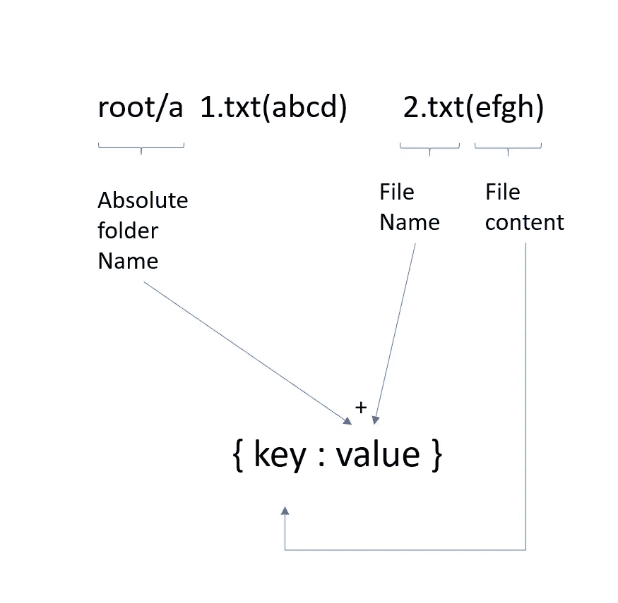

# 查找重复文件—每日挑战可能

> 原文：<https://medium.com/nerd-for-tech/find-duplicate-file-daily-challenge-may-cb726b3a1e53?source=collection_archive---------20----------------------->


照片由 [Thiébaud Faix](https://unsplash.com/@thips?utm_source=unsplash&utm_medium=referral&utm_content=creditCopyText) 在 [Unsplash](https://unsplash.com/s/photos/text?utm_source=unsplash&utm_medium=referral&utm_content=creditCopyText) 上拍摄

今天的问题来自每日 Leetcode 编码挑战赛——五月版。这是一个中等标签的问题。让我们看看问题陈述。

## [609。](https://leetcode.com/problems/find-duplicate-file-in-system/)在系统中找到重复文件

给定一个目录信息的列表`paths`，包括目录路径，以及该目录中包含内容的所有文件，根据路径返回*文件系统中所有重复的文件。你可以按**任何顺序**返回答案。*

一组重复文件由至少两个内容相同的文件组成。

输入列表中的单个目录信息字符串具有以下格式:

*   `"root/d1/d2/.../dm f1.txt(f1_content) f2.txt(f2_content) ... fn.txt(fn_content)"`

表示目录`root/d1/d2/.../dm"`中分别有内容为`(f1_content, f2_content ... fn_content)`的`n`文件`(f1.txt, f2.txt ... fn.txt)`。注意`n >= 1`和`m >= 0`。如果`m = 0`，则表示该目录只是根目录。

输出是一组重复文件路径的列表。对于每个组，它包含具有相同内容的文件的所有文件路径。文件路径是具有以下格式的字符串:

*   `"directory_path/file_name.txt"`

## 示例:

```
**Input:** paths = ["root/a 1.txt(abcd) 2.txt(efgh)","root/c 3.txt(abcd)","root/c/d 4.txt(efgh)","root 4.txt(efgh)"]
**Output:** [["root/a/2.txt","root/c/d/4.txt","root/4.txt"],["root/a/1.txt","root/c/3.txt"]]
```

## 理解问题:

如果文件的内容相同，我们需要对文件的绝对路径进行分组。当我们考虑基于键(这里是文件内容)对项目进行分组时，python 字典是一个不错的选择。我们创建了一个字典，其中键是内容，值是以键为内容的绝对文件路径列表。



## 代码实现:

```
def findDuplicate(paths):
    mapping = defaultdict(list)
    for item in paths:
        details = item.split(" ")
        pref = details[0]+'/'
        for detail in details[1:]:
            l = len(detail)
            idx = detail.find('(')
            if idx>0:
                key = detail[idx+1:l-1]
                mapping[key].append("".join([pref,  detail[:idx]]))

    return [value for value in mapping.values() if len(value)>1]
```

# 复杂性分析

*   时间复杂度:O(N*W) 其中 *N* 是路径的长度，W 是路径中文件的数量
*   空间复杂度:对于地图为 O(N*W)。