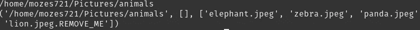

# 使用 Python 查找目录中的文件和文件夹

> 原文：<https://medium.com/nerd-for-tech/find-files-folders-in-your-directory-with-python-2ff11081e373?source=collection_archive---------11----------------------->

# **总结**

Python 的标准库中有许多模块。看看目录文件，最流行的模块是 os、global、pathlib 和其他一些我不知道的模块。

首先，每个用 python 编程的人都会碰到这些模块。

# IG_post_project

os 模块提供了简单的功能，允许我们进行交互并获取操作系统信息。Sys 模块提供对解释程序使用或维护的一些变量和函数的访问。

> 注意:choose_option()函数基于我发布的另一个项目，并链接到这个项目。所以如果你不感兴趣，你可以跳过这一部分。

# **查看目录**

创建一个使用 os.walk 方法的函数，我们将在 Pictures 目录中完成。所以要么已经在目录中选择了一个文件，要么使用那里可用的一个文件夹。

## 在文件夹中查找

Python 方法 **walk()** 通过自顶向下或自底向上遍历树来生成目录树中的文件名。

在 for 循环中，当我们选择 1 时，我们选择遍历该目录中的现有文件夹。正在创建一个空数组来存储根位置和带有 **os.path.join(root，dir)** 的目录，完成后退出循环，从而打印目录。

不用担心，现在循环的深度几乎结束了；)

在我们的例子中创建一个新变量 ***enter_dir*** ，它将存储从目录数组中选择的文件夹。

现在循环遍历新创建的变量，该变量包含该特定文件夹中的所有文件。

当遍历 dir 时，新创建的 pictures 变量应该追加第二个数组中的文件 **pictures = files[2]** 至少对我来说事实是这样的:

在我的目录中，根目录被删除，空括号，最后是我们真正要找的图片。

A 最后，我们选择所需的文件，将整个文件位置附加到图像空数组，并在放置相应的 else 语句后取消那里的循环。

## 在当前目录中查找图像

这将更容易和直接，因为我们将搜索目录中的文件(没有深度，幸运的是❤)

看，我告诉你的要简单得多！

相同的过程适用于唯一的区别是与 elif 退出按' q '退出过程。如果 1、2 或“q”都没有按下，则提示用户输入正确的值。

# 结论

好了，幸运的是我们没有进入无限循环。这是我前一段时间根据我的 IG 发布项目做的。如果你准备好了，这段代码可以(也应该)被修改。因为它从字典中获取所有的数据/文件。当寻找图片或任何其他格式时，我会用`.endswith('.jpg')`稍加修改。由于它在图片目录中，我没有添加它。希望你从中受益匪浅，并在未来能够实现自己的想法！

链接到下面的 py 脚本:

 [## Mozes721/IG_Tk_Gdrive

### 在 IG 上发布选择图像的本地目录或从 GDrive，然后使用 TkInter 完成发布…

github.com](https://github.com/Mozes721/IG_Tk_Gdrive/blob/master/checkIMG.py)