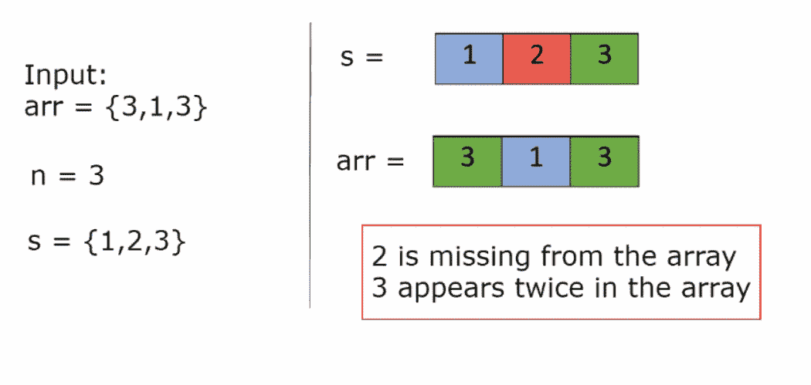

# 查找缺失和重复

> 原文：<https://medium.com/nerd-for-tech/find-missing-and-repeating-18494f2d751e?source=collection_archive---------4----------------------->

(极客归极客:中等水平)



给定一个大小为 **N** 的正整数的未排序数组 **Arr** 。**集合{1，2，…N}中的一个数字‘A’**丢失，并且**一个数字‘B’**在数组中出现两次。找出这两个数字。

**例 1:**

```
**Input:** N = 2
Arr[] = {2, 2}
**Output:** 2 1
**Explanation:** Repeating number is 2 and 
smallest positive missing number is 1.
```

**例 2:**

```
**Input:** N = 3
Arr[] = {1, 3, 3}
**Output:** 3 2
**Explanation:** Repeating number is 3 and 
smallest positive missing number is 2.
```

我将在这里讨论最优化的方法，那就是使用 xor 运算。

```
This is the code below and now I will dry run an example to help you understand of the approach and concept better. **class Solution{
public:
    int *findTwoElement(int *arr, int n) {
        // Step 1 =  Find xor of all elements in the array 
        // Step 2 = Find xor of step1 ans with numbers from 1 to n 
        int xorr = 0;
        for(int i=0;i<n;i++)
        {
            xorr^=arr[i];
            xorr^=(i+1);
        }

        // Now to find the significant bit , perfrom the below operation 
        int rightSBit = xorr & (-xorr);
        int x = 0;
        int y = 0;

        // Now numbers with same significant bit in the given array, xor them together 
        for(int i=0;i<n;i++)
        {
            if((rightSBit & arr[i])==0)
                x^=arr[i];
            else
                y^=arr[i];
        }

        // Similarly numbers from 1 to n with the same significant bits, xor them together 
        for(int i=1;i<=n;i++)
        {
            if((rightSBit & i)==0)
                x^=i;
            else
                y^=i;
        }

        int *ans = new int(2);

        // Final step : If x is found in array means it is repeating and y is missing & vice versa 
        for(int i=0;i<n;i++)
        {
            if(arr[i]==x)
            {
                ans[0]=x;
                ans[1]=y;
            }

            if(arr[i]==y)
            {
                ans[0]=y;
                ans[1]=x;
            }
        }
        return ans;

    }
};**Let us for example take arr = {1 3 3}**Step 1** : Find xor of all elements 
         xorr = 1^3^3 = 1 **Step 2** : Find the xor of all elements from 1 to n with xorr,
         xorr = 1^1^2^3 = 1 **Step 3** : Now find , rightSBit = 1 & (-1)
         To find what -1 is written in binary follow the below steps 
         1\. Ignore the sign and write its binary equivalent , 1
         2\. Now add 1 , it becomes = 10 in binary (2)
         3\. Now negate it , ~10 = 01 which is again 1
         4\. so rightSBit = 1&1 = 1**Step 4** : Now find rightSBit & arr[i]
         1&1 = 1, 1&3 = 1, 1&3 =1
         so x will be 0, 
         y = 1^3^3 = 1**Step 5** : Now find rightSBit & i
         1&1 = 1, 1&2 = 0, 1&3 = 1
         x = 0^2 = 2
         y = 1^1^3 = 3**Step 6** : Now traversing the loop, 
         y is present in the array so, y is the reeating element and 
         x is the missing element.**Time Complexity - O(n)
Space Complexity - O(1)**
```

链接到我的 GitHub 知识库获取注释:[https://github.com/BharatiSukanya/Striver_Sheet_Notes](https://github.com/BharatiSukanya/Striver_Sheet_Notes)

**希望这有所帮助！继续编码！**

有用的资源:

1.  [https://practice . geeks forgeeks . org/problems/find-missing-and-repeating 2512/1 #](https://practice.geeksforgeeks.org/problems/find-missing-and-repeating2512/1#)
2.  [https://www.youtube.com/watch?v=5nMGY4VUoRY&list = plguwdvibif 0 RPG 3 ictpu 74 ywbq 1 cabk 2&index = 3](https://www.youtube.com/watch?v=5nMGY4VUoRY&list=PLgUwDviBIf0rPG3Ictpu74YWBQ1CaBkm2&index=3)
3.  [https://docs . Google . com/document/d/1 sm 92 efk 8 odl 8 nyvw 8 nhpnbgexts 9 w-1 gmteyfeurlwq/edit](https://docs.google.com/document/d/1SM92efk8oDl8nyVw8NHPnbGexTS9W-1gmTEYfEurLWQ/edit)

既然你喜欢看我的博客，为什么不请我喝杯咖啡，支持我的工作呢！！[**https://www.buymeacoffee.com/sukanyabharati**](https://www.buymeacoffee.com/sukanyabharati)t28】☕