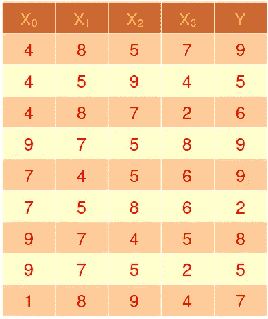
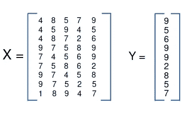
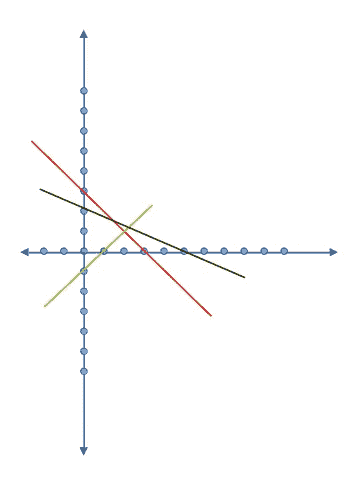
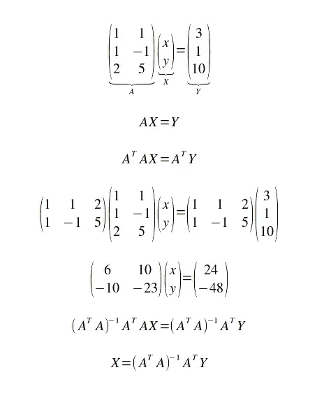

# 机器学习的概念|多元回归，使用超定方程组找到机器学习模型的系数值😉

> 原文：<https://medium.com/nerd-for-tech/find-values-of-coefficients-of-a-machine-learning-model-using-over-determined-system-of-equation-6e5a55b22e11?source=collection_archive---------12----------------------->

假设机器学习模型的等式是，

**多元回归模型**

其中 B0，B1……为参数，1，x1，x2……为特征，曲线为 n 维。

例如，假设下表是机器学习模型的训练数据集，其中 x0、x1、x2、x3 是特征，y 是结果。

现在我们要找到一个关系 b/w x0，x1，x2，x3 和 y，让我们用矩阵形式写出来。

**矩阵形式**

如果这些方程是线性独立的，那么方程的数量大于变量的数量。这种情况称为超定方程组。它对 x0，x1，x2，x3 有一个最接近的解。

## 如何求解超定方程组？

让我们来解这三个方程。

X + Y = 3

X — Y = 1

2X +5Y = 10

**画出线条**

你可以看到没有一个点穿过所有的线。但是他们是一个更接近所有 3 条线的点。**现在如何计算这个点？**

**超定方程组的解**

***证明。***

如果你对我们为什么取 Grad RSS(B) = 0 有疑问，那么读梯度下降的文章。

## 全文系列:

 [## 机器学习的概念文章系列| Ujjwal Kar

### 回归入门|使用梯度下降的简单线性回归优化…

ujjwalkar.netlify.app](https://ujjwalkar.netlify.app/post/concept-of-machine-learning-tutorial-series/)