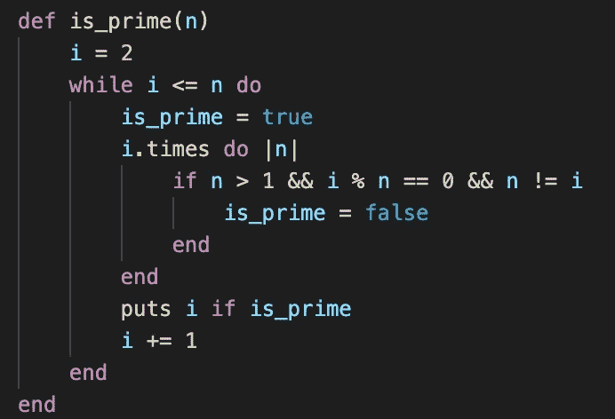
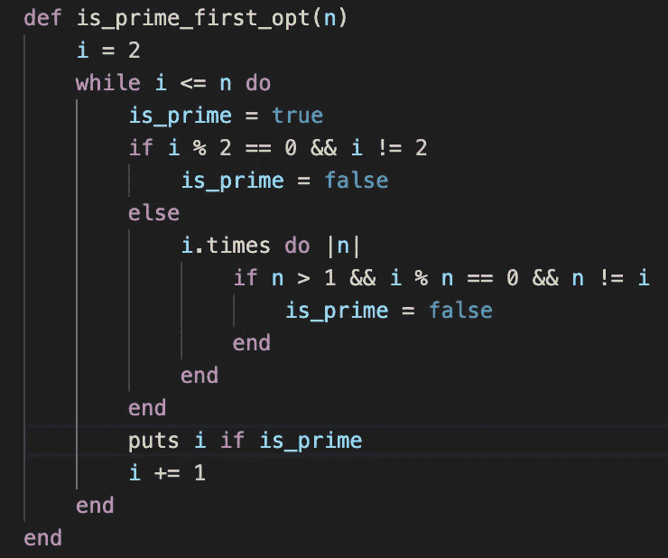
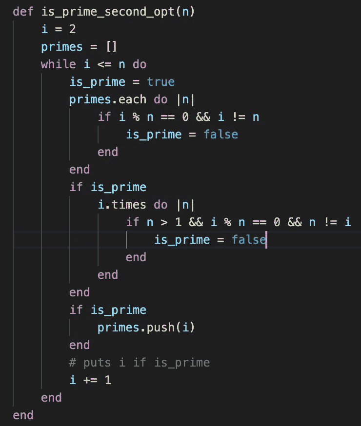
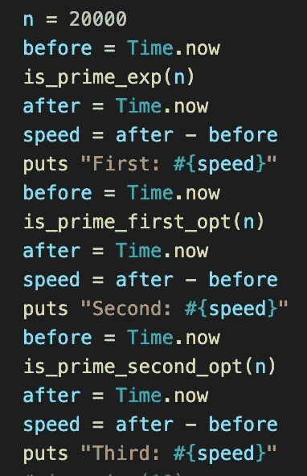
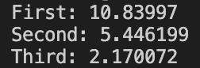

# 用 Ruby 寻找素数

> 原文：<https://medium.com/nerd-for-tech/finding-primes-with-ruby-bfd3cee8ee1c?source=collection_archive---------0----------------------->

质数是除 1 之外的只能被自身和 1 整除的数。例如，1 和 10 之间的质数是 2、3、5 和 7。因此，仅仅知道素数的定义就给了我们一个巨大的提示，告诉我们如何构建一个算法来找到 0 到 n 之间的所有素数。

解决这个问题最简单的方法就是使用[审判师](https://en.wikipedia.org/wiki/Trial_division)。检查每个数字 n，并检查 n 除以除 1 之外的它之前的每个数字的余数。如果你找到一个余数为 0 的数，你就知道 n 不是质数。所以如果 n = 9，你说`9 % 2 == 0 #=> false`，那么`9 % 3 == 0 #=> true`。因为你找到了一个真实的结果，你知道 9 不是质数。下面是一个代码示例，它打印出从 0 到 n 的所有质数:

这将为任何输入提供正确的答案，但你可以看到，随着 n 变大，它会成倍地变慢。我们怎样才能做得更好？

让我们想出一些我们知道的可以应用于代码的关于质数的一般规则。我们对所有的数字都知道些什么？嗯，数字不是偶数就是奇数，所以我们通常可以把数字分成两组。我们对偶数了解多少？它们能被 2 整除。因此，根据定义，唯一的偶数素数是 2。就在这里，我们刚刚将必须完成的工作量减少了一半。因此，让我们添加一个简单的 if 语句来实现该规则:

现在我们有了一个如何改进的想法，我们可以扩展它来进一步减少我们需要检查的数量。合乎逻辑的下一步是添加一个规则，对于我们找到的每一个素数，如果下一个要检查的数可以被前面的任何一个素数整除，我们可以跳过它。因此，我们将创建一个已经找到的质数数组，然后对照已经找到的每个质数检查接下来的数字。代码如下:

让我们通过一些基准测试来验证这一点。我们将使用 n = 20，000 来演示时差。代码如下:

结果如下:

现在我们已经看到了几种不同的方法来寻找质数，并探讨了如何使它更快。关于这方面的进一步阅读，请查看厄拉多塞的[筛子。](https://en.wikipedia.org/wiki/Sieve_of_Eratosthenes)