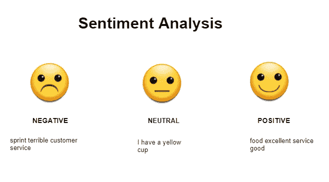
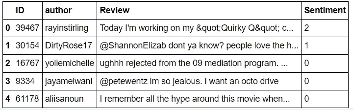
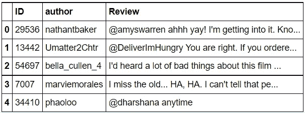
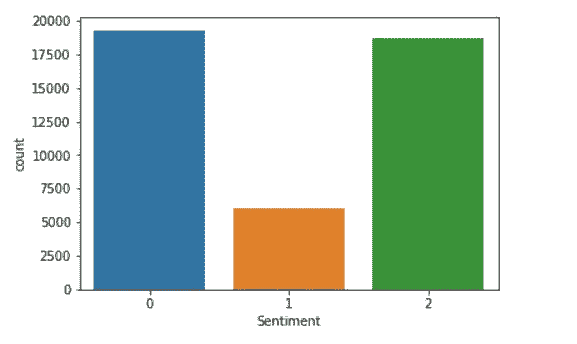
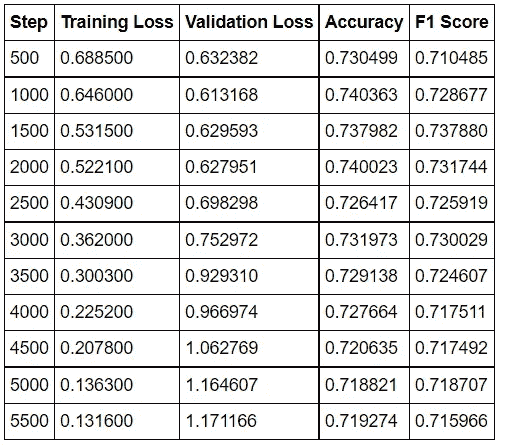
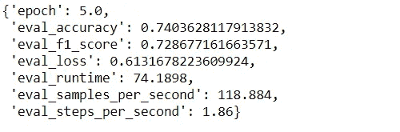
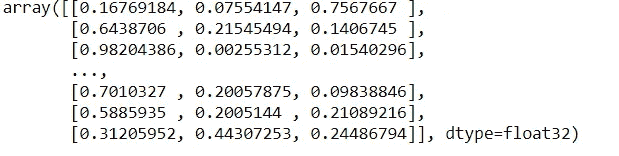
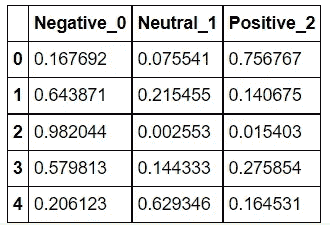
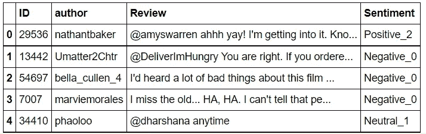

# 使用 Python 中的转换器微调预训练的用于情感分类的 BERT

> 原文：<https://medium.com/nerd-for-tech/fine-tuning-pretrained-bert-for-sentiment-classification-using-transformers-in-python-931ed142e37?source=collection_archive---------2----------------------->



# 情感分析

情感分析是自然语言处理(NLP)的一个应用，用于发现用户评论、评论等的情感。在网上。如今，像脸书、推特这样的社交网站被广泛用于发布用户对不同事物的评论，比如电影、新闻、美食、时尚、政治等等。评论和意见在确定用户对特定实体的满意度方面起着重要作用。然后，这些用于找到极性，即正极、负极和中性。在这个项目中，讨论了一种对电影评论进行情感分析的方法。

# 问题陈述

ABC 公司希望拥有一个高度可扩展的情感分析模型。因此，它决定超越他们的评论生态系统，并根据更多数据训练他们现有的模型。训练样本是评论和推文的混合。

# 属性描述:

*   ID —唯一标识符
*   作者-用户 ID
*   审查—不同类型
*   类别—代表各种情绪( **0** :负面， **1** :中性 **2** :正面)

# 必需的安装


**抱脸变压器**

```
!pip install transformers
```

# 导入所需的包

```
**import** **pandas** **as** **pd**
**import** **numpy** **as** **np**
**import** **seaborn** **as** **sns**
**import** **matplotlib.pyplot** **as** **plt**
%matplotlib inline
**import** **warnings**
warnings.filterwarnings('ignore')
```

# 读取训练和测试数据样本

```
train = pd.read_csv("/content/disk/MyDrive/Machine_Hack/train.csv")
test = pd.read_csv("/content/disk/MyDrive/Machine_Hack/test.csv")
sub = pd.read_csv("/content/disk/MyDrive/Machine_Hack/submission.csv")train.head()
```



```
test.head()
```



# 训练样本中标签的分布



# 提取要素和标注

```
train_texts = train['Review'].values.tolist()
train_labels = train['Sentiment'].values.tolist()
test_texts = test['Review'].values.tolist()
```

# 将训练样本分成训练集和验证集

```
**from** **sklearn.model_selection** **import** train_test_split
train_texts, val_texts, train_labels, val_labels = train_test_split(train_texts, train_labels, test_size=.2,random_state=42,stratify=train_labels)
```

# 微调定制模型的步骤

*   准备数据集
*   加载预训练的标记器，用数据集调用它
*   使用编码构建 Pytorch 数据集
*   负载预训练模型
*   加载训练器并训练它(或)使用本机 Pytorch 训练管道

注意:这里我们使用了培训师

# 导入所需的转换器库

```
**import** **torch**
**from** **torch.utils.data** **import** Dataset
**from** **transformers** **import** DistilBertTokenizerFast,DistilBertForSequenceClassification
**from** **transformers** **import** Trainer,TrainingArguments
```

# 设置模型名称

```
model_name  = 'distilbert-base-uncased'
```

# 标记化

使用 tokenizer 对语料库进行编码。

```
tokenizer = DistilBertTokenizerFast.from_pretrained('distilbert-base-uncased',num_labels=3)
```

*   这里标签的数量=3

```
train_encodings = tokenizer(train_texts, truncation=**True**, padding=**True**,return_tensors = 'pt')
val_encodings = tokenizer(val_texts, truncation=**True**, padding=**True**,return_tensors = 'pt')
test_encodings = tokenizer(test_texts, truncation=**True**, padding=**True**,return_tensors = 'pt')
```

*   在 BERT 情况下，设置 truncation = True 将消除超过 max_length(512)的令牌
*   设置 padding =True 将使用空标记(即 0)填充长度小于 max_length 的文档，确保我们的所有序列都填充到相同的长度
*   设置 return_tensors = 'pt '会将编码返回为 pytorch 张量
*   这将允许我们同时向模型中输入一批序列。

# 将我们的标签和编码转换成数据集对象

*   将标记化的数据包装到 torch 数据集中
*   在 PyTorch 中，这是通过子类化 torch.utils.data.Dataset 对象并实现 len 和 getitem 来实现的。

```
**class** **SentimentDataset**(torch.utils.data.Dataset):
    **def** __init__(self, encodings, labels):
        self.encodings = encodings
        self.labels = labels

    **def** __getitem__(self, idx):
        item = {key: torch.tensor(val[idx]) **for** key, val **in** self.encodings.items()}
        item['labels'] = torch.tensor(self.labels[idx])
        **return** item

    **def** __len__(self):
        **return** len(self.labels)
## Test Dataset**class** **SentimentTestDataset**(torch.utils.data.Dataset):
    **def** __init__(self, encodings):
        self.encodings = encodings

    **def** __getitem__(self, idx):
        item = {key: torch.tensor(val[idx]) **for** key, val **in** self.encodings.items()}
        **return** item
    **def** __len__(self):
        **return** len(self.encodings)
```

# Genearte 数据加载器

*   将标记化的数据转换为 torch 数据集

```
train_dataset = SentimentDataset(train_encodings, train_labels)
val_dataset = SentimentDataset(val_encodings, val_labels)
test_dataset = SentimentTestDataset(test_encodings)
```

# 定义一个简单的度量函数

```
**from** **sklearn.metrics** **import** accuracy_score, f1_score
**def** compute_metrics(p):
    pred, labels = p
    pred = np.argmax(pred, axis=1)

    accuracy = accuracy_score(y_true=labels, y_pred=pred)
    *#recall = recall_score(y_true=labels, y_pred=pred)*
    *#precision = precision_score(y_true=labels, y_pred=pred)*
    f1 = f1_score(labels, pred, average='weighted')

    **return** {"accuracy": accuracy,"f1_score":f1}
```

# 定义培训参数

```
training_args = TrainingArguments(
    output_dir='./res',          *# output directory*
    evaluation_strategy="steps",
    num_train_epochs=5,              *# total number of training epochs*
    per_device_train_batch_size=32,  *# batch size per device during training*
    per_device_eval_batch_size=64,   *# batch size for evaluation*
    warmup_steps=500,                *# number of warmup steps for learning rate scheduler*
    weight_decay=0.01,               *# strength of weight decay*
    logging_dir='./logs4',            *# directory for storing logs*
    *#logging_steps=10,*
    load_best_model_at_end=**True**,
)
```

# 使用教练进行微调

```
model = DistilBertForSequenceClassification.from_pretrained("distilbert-base-uncased",num_labels=3)

trainer = Trainer(
    model=model,*# the instantiated 🤗 Transformers model to be trained*
    args=training_args, *# training arguments, defined above*
    train_dataset=train_dataset,*# training dataset*
    eval_dataset=val_dataset , *# evaluation dataset*
    compute_metrics=compute_metrics,
)

trainer.train()
```



# 基于验证数据集评估培训师

因为作为训练的一部分，load_best_model_at_end 被设置为 True，所以这将在完成训练时自动加载最佳模型。

```
trainer.evaluate()
```



# 根据测试数据进行预测

```
test[‘Sentiment’] = 0 test_texts = test[‘Review’].values.tolist() test_labels = test[‘Sentiment’].values.tolist() 
test_encodings = tokenizer(test_texts, truncation=**True**, padding=**True**,return_tensors = ‘pt’).to(“cuda”) 
test_dataset = SentimentDataset(test_encodings, test_labels)preds = trainer.predict(test_dataset=test_dataset)
```

# 检索预测概率

```
probs = torch.from_numpy(preds[0]).softmax(1)

predictions = probs.numpy()# convert tensors to numpy array
```



# 将相关的预测概率转换成数据帧

```
newdf = pd.DataFrame(predictions,columns=['Negative_0','Neutral_1','Positive_2'])
new_df.head()
```



# 定义函数以格式化预测标签

```
**def** labels(x):
  **if** x == 0:
    **return** 'Negative_0'
  **elif** x == 1:
    **return** 'Neutral_1'
  **else**:
    **return** 'Positive_2'

results = np.argmax(predictions,axis=1)
test['Sentiment'] = results
test['Sentiment'] = test['Sentiment'].map(labels)
test.head()
```



# 想象一下预测

```
**import** **seaborn** **as** **sns**
sns.countplot(x='Sentiment',data=test)
```


# 结论

*   在这里，我们已经在自定义数据集上使用 huggingface transformers 库训练了 BERT 模型
*   同样，我们也可以使用其他型号的变压器，如带有 GPT 2 的 GPT-2 变压器、带有 distilt for sequence classification 的 DistilBert 变压器等。

# 推荐人:

[](https://huggingface.co/transformers/training.html) [## 微调预训练模型

### PyTorch 和 TensorFlow 2.0 的最先进的自然语言处理。变形金刚提供了成千上万的…

huggingface.co](https://huggingface.co/transformers/training.html) 

## [数据](https://machinehack.com/practice/sentiment_analysis_with_rnn/overview)

[联系我](https://www.linkedin.com/in/plaban-nayak-a9433a25/)