# 完成三倍和动画

> 原文：<https://medium.com/nerd-for-tech/finishing-up-triple-and-animations-d8b22be0560e?source=collection_archive---------21----------------------->

既然我们已经知道了如何在游戏中获得三连击，是时候让我们的玩家激活它了。首先，我们需要设置更多的协程，并完成我们的碰撞编码，这样我们的玩家就可以使用这个功能了。

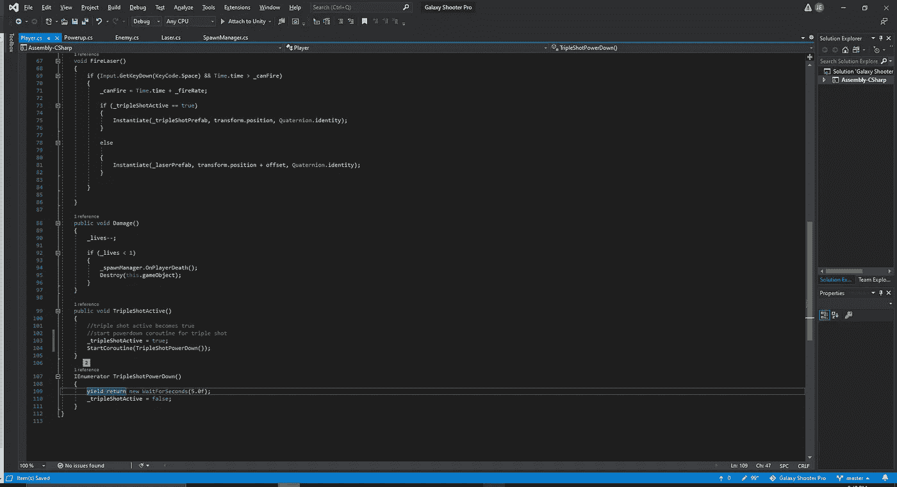

更改玩家脚本

首先，让我们更多地了解我们的球员，让我们的三枪有代码设置成为现实。首先，我们必须构建我们的公共 void TripleShotActive，并让它知道在激活时设置为 true。从这里开始，我们必须构建一个快速的协程，以便在指定的一段时间后，我们关闭电源。然后，我们在新的 public void 中启动协程，现在切换到我们的 powerup 脚本来完成它们之间的连接。

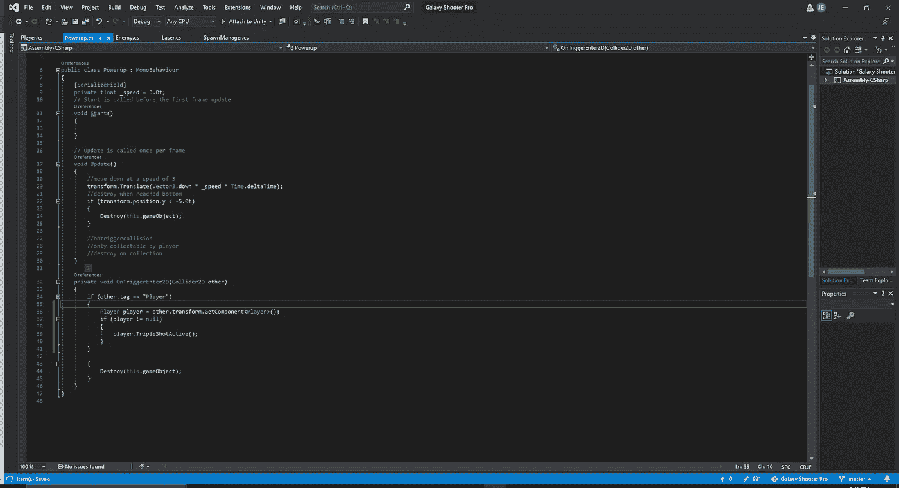

通电脚本的更改

在我们的 powerups 脚本中，我们现在必须添加 GetComponent <player>以便当我们的 powerup sprite 与我们的 player 单元交互时，它知道它正在影响脚本的哪一部分。
现在，我们测试我们的结果，看看是否一切都很快见效:</player>

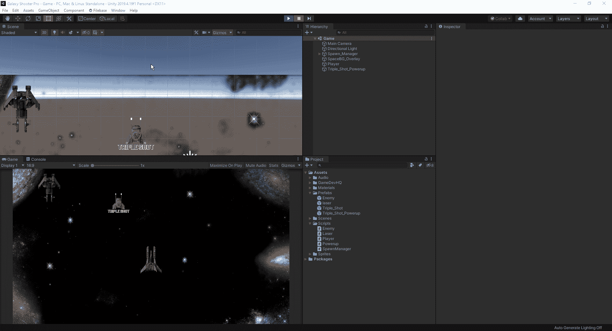

三次发射工作

现在，我们必须考虑从游戏中删除所有的三镜头父对象，这样它们就不会使我们的内存过载。

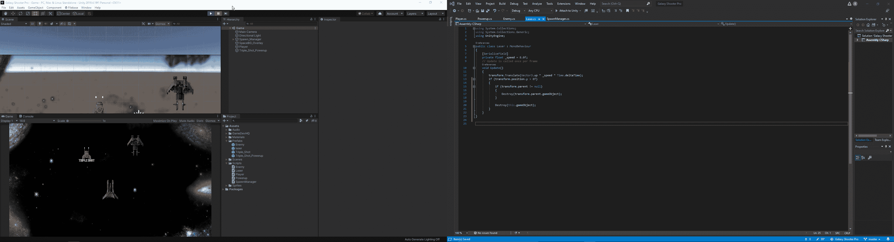

为了解决这个问题，我们必须为父节点创建一个空检查。从这里，我们可以稍微调整我们的代码，这样，如果有一个父活动，我们也摧毁它，否则激光本身将从场景中删除，一旦它离开我们的游戏视图。
现在，让我们看看如何给我们的精灵设置动画。首先，让我们将动画标签放入编辑器中，并创建一个文件夹来保存我们将要制作的所有动画:

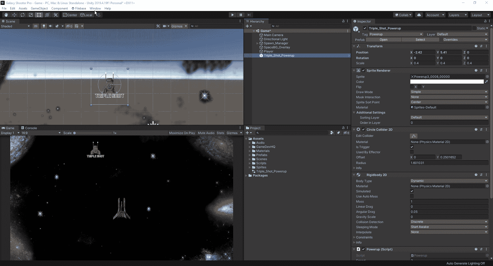

创建动画文件夹

从这里，我们可以让我们的 dopesheet 运行，并拖动动画，我们想把我们的精灵。

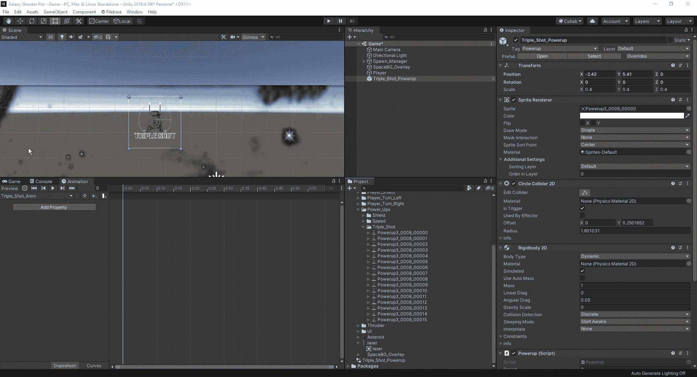

我们所要做的就是开始录制我们的动画，突出显示我们希望使用的所有帧，并将其拖动到我们的 dopesheet 中。从这里开始，我们停止录音，然后继续。
当我们创建这个动画时，我们的动画文件夹中有两个新文件:

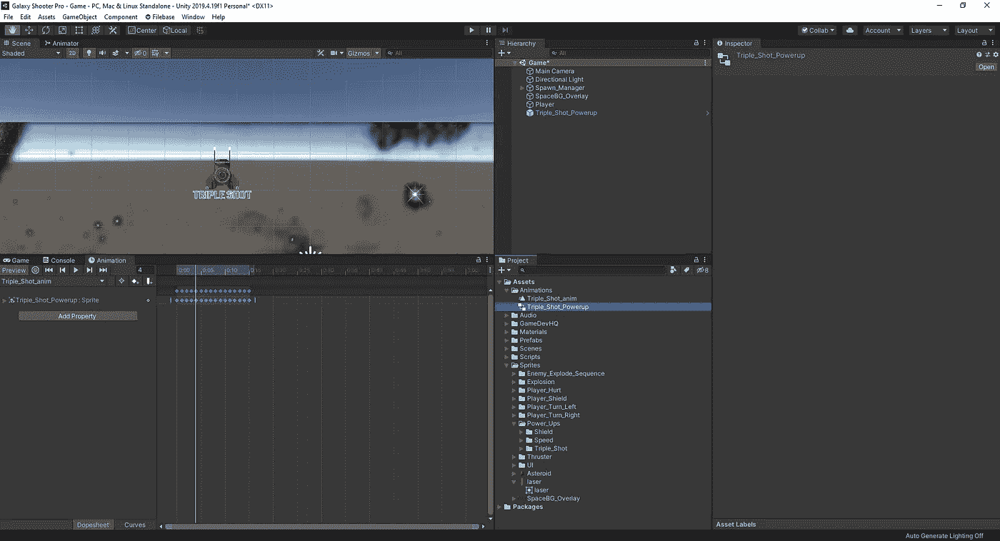

新文件

这些新文件是我们刚刚创建的动画和动画的控件。对于这个基本的动画来说，控制器并不太重要，但是如果一个角色有半打不同的动画技能，控制器将会帮助组织这些动画。现在我们可以点击播放，看看我们的动画在游戏中是什么样子。

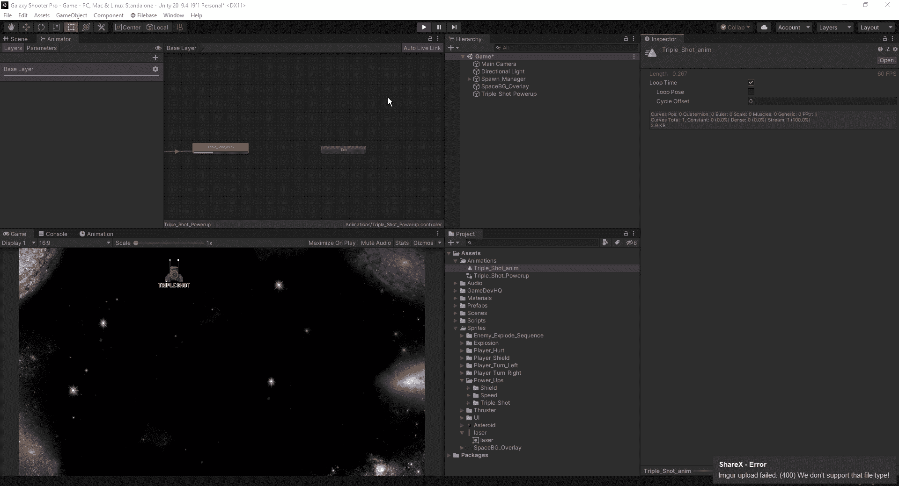

现在，让我们开始让我们的能量在游戏中自己繁殖。首先，我们将转到我们的 spawnmanager 脚本，并在那里创建我们的代码。为了创建一个更简单的方法来确定哪个卵是哪个卵，我们将把敌人的协程重命名为 SpawnEnemyRoutine。从这里，我们现在将创建一个新的游戏对象来放置和调用三重射击。最后，我们将为三重显示加电创建我们的协程，它本质上与我们的敌人相同:

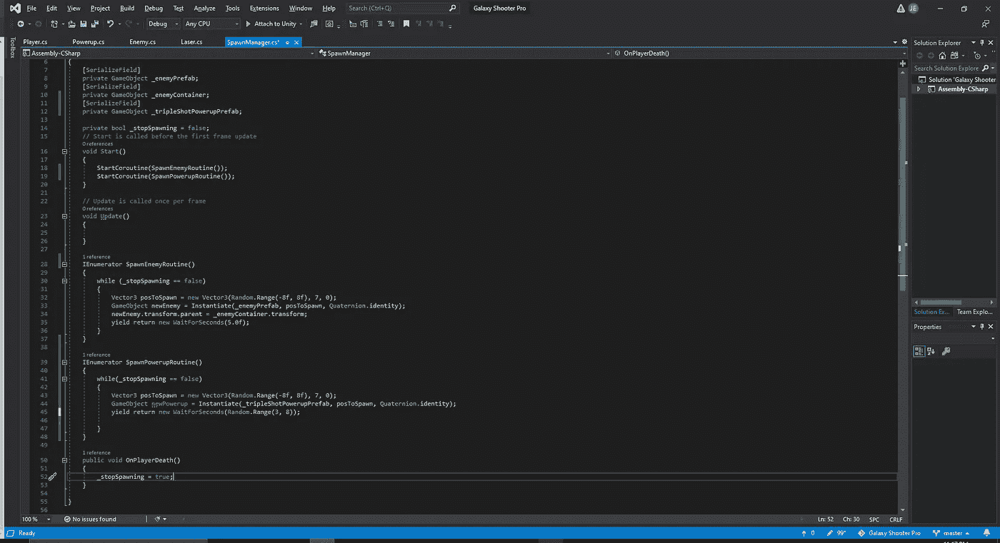

通电产卵

我们所做的唯一不同是改变产卵频率为 3-7 秒。这给我们的电源提供了更多的随机性。最后，让我们在我们的游戏中测试一下，看看它是否正常工作。

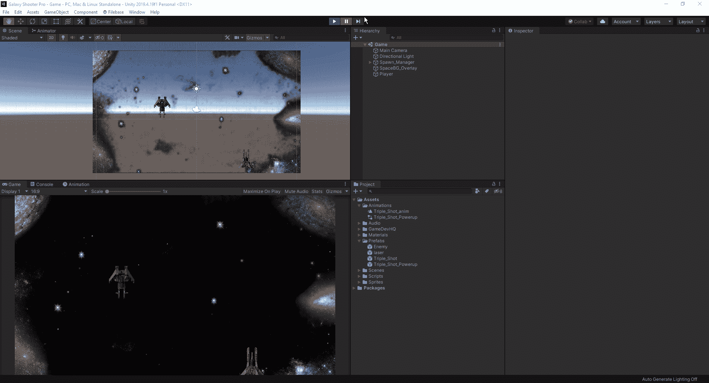

测试加电的种子

最后，我们可以做一点清理工作。我们使用的任何伪代码，我们可以从我们的脚本中清除，当我们这样做的时候，让我们在我们的预置中创建几个子文件夹，这样当我们添加更多的时候，它会被分成更小的组，更容易管理。

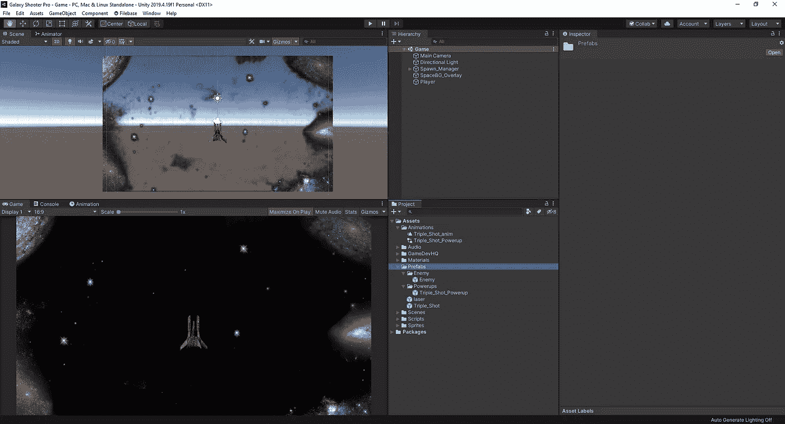

接下来，我们将研究如何提高速度，以及了解 switch 语句的工作原理和方式。