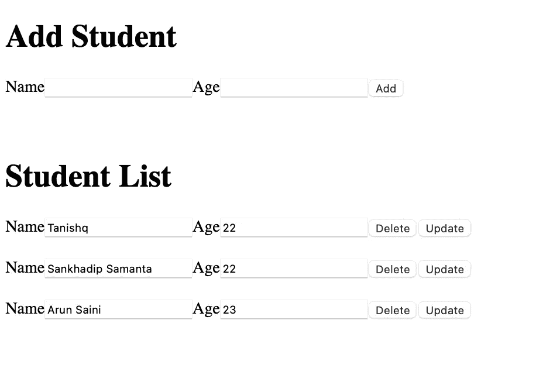

# 带角积垢操作的燃烧室

> 原文：<https://medium.com/nerd-for-tech/firebase-with-angular-crud-operations-ba91ddf1dcc4?source=collection_archive---------0----------------------->

带 13°角的火焰基座 9

Firebase 是一个后端即服务。它为开发者和组织提供各种工具和服务，帮助他们开发高质量的应用程序，扩大用户群，并赚取利润。它建立在谷歌的基础设施之上。Firebase 是一个 NoSQL 数据库，它将数据存储在类似 JSON 的文档中。

在 Firebase 中，文档是由模式定义的一组键值对。一组文档构成一个集合。

Firebase 的主要特点是

*   证明
*   实时数据库
*   主办；主持
*   通知

在本文中，我们将把 Firebase 与 Angular 集成起来，并执行基本的 CRUD 操作。我们将从 Firebase 实时获取数据。

我们将创建一个基本的用户界面，我们可以输入学生的姓名和年龄，获取学生名单，删除学生和更新他们的详细信息。

> **创建项目**

使用下面的命令创建一个角度项目。

ng 新的燃烧室 9 并安装以下模块

npm i 燃烧基地

我将使用 visual studio 代码。

> **代号**

删除 app.component.html 的内容

使用下面的命令创建一个组件

**ng g c firebase-crud —跳过测试**

放置在 firebase-crud.component.html 代码下方

以及 firebase-crud.component.ts 中的以下代码

在 HTML 和 TS 文件中，我添加了简单的添加、删除、获取和更新函数，这些函数稍后将调用 firebase 函数来执行 CRUD。

使用下面的命令创建一个服务，我们将调用 firebase 函数来执行 CRUD 操作。

**ng g s firebase —跳过测试**

现在，导航到这个 [URL](https://console.firebase.google.com/u/0/) 来创建一个 firebase 项目。

从项目设置->常规中获取 firebase 配置对象，并将其放在如下所示的 environment.ts 中。

然后创建一个 Firebase 数据库和一个名为 **students** 的集合。

将代码放在 firebase.service.ts 中。

在这项服务中，我们将执行以下操作。

*   在构造函数内部，用 firebase 配置初始化 firebase 应用程序，获取 Firebase 数据库，并在上面创建了**学生**集合。我们还订阅了**学生**集合的数据变化，这样我们可以获得实时更新，并在 UI 中显示更新的数据。
*   获取所有学生的数据。
*   deleteStudent:-根据文档 ID 删除单个学生。
*   updateStudent:-根据文档 ID 更新单个学生。
*   addStudent:-将新学生添加到**学生**集合中。

现在，让我们更新 firebase-crud.component.ts，以便它可以调用 firebase.service.ts crud 函数。将代码放在 firebase-crud.component.ts 中

现在，运行 npm start 或 ng serve 命令，转到 [http://localhost:4200](http://localhost:4200) ，用 firebase 执行惊人的 crud 操作。

用户界面

如果您有任何问题，请留下您的评论。

查看 Github 仓库中的源代码。

 [## GitHub-dev-sankhadip/CRUD-in-fire base-Angular 操作

### 此项目是使用 Angular CLI 版本 13.0.3 生成的。为开发服务器运行 ng serve。导航到…

github.com](https://github.com/dev-sankhadip/CRUD-operations-in-Firebase-Angular) 

# Sankhadip Samanta

*软件工程师、Mirra |科技作家*

在 [Linkedin](https://www.linkedin.com/in/sankhadip-samanta-7bb891180/) 上找到我😃和 [Github](https://github.com/dev-sankhadip) 😅