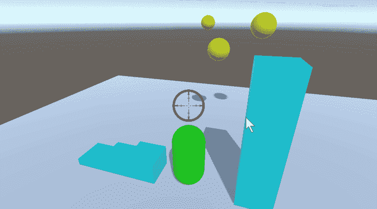
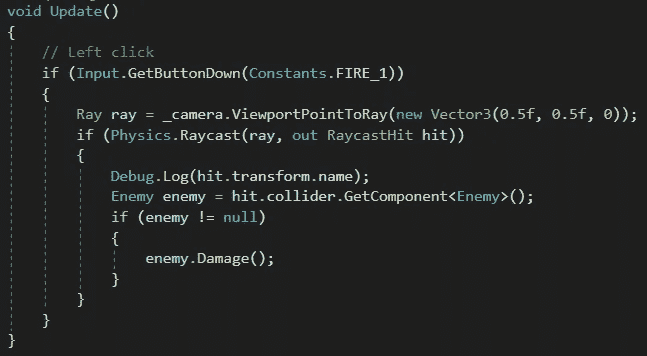

# 在统一中“发射”一束光

> 原文：<https://medium.com/nerd-for-tech/firing-a-ray-in-unity-1c6308668cf9?source=collection_archive---------12----------------------->

**目标:**使用射线确定目标是否被击中。

我们将为玩家添加一个*射击*脚本。当鼠标左键或开火键被按下时，我们将从屏幕中央画出一条看不见的*射线*进入游戏世界。如果光线击中了什么东西(任何带有碰撞器的物体)，它会将碰撞器击中的信息存储到一个名为 *hit* 的 *RaycastHit* 变量中。然后，我们将在该对象中搜索一个*敌人*脚本。如果找到这个脚本，我们将调用它的*损坏*方法。在这种情况下。gif 以上，第一击把我们的目标从黄色变成橙色，第二击变成红色，最后一击会消灭它。

