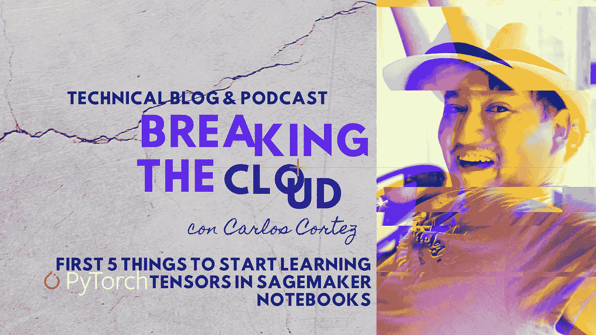
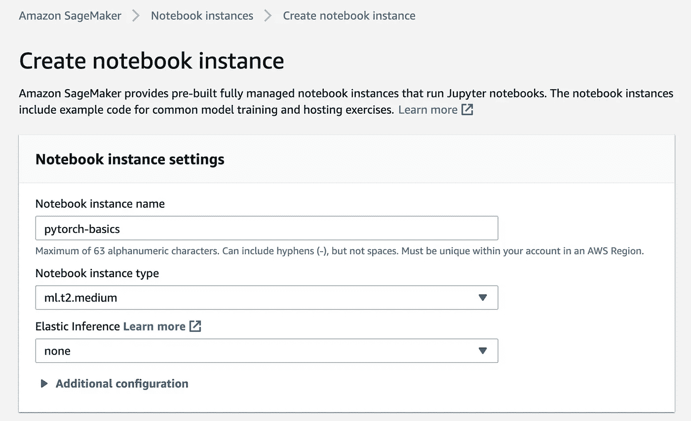
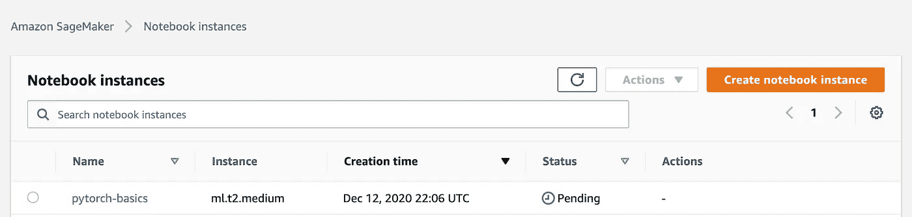
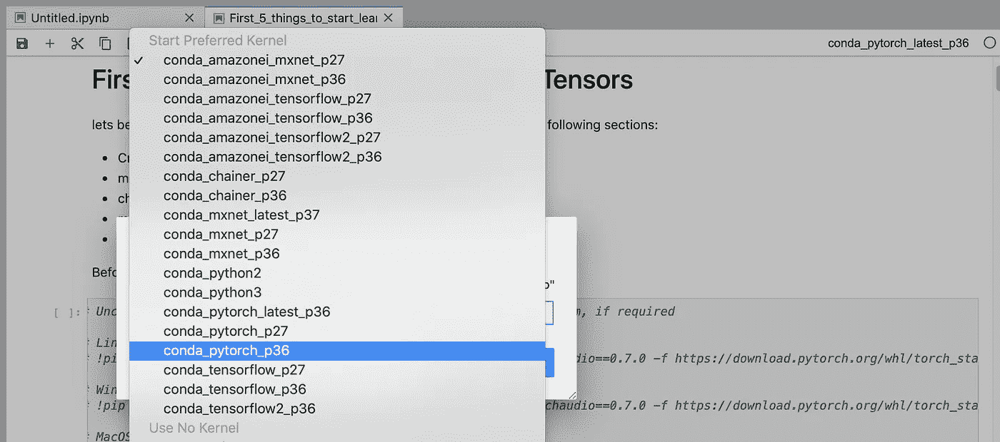
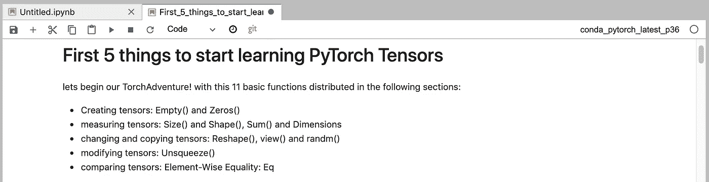

# 在 Sagemaker 笔记本上开始学习 PyTorch 张量的前 5 件事

> 原文：<https://medium.com/nerd-for-tech/first-5-things-to-start-learning-pytorch-tensors-in-sagemaker-notebooks-67151576f6e3?source=collection_archive---------1----------------------->



让我们开始 AWS 的火炬之旅吧！这 11 个基本功能分布在以下部分:

*   **创建张量:**空()和零()
*   **测量张量:**大小()和形状()，总和()和维度
*   **改变和复制张量:【Reshape()、view()和 randn()**
*   **修改张量** s: Unsqueeze()
*   **比较张量**:元素式等式:Eq

首先让我们启动一个新的 sagemaker 实例:



现在转到 Jupyter 实验室，使用 Pytorch 的内核导入或创建一个新的笔记本:



选择合适的内核，在这种情况下可能是:conda_pytorch_p36



这里是我将从零开始的地方。



在开始之前，让我们安装并导入 PyTorch

```
*# Uncomment and run the appropriate command for your operating system, if required**# Linux / Binder*
*# !pip install numpy torch==1.7.0+cpu torchvision==0.8.1+cpu torchaudio==0.7.0 -f* [*https://download.pytorch.org/whl/torch_stable.html*](https://download.pytorch.org/whl/torch_stable.html)*# Windows*
*# !pip install numpy torch==1.7.0+cpu torchvision==0.8.1+cpu torchaudio==0.7.0 -f* [*https://download.pytorch.org/whl/torch_stable.html*](https://download.pytorch.org/whl/torch_stable.html)*# MacOS*
*# !pip install numpy torch torchvision torchaudio*
```

从笔记本实例导入 Pytorch

```
**import** **torch**
```

# 函数 1 —空和零—如何初始化张量

我们需要开始使用基本的 pytorch 函数，第一件事是创建我们的矩阵

```
*# Creates a 3 x 2 matrix which is empty*
a = torch.empty(3, 2)
print(a)tensor([[1.5842e-35, 0.0000e+00],
        [4.4842e-44, 0.0000e+00],
        [       nan, 0.0000e+00]])
```

PyTorch 是如何为这个张量分配内存的。不管怎样，它不会抹去记忆中任何以前的内容。

默认情况下，初始化张量时使用的是 float32 dtype。可以在这里回顾:[https://py torch . org/docs/stable/generated/torch . set _ default _ tensor _ type . html # torch . set _ default _ tensor _ type](https://pytorch.org/docs/stable/generated/torch.set_default_tensor_type.html#torch.set_default_tensor_type)

但是你也可以开始使用 torch.zeros

```
*# Applying the zeros function and* 
*# storing the resulting tensor*

a = torch.zeros([3, 5]) 
print("a = ", a) 

b = torch.zeros([2, 4]) 
print("b = ", b) 

c = torch.zeros([4, 1]) 
print("c = ", c) 

d = torch.zeros([4, 4, 2]) 
print("d = ", d)
```

结果将是:

```
a =  tensor([[0., 0., 0., 0., 0.],
        [0., 0., 0., 0., 0.],
        [0., 0., 0., 0., 0.]])
b =  tensor([[0., 0., 0., 0.],
        [0., 0., 0., 0.]])
c =  tensor([[0.],
        [0.],
        [0.],
        [0.]])
d =  tensor([[[0., 0.],
         [0., 0.],
         [0., 0.],
         [0., 0.]],[[0., 0.],
         [0., 0.],
         [0., 0.],
         [0., 0.]],[[0., 0.],
         [0., 0.],
         [0., 0.],
         [0., 0.]],[[0., 0.],
         [0., 0.],
         [0., 0.],
         [0., 0.]]])
```

这个张量用零填充，因此 PyTorch 分配内存并对其中的张量元素进行零初始化

您不能更改创建张量的方式，如果您创建了零张量，请确保没有引用任何其他张量。

```
*# correctly initialized*
a = torch.empty(3,3)
print(a)*#also correct*
b = torch.empty(1,2,3)print(b)
```

结果将是:

```
tensor([[2.4258e-35, 0.0000e+00, 1.5975e-43],
        [1.3873e-43, 1.4574e-43, 6.4460e-44],
        [1.4153e-43, 1.5274e-43, 1.5695e-43]])
tensor([[[2.3564e-35, 0.0000e+00, 1.4013e-45],
         [1.4574e-43, 6.4460e-44, 1.4153e-43]]])
```

现在让我们看看，为什么不能使用 zeros 函数:

```
*# incorrect reference, you must create a new one*
c = torch.zeros(b,1) 
print("c = ", c)
```

输出:

```
---------------------------------------------------------------------------
TypeError                                 Traceback (most recent call last)
<ipython-input-35-c044e2995879> in <module>()
 **1** # incorrect reference, you must create a new one
----> 2 c = torch.zeros(b,1)
 **3** print("c = ", c)TypeError: zeros() received an invalid combination of arguments - got (Tensor, int), but expected one of:
 * (tuple of ints size, *, tuple of names names, torch.dtype dtype, torch.layout layout, torch.device device, bool pin_memory, bool requires_grad)
 * (tuple of ints size, *, Tensor out, torch.dtype dtype, torch.layout layout, torch.device device, bool pin_memory, bool requires_grad)
```

让我们仔细回顾一下零点方法:

我们的文件说:

```
Syntax: torch.zeros(size, out=None)Parameters:
size: a sequence of integers defining the shape of the output tensor
out (Tensor, optional): the output tensorReturn type: A tensor filled with scalar value 0, of same shape as size.
```

torch.zeros 和 torch.empty 是开始使用 pytorch 张量并学习一点矩阵和向量的第一批函数

# 函数 2——张量大小、形状和维度运算

让我们理解 Pytorch 中的维度。

现在让我们创建一些张量，并确定每个张量的大小

```
**import** **torch** 
*# Create a tensor from data*
c = torch.tensor([[3.2 , 1.6, 2], [1.3, 2.5 , 6.9]])
print(c)print(c.size())
```

输出

```
tensor([[3.2000, 1.6000, 2.0000],
        [1.3000, 2.5000, 6.9000]])
torch.Size([2, 3])
```

让我们看看 torch.shape，并仔细看看这里是如何给出大小的

现在在下一个例子中，让我们用形状函数来得到张量的大小

在[ ]:

```
x = torch.tensor([
     [1, 2, 3],
     [4, 5, 6]
   ])
x.shape
torch.Size([2, 3])
```

Out[ ]:

```
torch.Size([2, 3])
```

形状和大小给了我们张量相同的正确维数。

在这种情况下，我们有一个三维张量(3 维)

维度 0 维度 1 和维度 2

让我们创建一个新的张量:

在[ ]:

```
y = torch.tensor([
     [
       [1, 2, 3],
       [4, 5, 6]
     ],
     [
       [1, 2, 3],
       [4, 5, 6]
     ],
     [
       [1, 2, 3],
       [4, 5, 6]
     ]
   ])y.shape
```

Out[ ]:

```
torch.Size([3, 2, 3])
```

让我们看看如何使用 3d 张量对每个维度层进行操作，看看它的表现如何

在[ ]:

```
sum1 = torch.sum(y, dim=0)
print(sum1)sum2 = torch.sum(y, dim=1)
print(sum2)sum3 = torch.sum(y, dim=2)
print(sum3)tensor([[ 3,  6,  9],
        [12, 15, 18]])
tensor([[5, 7, 9],
        [5, 7, 9],
        [5, 7, 9]])
tensor([[ 6, 15],
        [ 6, 15],
        [ 6, 15]])
```

我们现在可以看到，随着我们的发展，3d 张量变得更加复杂，我们可以在每个维度内执行自定义操作

目前限制为 3 个 dims，因此我们无法执行此操作:

在[]

```
sum2 = torch.sum(y, dim=3)
print(sum1)
```

Out [ ]:

```
---------------------------------------------------------------------------
IndexError                                Traceback (most recent call last)
<ipython-input-56-7caf723c6102> in <module>()
----> 1 sum2 = torch.sum(y, dim=3)
 **2** print(sum1)**IndexError: Dimension out of range (expected to be in range of [-3, 2], but got 3)**
```

为了增加更多的维度层，我们可以回顾 unsqueeze 函数→。unsqueeze()但是现在让我们来看看下一个基本函数

# 功能 3 —整形、查看和随机

NunPy 中有一个名为 ndarray.reshape()的函数用于整形数组。

现在在 pytorch 中，有 torch.view(张量)也是为了同样的目的，但同时，也有 torch.reshape(张量)。

让我们弄清楚它们之间的区别，以及何时应该使用它们中的任何一个。

首先，我们将使用一个新的函数来随机化我们的张量。

在[ ]:

```
**import** **torch** 
x = torch.randn(5, 3)print(x)
```

Out []

```
tensor([[-0.5793,  0.6999,  1.7417],
        [-0.9810,  0.0626,  0.4100],
        [-0.6519, -0.0595, -1.2156],
        [-0.3973, -0.3103,  1.6253],
        [ 0.2775, -0.0045, -0.2985]])
```

这是 torch.randm 的基本用法，所以现在让我们使用另一个变量“y”的视图并描述所有元素

在[ ]:

```
*# Return a view of the x, but only having* 
*# one dimension and max number of elements*
y = x.view(5 * 3)

*#lets see the size of every tensor*
print("lets see the size of every tensor")
print('Size of x:', x.size())
print('Size of y:', y.size())

*#and the elements of very tensor to compare*
print("and the elements of very tensor to compare")
print("X:", x)
print("Y:", y)
```

Out []

```
lets see the size of every tensor
Size of x: torch.Size([5, 3])
Size of y: torch.Size([15])
and the elements of very tensor to compare
X: tensor([[-0.5793,  0.6999,  1.7417],
        [-0.9810,  0.0626,  0.4100],
        [-0.6519, -0.0595, -1.2156],
        [-0.3973, -0.3103,  1.6253],
        [ 0.2775, -0.0045, -0.2985]])
Y: tensor([-0.5793,  0.6999,  1.7417, -0.9810,  0.0626,  0.4100, -0.6519, -0.0595,
        -1.2156, -0.3973, -0.3103,  1.6253,  0.2775, -0.0045, -0.2985])
```

看看 Y 张量，它只有一维。因此，对于某些操作来说，查看另一个张量可能很困难

现在让我们使用整形来复制 X 的精确尺寸

在[ ]:

```
*# Get back the original tensor with reshape()*
z = y.reshape(5, 3)
print(z)tensor([[-0.2927,  0.0329,  0.8485],
        [ 1.9581,  0.8313, -0.1529],
        [-0.2330, -0.1887,  1.8206],
        [ 1.5252,  1.0909,  0.0547],
        [-0.1231, -0.4238, -0.6724]])
```

我们不仅可以重塑原始形状，还可以通过一些与最大元素相关的有限操作来改变尺寸:

首先，让我们重塑为 1 维以上

在[ ]:

```
*# Get back the original tensor with reshape()*
z = y.reshape(15)
print(z)*#reshaping 15 elements, 1 dim*
z = y.reshape(3*5)
print(z)*#reshaping in different order, 3 dimensions*
z = y.reshape(3,5)
print(z)*#Reshaping with more dimensions but its 15 elements always*
z = y.reshape(3,5,1)
print(z)tensor([-0.5793,  0.6999,  1.7417, -0.9810,  0.0626,  0.4100, -0.6519, -0.0595,
        -1.2156, -0.3973, -0.3103,  1.6253,  0.2775, -0.0045, -0.2985])
tensor([-0.5793,  0.6999,  1.7417, -0.9810,  0.0626,  0.4100, -0.6519, -0.0595,
        -1.2156, -0.3973, -0.3103,  1.6253,  0.2775, -0.0045, -0.2985])
tensor([[-0.5793,  0.6999,  1.7417, -0.9810,  0.0626],
        [ 0.4100, -0.6519, -0.0595, -1.2156, -0.3973],
        [-0.3103,  1.6253,  0.2775, -0.0045, -0.2985]])
tensor([[[-0.5793],
         [ 0.6999],
         [ 1.7417],
         [-0.9810],
         [ 0.0626]], [[ 0.4100],
         [-0.6519],
         [-0.0595],
         [-1.2156],
         [-0.3973]], [[-0.3103],
         [ 1.6253],
         [ 0.2775],
         [-0.0045],
         [-0.2985]]])
```

现在让我们整形超过张量中元素的数量:

在[ ]:

```
z = y.reshape(16)
print(z)
```

Out []

```
---------------------------------------------------------------------------
RuntimeError Traceback (most recent call last)
<ipython-input-78-c7ae174fce73> in <module>()
----> 1 z = y.reshape(16)
 **2** print(z)RuntimeError: shape '[16]' is invalid for input of size 15
```

对于 z = y . shape(3 * 6)或放置更多张量中不存在的元素，它也会失败。

现在让我们继续下一节。

# 功能 4 —取消队列()

主要是，它允许我们在您定义的特定索引上添加更多的维度。

让我们来看看:

在[ ]:

```
**import** **torch***#dim=1, that is (3)*
x = torch.tensor([1, 2, 3])
print('x: ', x)
print('x.size: ', x.size())*#x1 becomes a matrix of (3,1)*
x1 = torch.unsqueeze(x, 1)
print('x1: ', x1)
print('x1.size: ', x1.size())
```

Out []

```
x:  tensor([1, 2, 3])
x.size:  torch.Size([3])
x1:  tensor([[1],
        [2],
        [3]])
x1.size:  torch.Size([3, 1])
x2:  tensor([[1, 2, 3]])
x2.size:  torch.Size([1, 3])
```

我们的初始张量是张量([1，2，3])，输出大小是[3]。

然后我们继续用 unsqueeze 运算增加 1 维，即 torch.unsqueeze(x，1)，x1 的大小是[3，1]。

在[ ]:

```
*#x2 becomes a matrix of (1,3)*
x2 = torch.unsqueeze(x, 0)
print('x2: ', x2)
print('x2.size: ', x2.size())
```

Out []

```
x2:  tensor([[1, 2, 3]])
x2.size:  torch.Size([1, 3])
```

当我们执行 torch.unsqueeze(x，0)时，x2 的大小是[1，3]。

在[ ]:

```
*# Example 3 - breaking (to illustrate when it breaks)* print(x.unsqueeze())
```

Out []

```
---------------------------------------------------------------------------
TypeError  Traceback (most recent call last)
<ipython-input-89-5a320a828907> in <module>()
 **2** 
 **3** 
----> 4 print(x.unsqueeze())TypeError: unsqueeze() missing 1 required positional arguments: "dim"
```

我们必须正确地指定维度，虽然我们只是添加 1 个维度，但有必要这样放置:x . un queze(0)

# 功能 5 —火炬 Eq(元素间相等)

这个函数属于比较类别，它计算元素的相等性，并返回一个布尔张量。如果相等，则为真，否则为假。

让我们回顾一下如何处理不同大小的张量:

在[ ]:

```
*# Example 1 - working* 
x1 = torch.tensor([[1, 2], [3, 4.]])
x2 = torch.tensor([[2, 2], [2, 5]])
x3 = torch.randn(3,5)*#size x1 and z2*
print(x1.size())
print(x2.size())*# tensors 1 and 2*
print(x1)
print(x2) *#size x3*
print(x3.size())*#tensors 3*
print(x3)torch.eq(x1,x2)torch.Size([2, 2])
torch.Size([2, 2])
tensor([[1., 2.],
        [3., 4.]])
tensor([[2, 2],
        [2, 5]])
torch.Size([3, 5])
tensor([[-1.3040, -0.4658, -0.5269,  0.7409,  0.9135],
        [ 1.0780,  2.0584, -0.9629, -1.1412, -0.3105],
        [ 0.3613, -1.4196,  2.1145,  0.3649,  0.2037]])
```

Out[ ]:

```
tensor([[False,  True],
        [False, False]])
```

x1 和 x3 具有相同的大小，但是 x3 是[3，5]，具有更大的大小。

比较 x1 和 x2 就可以了。

在[ ]:

```
*# Example 2 - working (with broadcasting)*
x4 = torch.tensor([[1, 2], [3, 4]])
print(x4.size())
x5 = torch.tensor([2, 5])
print(x5.size())
torch.eq(x4, x5)torch.Size([2, 2])
torch.Size([2])
```

Out[ ]:

```
tensor([[False, False],
        [False, False]])
```

我们也可以比较不同的大小，只有当第二个大小为[2]的 conf 值(在本例中为 x5)与第一个大小为[2，2]的 seconf 值是可扩展的

在[ ]:

```
*# Example 3 - breaking (to illustrate when it breaks)*
x6 = torch.tensor([[0, 2, 4], [3, 4, 5]])
print(x6.size())
x7 = torch.tensor([[2, 3], [2, 4]])
print(x7.size())torch.eq(x6, x3)torch.Size([2, 3])
torch.Size([2, 2])---------------------------------------------------------------------------
RuntimeError                              Traceback (most recent call last)
<ipython-input-98-ac2ad1ecd5b0> in <module>()
 **5** print(x7.size())
 **6** 
----> 7 torch.eq(x6, x3)RuntimeError: The size of tensor a (3) must match the size of tensor b (5) at non-singleton dimension 1
```

最后，如果第二个参数形状不能与第一个参数一起转换，我们就不能比较不同的大小。

# 结论

我们回顾了涵盖 10 多个 PyTorch 函数的 5 个基本主题。

在下一篇文章中，我将讨论线性回归。

# 参考链接

提供你的参考资料和其他关于张量的有趣文章的链接

*   张量运算的官方文档:[https://pytorch.org/docs/stable/torch.html](https://pytorch.org/docs/stable/torch.html)
*   这里的挤压和不挤压功能:[https://www.programmersought.com/article/65705814717/](https://www.programmersought.com/article/65705814717/)
*   了解 Pytorch 中的维度:[https://towards data science . com/understanding-dimensions-in-py torch-6edf 9972d 3 be](https://towardsdatascience.com/understanding-dimensions-in-pytorch-6edf9972d3be)

# AWS # reinvention 2020 # AWS Peru # awsug Peru # AWS cloud

Carlos Cortez—AWS UG perúLeader/AWS ML 社区构建者
ccortez @ AWS . PE
[@ ccortezb](https://dev.to/ccortezb)
播客:imperiocloud.com @ imperiocloud
twitch.tv/awsugperu
cennticloud.thinkific.com

[](https://www.linkedin.com/in/carloscortezcloud/) [## Carlos Cortez ML 工程师—高级云架构师—专业服务集群— BGH 技术合作伙伴|…

### 大家好，我是 AWS 用户组秘鲁🇵🇪 (2014)的创始人，也是 AWS 解决方案架构师认证…

www.linkedin.com](https://www.linkedin.com/in/carloscortezcloud/)