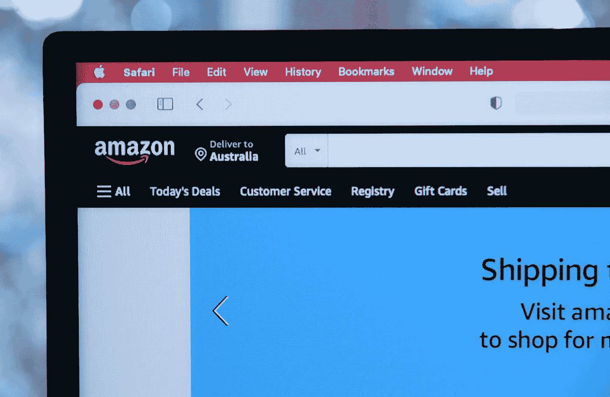

# 人工智能的五种应用——第二部分

> 原文：<https://medium.com/nerd-for-tech/five-applications-of-artificial-intelligence-part2-e004f7c0dbbf?source=collection_archive---------2----------------------->

## 购买预测

如果亚马逊、JD.com、天猫等大型零售商能够提前预测顾客的需求，收入将大幅增加。亚马逊目前正在研究这样一个预期的运输项目。在您下订单之前，货物会被运送到送货车，这样当订单准备好时，您甚至可以在几个小时内收到货物。

毫无疑问，这项技术需要 AI 参与。它需要对每个用户的地址、购买偏好、愿望清单和其他数据进行深入分析，以获得高度可靠的结果。

虽然这项技术还没有实现，但它表明了一种增加销售的想法。它衍生出许多其他方法，包括发送特定优惠券、独特的折扣计划、定向广告等。仓库储存他们可能购买的产品。

## 音乐和电影推荐服务

与其他人工智能系统相比，这项服务相对简单。然而，这项技术将显著提高生活质量。使用网易云音乐，你会惊奇的发现私人 FM 和每日音乐推荐都符合你喜欢的歌单。

AI 可以通过分析你喜欢的音乐，从浩如烟海的曲库中筛选出你想要的部分，找到其中的共性。

电影推荐也是这个道理。AI 对你过去喜欢的电影了解得越多，它就能越好地推荐你想要的电影。

## 对数据标签的需求持续增长

随着 AI 商业化进程的加快，以及辅助驾驶、客服聊天机器人等 AI 技术在各行各业的应用，人们对特殊场景下的数据质量的期望越来越高。高质量的标签数据将是人工智能公司的核心竞争力之一。

如果说之前的算法模型使用的一般数据集是粗粮，那么算法模型目前需要的是定制的营养餐。如果公司想要进一步提高某些模型的商业化，他们必须逐步从通用数据集向前发展，以创建独特的数据集。

## NLP 服务

我们在电子商务、零售、搜索引擎、社交媒体等领域提供不同类型的自然语言处理。我们的服务包括语音分类、情感分析、文本识别和文本分类(聊天机器人相关性)。

ByteBridge 与全球 30 多个不同的语言社区合作，现在提供[数据收集和文本注释服务](https://tinyurl.com/4j2h9nb6)，涵盖语言包括**英语、中文、西班牙语、韩语、孟加拉语、越南语、印度尼西亚语、土耳其语、阿拉伯语、俄语等**。

# 结束

将你的数据标注任务外包给 [ByteBridge](https://tinyurl.com/4j2h9nb6) ，你可以更便宜更快的获得高质量的 ML 训练数据集！

*   无需信用卡的免费试用:您可以快速获得样品结果，检查输出，并直接向我们的项目经理反馈。
*   100%人工验证
*   透明标准定价:[有明确的定价](https://www.bytebridge.io/#/?module=price)(含人工成本)

**为什么不试一试？**

资料来源:http://www.795.com.cn/wz/108245.html