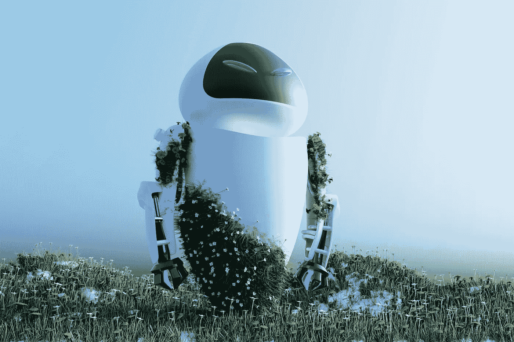

# 数字化转型时期工业机器人的五大发展趋势

> 原文：<https://medium.com/nerd-for-tech/five-major-industrial-robot-development-trends-in-the-digital-transformation-period-b8d2f7edd36d?source=collection_archive---------3----------------------->

## **在人工智能(AI)的帮助下更加智能的机器人**

随着机器人变得越来越智能，它们的效率水平也在提高。许多具有人工智能能力的机器人可以学习收集数据，并在流程和任务中改进行动。这些更智能的版本甚至可以具有“自我修复”功能，机器可以识别内部问题并进行自我修复，而无需人工干预。

这些提高的人工智能水平让我们得以一窥行业的未来，在工作、学习和解决问题时增加机器人劳动力是可能的。

## **环境第一**

所有级别的组织都开始优先考虑其日常实践的环境影响，这反映在他们使用的技术类型中。

2021 年的机器人关注环境，因为该公司希望在改善流程和增加利润的同时减少碳足迹。现代机器人可以最大限度地减少整体资源的使用，因为它们的工作可以更加准确和精确，消除了人为错误和用于纠正错误的额外材料。

机器人还可以协助生产可再生能源设备，为外部组织改善能源消耗提供机会。

## **培养人机协作**

虽然自动化继续改善制造过程的各个方面，但人机协作的增加将在 2022 年继续。

允许机器人和人类在一个共享的空间工作，可以在执行任务时提供更大的协同作用。机器人学会实时响应人类的动作。这种安全共存可以在人类可能需要给机器带来新材料、改变程序或检查新系统运行的环境中看到。

这种结合的方法还允许更灵活的工厂流程，允许机器人完成单调重复的任务，并允许人类提供必要的即兴创作和变化。

更智能的机器人对人类来说也更安全。这些机器人可以感知人类何时在附近，并相应地调整它们的路线或采取行动来防止碰撞或其他潜在的安全危险。

## **机器人技术的多样性**

2021 年机器人行业没有统一的感觉。取而代之的是，工程师们采用了各种各样的设计和材料来最大限度地满足他们的需求。

工程师们正在推动市场上现有产品的极限，以创造更精简的设计，比以前的产品更小、更轻、更灵活。这些流线型的框架还使用了尖端的创新技术，易于编程和优化，以实现人机交互。使用更少的单位材料也有助于降低底线，节省更多的生产成本。

## **机器人进入新市场**

工业部门一直是人工智能技术的早期采用者。然而，机器人提供的生产力不断提高，许多其他行业都采用了令人兴奋的新解决方案。

智能工厂正在颠覆传统生产线，而食品和饮料、纺织和塑料制造已经看到机器人和自动化成为常态。从先进的机器人从托盘中取出烘焙食品并将随机定向的食品放入包装，到监控准确的色度作为纺织品质量控制的一部分，这一过程的各个方面都可以看到。

随着云的广泛采用和远程操作的能力，以及直觉机器人的影响，传统制造设施将很快成为生产力中心。

## 定制数据集

随着 AI 商业化进程的加快和 AI 技术在各行各业的应用，人们对特殊场景下的数据质量的期望越来越高。**高质量的标签数据将是人工智能公司的核心竞争力之一。**

如果说之前的算法模型使用的一般数据集是粗粮，那么算法模型目前需要的是定制的营养餐。如果公司想要进一步提高某些模型的商业化，他们必须逐步从通用数据集向前发展，以创建独特的数据集。

# NLP 服务

我们在电子商务、零售、搜索引擎、社交媒体等领域提供不同类型的自然语言处理。我们的服务包括语音分类、情感分析、文本识别和文本分类(聊天机器人相关性)。

ByteBridge 与全球 30 多个不同的语言社区合作，现在提供[数据收集和文本注释服务](https://tinyurl.com/2p8kdy64)，涵盖**英语、中文、西班牙语、韩语、孟加拉语、越南语、印度尼西亚语、土耳其语、阿拉伯语、俄语等语言**。

# 结束

将你的数据标注任务外包给 [ByteBridge](https://tinyurl.com/2p8kdy64) ，你可以更便宜更快的获得高质量的 ML 训练数据集！

*   无需信用卡的免费试用:您可以快速获得样品结果，检查输出，并直接向我们的项目经理反馈。
*   100%人工验证
*   透明和标准定价:[有明确的定价](https://www.bytebridge.io/#/?module=price)(包含人工成本)

为什么不试一试呢？

https://www.robot-china.com/news/202112/27/69191.html