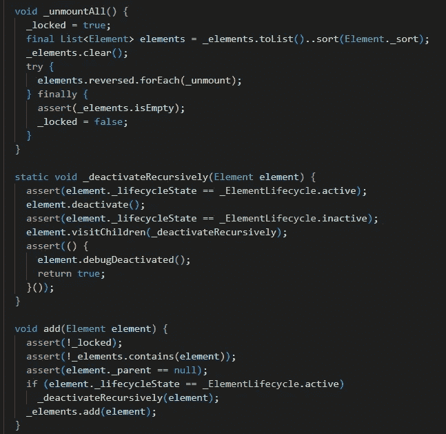

# 给初学程序员的五个建议

> 原文：<https://medium.com/nerd-for-tech/five-tips-for-the-beginner-programmer-25bde40d5aee?source=collection_archive---------8----------------------->

在这篇文章中，我分享一些入门程序员的小技巧。这些对你的职业生涯都有帮助！:)

随机代码。

# 编程世界

当你开始做程序员时，一个新的世界就展现在你面前。编程的世界与“正常”的世界有些不同。一个你必须遵循严格逻辑规则的世界。几乎没有犯错的余地，这有时会令人沮丧。如果某样东西不工作，那是你的错。电脑不在乎；它只听从你的命令。但是不要气馁，因为一切都会在某个时候开始运转！:D

# 1.如果你卡住了，你需要学习更多。

普通编码员。

在我职业生涯的开始，我有时会因为我写的代码不起作用而感到愤怒。这非常令人沮丧，因为我不明白为什么会这样。有些是因为我是一个初学者，缺乏知识，我没有费心去阅读足够的文档或足够努力去理解事情。人们很容易对所有的编程复杂性和规则感到沮丧。因为很难知道一切是如何运作的；然而，最终，你会习惯它，甚至欣赏它，因为当你足够理解并告诉程序做一些事情时，它就会工作。

# 2.和你的朋友谈论编程

和朋友聊天。

如果你有朋友也是做编程的，比如在学校同班，那就好。但是和不太懂的人聊聊自己的职业也是好的。这是因为要向一窍不通的人解释编程，你必须对它有深刻的理解。

与同样做编程的朋友交谈是分享你的专业问题并从中学习的好方法。此外，你的朋友可能知道一些对你的工作或学校项目有很大帮助的事情。

懂编程的人很少，做编程的就更少了。很难找到有相同兴趣或职业的朋友。它让你在一个全新的层面上与他们交流。这也给了你一个当你需要帮助时可以寻求帮助的人，当然，反之亦然；能够帮助你的朋友真好。

# 3.与在线社区分享您的作品

比如 FlutterDev。

乐于分享你的作品。这是一种很好的学习方式。它还教授如何处理批评，以及如何在现实世界中做项目。这比你从不与任何人分享的东西更有意义。因此，大胆和勇敢，并尝试尽可能多地分享你的工作。这可以通过在 Reddit 上发帖、写文章、创作视频或参与开源项目来实现。

# 4.好奇

好奇的猫。:)

不断发现新事物，尝试新技术。阅读文章(如本文)或观看 Youtube 视频是获取软件相关技术新闻的好方法。Reddit 也适合关注特定的技术，比如 Flutter 或者 React。这很重要，因为技术，尤其是软件，发展很快，我们应该跟上最新的发展。

# 5.坚持不懈

打码！

有时候编程的时候会碰到感觉无法通行的砖墙。一些你无法解决的错误。在这些时候，保持冷静并退一步，与同事交谈并从网上寻找答案是至关重要的。为你的问题找到正确的解决方案可能需要一段时间，但是请放心，如果你坚持下去，你会找到的。然而，如果你被困了很长时间，一定要记得休息一下，重新评估情况。关注其他事情也能帮助你更好地处理问题。

如果你喜欢或想给出反馈，请留下评论或鼓掌。:)

[**上一篇:**](/nerd-for-tech/parallels-of-programming-and-writing-5e051bf447d) 编程与写作并行

[**YouTube**](https://www.youtube.com/channel/UCjCeTp2PUd3cqXhEHsx9NHw?view_as=subscriber)

[**推特**](https://twitter.com/vikke94)

[**网站**](http://ktcoding.fi)

[**GitHub**](http://github.com/thevikke)