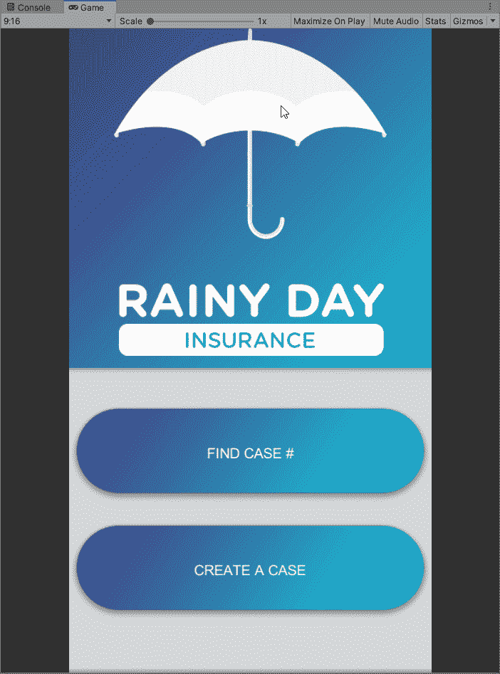
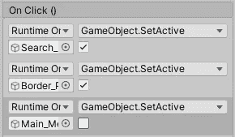
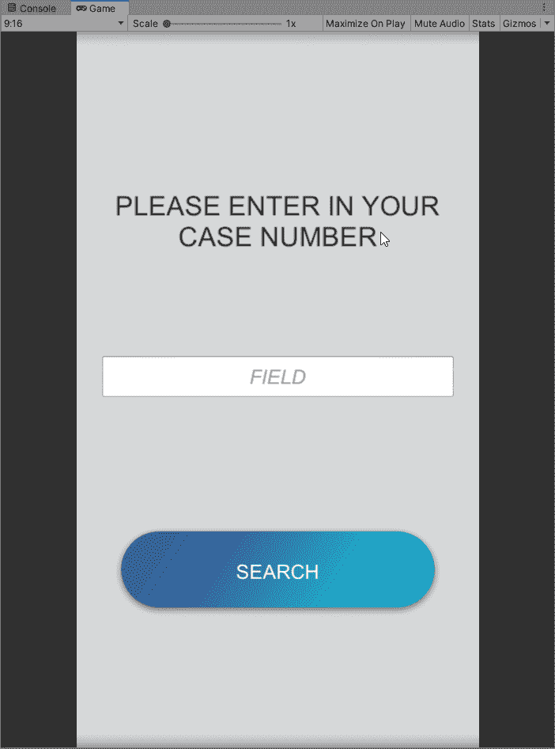
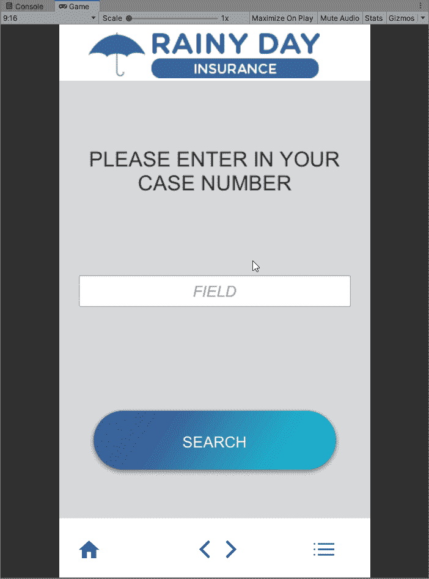
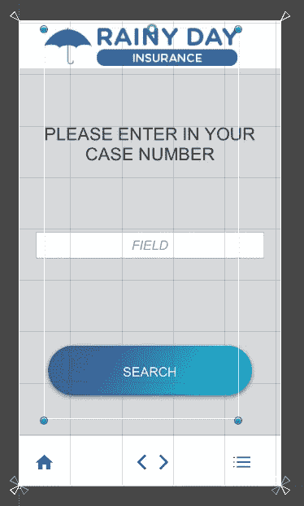
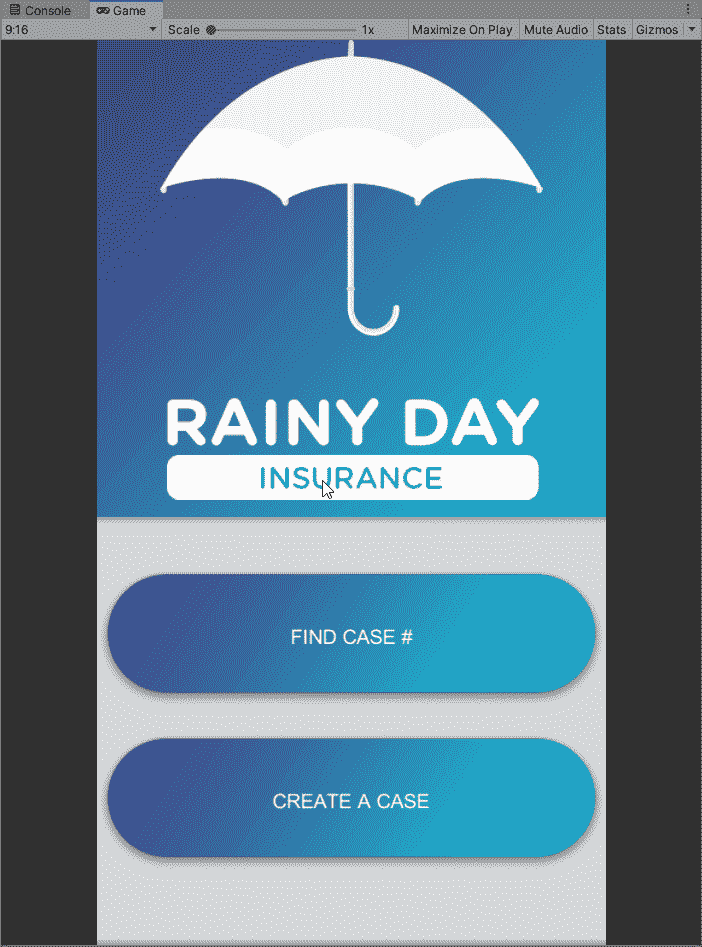

# 修复我的应用程序中的错误

> 原文：<https://medium.com/nerd-for-tech/fixing-a-bug-in-my-app-bc03c9c62c0c?source=collection_archive---------5----------------------->

我正在开发一个有许多 UI 元素的保险应用程序。一个对应用程序运行至关重要的 UI 元素是按钮。我有一个错误，我只能点击按钮的侧面，而不是中间。

我最初认为这与按钮上的文本有关，所以我尝试关闭文本的光线投射目标。

这并没有解决问题。我也意识到我在菜单面板上没有这个问题。然后我想这可能与面板相互作用和相互阻挡有关。应用程序完成后，我尝试禁用面板。

这也没有解决问题。我尝试的下一件事是从点击第一个按钮后的面板启动应用程序。

从此面板开始修复问题。现在我需要找出原因。我意识到我忘了启用这个面板的边框面板。一旦我启用了它，问题又回来了。

现在我知道这个问题与边框面板有关。看了几分钟后，我意识到边框图标的点击框向下延伸到了按钮上。

拉起 hitbox 并确保它没有覆盖任何东西后，按钮开始工作。

