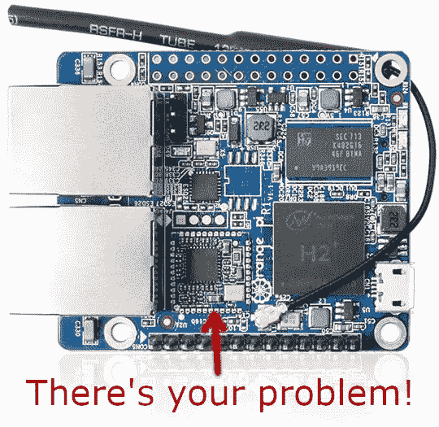
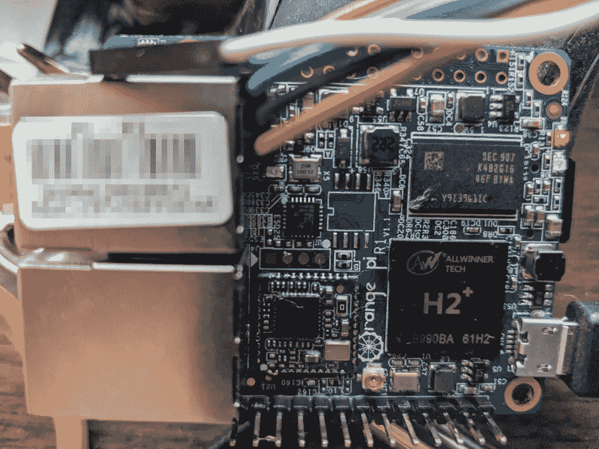

# 修复有缺陷的橙色 Pi R1

> 原文：<https://medium.com/nerd-for-tech/fixing-a-defective-orange-pi-r1-a95ba7901fcf?source=collection_archive---------14----------------------->

几年前，我买了几个橘子皮 R1，我一直很喜欢橘子皮系列的树莓皮克隆。它们非常便宜，一般都很坚固，而且往往比你在类似价格的树莓派上找到的硬件功能好得多。他们也有很好的软件支持，这是 Pi 克隆所没有的。

这一批橙皮 R1 一直在硬件柜中煎熬，等待一个潜在的用例。前几天晚上，我决定为一个项目(我可能会在不久的将来写一篇关于这个项目的文章)拔一个出来。然而，无论我做了什么，我总是在启动过程的早期收到内核崩溃。我尝试了不同的操作系统，官方的 Orange Pi Ubuntu 和 Debian，然后是 Armbian。所有这些都崩溃了，尽管有不同的错误。

不幸的是，我没有捕捉到这些错误中的一个，但是它看起来像这样的错误:

 [## Orange Pi R1 启动错误内核崩溃问题#1603 armbian/build

### armbian 版本 5.98 橙 Pi R1 启动错误消息:[ OK ]启动 LSB:设置 CPUFreq 内核参数。[ 8.670214]…

github.com](https://github.com/armbian/build/issues/1603#issue-511699852) 

但是在我的例子中，我可以看到它试图在这些错误之前加载“rtl8188e”模块。因为这是一致的，并且我知道这个模块是一个与 WiFi 相关的驱动程序，所以我能够推断出我或者是有一个有缺陷的 WiFi 模块，或者是发生了其他事情。

如果参考本文顶部的图片，会看到箭头所指的一个小子板，这个小板就是 WiFi +蓝牙板。从图中可以看到，它是边缘焊接到主板上的。由于我没有什么可损失的，我决定尝试回流这个焊料。在我的主板上，WiFi 板的边缘缺少可见的焊料，我认为这很有可能是罪魁祸首。

在用我的便携式热风枪小心地击打了所有的边之后，我让板子冷却了几分钟，然后试着启动它。这次成功了！我能够完全启动，但是大约 10 分钟后，一旦主板完全冷却下来，我开始收到更多与 WiFi 卡相关的错误，然后内核崩溃。受到鼓舞，我把电路板拿回我的焊接工作台，添加一些助焊剂并拖动焊接电路板的所有边缘，仔细检查桥接。由于空间有限，唯一棘手的部分是沿着以太网插孔的后边缘焊接。下面是焊接工作后的电路板视图(电线连接到串行控制台):

插上电源后，它已经运行了多天，没有出现任何问题。所以，看起来像是错误的边缘焊接是罪魁祸首。如果这个问题是普遍的，我希望这能帮助其他人。