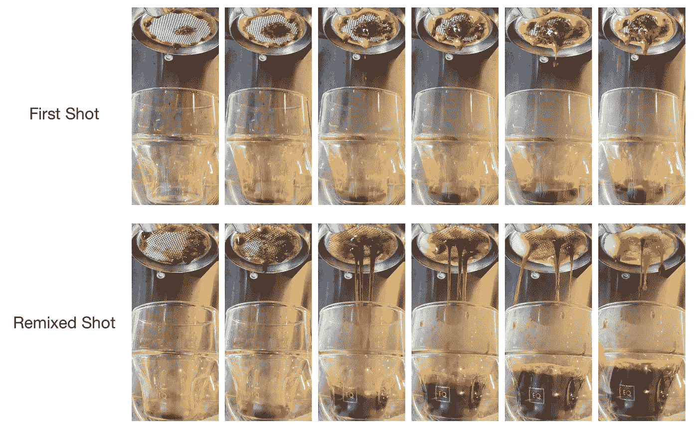
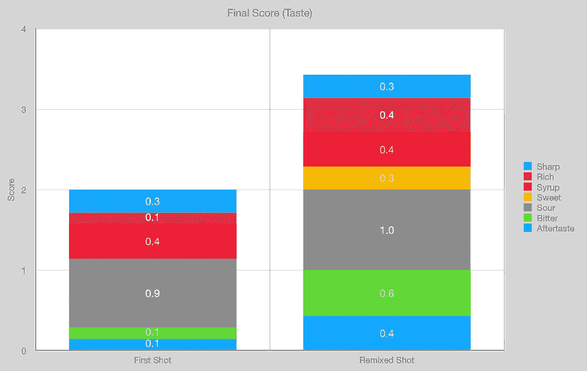
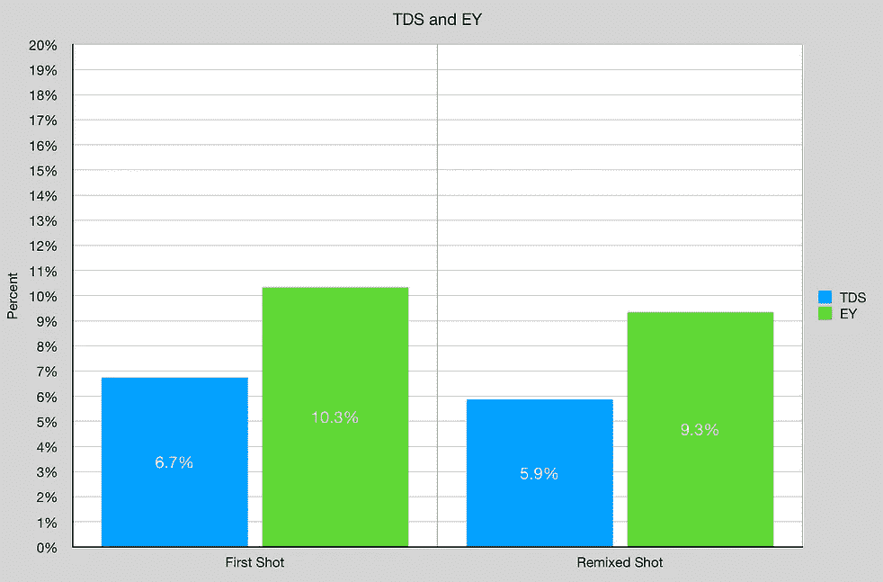

# 修复一杯混乱的罗布斯塔浓缩咖啡

> 原文：<https://medium.com/nerd-for-tech/fixing-a-messed-up-robusta-espresso-shot-a31bbc238e63?source=collection_archive---------0----------------------->

## 咖啡数据科学

## 重复使用而不是浪费

我一直在学习如何拉好罗布斯塔，但有时会出错，通常是在研磨尺寸方面。一天早上，我有一次糟糕的经历，但我不想把咖啡直接扔进水槽。我的包没剩多少了，所以我试了别的东西。

第一枪打错了，所以我拿出冰球，重新混合，并捣实。

重新混合的镜头表现得并不差，我想至少，我可以把两个镜头都放在牛奶里，仍然有很好的咖啡体验。

我研究了味道和提取率(见最后的定义)。重新混合的镜头味道更好。两者都在我的范围的低端，这是意料之中的。当拍摄[意大利腊肠罗布斯塔镜头](/geekculture/we-dont-talk-about-robusta-fa5d14c8e505)时，重新混合的镜头味道更好，因为镜头的第一部分有大部分苦味。

总的来说，我能够很好地提取并继续我的早晨。

我并不总是重新混合糟糕的镜头，但当我这样做时，我通常会添加牛奶。

# 设备/技术

[意式咖啡机](https://towardsdatascience.com/taxonomy-of-lever-espresso-machines-f32d111688f1) : [像样的意式咖啡机](https://towardsdatascience.com/developing-a-decent-profile-for-espresso-c2750bed053f)

[咖啡研磨机](https://towardsdatascience.com/rok-beats-niche-zero-part-1-7957ec49840d) : [小生零位](https://youtu.be/2F_0bPW7ZPw)

咖啡:[家庭烘焙咖啡](https://rmckeon.medium.com/coffee-roasting-splash-page-780b0c3242ea)，中杯(第一口+ 1 分钟)

镜头准备:[断奏夯实](https://towardsdatascience.com/staccato-tamping-improving-espresso-without-a-sifter-b22de5db28f6)

[预灌注](https://towardsdatascience.com/pre-infusion-for-espresso-visual-cues-for-better-espresso-c23b2542152e):长，约 25 秒

输液:[压力脉动](https://towardsdatascience.com/pressure-pulsing-for-better-espresso-62f09362211d)

[过滤篮](https://rmckeon.medium.com/espresso-baskets-and-related-topics-splash-page-ff10f690a738) : 20g VST

其他设备: [Atago TDS 计](https://towardsdatascience.com/affordable-coffee-solubility-tools-tds-for-espresso-brix-vs-atago-f8367efb5aa4)， [Acaia Pyxis 秤](https://towardsdatascience.com/data-review-acaia-scale-pyxis-for-espresso-457782bafa5d)

# 绩效指标

我使用了两套[指标](https://towardsdatascience.com/metrics-of-performance-espresso-1ef8af75ce9a)来评估技术之间的差异:最终得分和咖啡萃取。

[**最终得分**](https://towardsdatascience.com/@rmckeon/coffee-data-sheet-d95fd241e7f6) 是评分卡上 7 个指标(辛辣、浓郁、糖浆、甜味、酸味、苦味和余味)的平均值。当然，这些分数是主观的，但它们符合我的口味，帮助我提高了我的拍摄水平。分数有一些变化。我的目标是保持每个指标的一致性，但有时粒度很难确定。

**使用折射仪测量总溶解固体量(TDS)，这个数字结合咖啡的输出重量和输入重量用于确定提取到杯中的咖啡的百分比，称为**提取率(EY)** 。**

**如果你愿意，可以在推特上关注我，在 YouTube 上关注我，在 Instagram 上关注我在不同机器上拍摄的浓缩咖啡视频和浓缩咖啡相关的东西。你也可以在 [LinkedIn](https://www.linkedin.com/in/dr-robert-mckeon-aloe-01581595) 上找到我。也可以关注我的[中](https://towardsdatascience.com/@rmckeon/follow)和[订阅](https://rmckeon.medium.com/subscribe)。**

# **[我的进一步阅读](https://rmckeon.medium.com/story-collection-splash-page-e15025710347):**

**[我的书](https://www.kickstarter.com/projects/espressofun/engineering-better-espresso-data-driven-coffee)**

**[我的链接](https://rmckeon.medium.com/my-links-5de9eb69c26b?source=your_stories_page----------------------------------------)**

**[浓缩咖啡系列文章](https://rmckeon.medium.com/a-collection-of-espresso-articles-de8a3abf9917?postPublishedType=repub)**

**[工作和学校故事集](https://rmckeon.medium.com/a-collection-of-work-and-school-stories-6b7ca5a58318?source=your_stories_page-------------------------------------)**