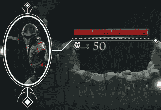
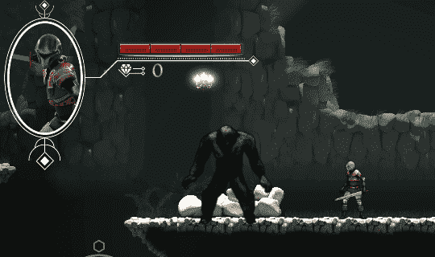
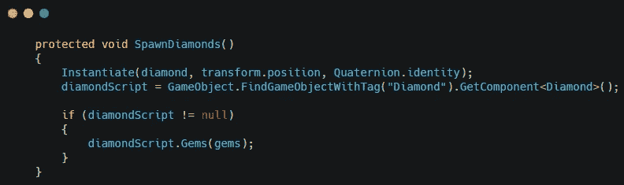
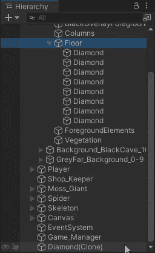
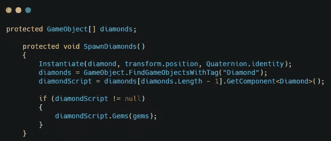
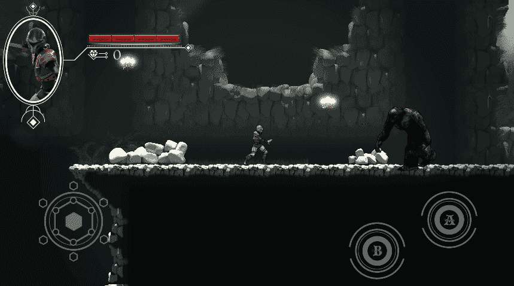

# 修正我游戏中的宝石计数错误

> 原文：<https://medium.com/nerd-for-tech/fixing-the-gem-count-bug-in-my-game-5992b6496773?source=collection_archive---------16----------------------->

当我创建战利品系统的时候，敌人掉落了他们分数数量的宝石。所以一个苔藓巨人会给大约 50 颗宝石，而骷髅只会给 25 颗。在我决定在地图周围添加多颗钻石让玩家发现之前，这一直很有效。这打破了系统，所有的敌人都掉落了 10 颗宝石。

过了一会儿，我发现了问题所在。我使用的代码实例化了钻石，然后找到了钻石脚本并更改了宝石分数。

我发现 unity 是找到第一个菱形脚本，该脚本附加到层次结构中的第一个菱形上，并将该菱形设置为 50 分。因为实例化的钻石是层次结构中的最后一个，所以它永远不会被找到。

为了给正确的钻石设定分数，我稍微修改了一下我的代码。在实例化钻石之后，我创建了一个包含所有钻石的数组。菱形按照 unity 查找脚本的顺序放入数组中。因此实例化的钻石将是最后的。然后，我将菱形脚本设置为数组中最后一个菱形的脚本。这解决了我的问题。

