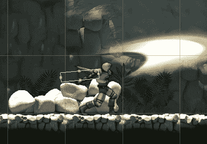
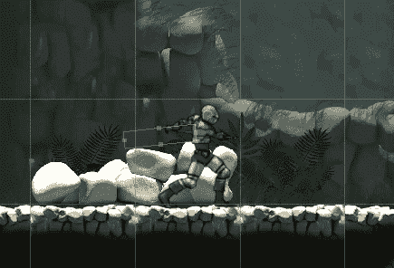
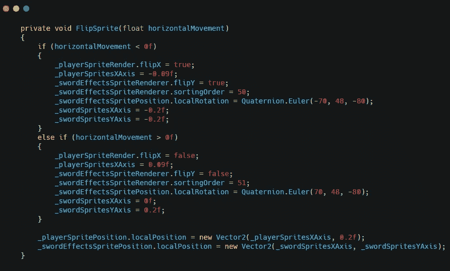
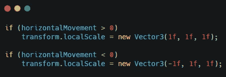
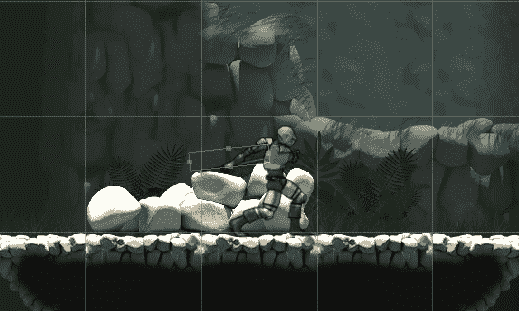

# 翻转 Unity 中的 Hitbox

> 原文：<https://medium.com/nerd-for-tech/flipping-the-hitbox-in-unity-6150b77e9a8c?source=collection_archive---------11----------------------->

当我设计 hitbox 的时候，我让我的球员面向右边。当我把播放器转向左边时，所有的精灵都会翻转，但 hitbox 不会。

这意味着当球员面向左侧时，我的进攻将无法正常进行。

翻转我正在使用的精灵。 **flipY** 和**。flipX** 。

这种方法对 hitbox 不起作用，所以我需要别的东西。过了一会儿，我发现了一个翻转 hitbox 和所有其他精灵的方法。

这个方法是当玩家向左时将父对象的局部比例更改为-1，当玩家向右时更改为 1。这给了我想要的结果，并且消除了对翻转精灵的大块代码的需求。

这段代码做了我想要它做的事情。

