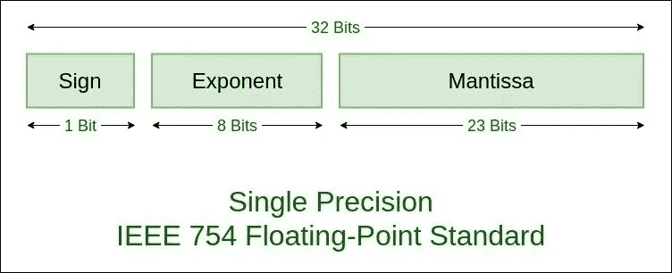
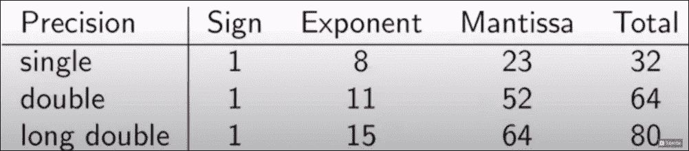
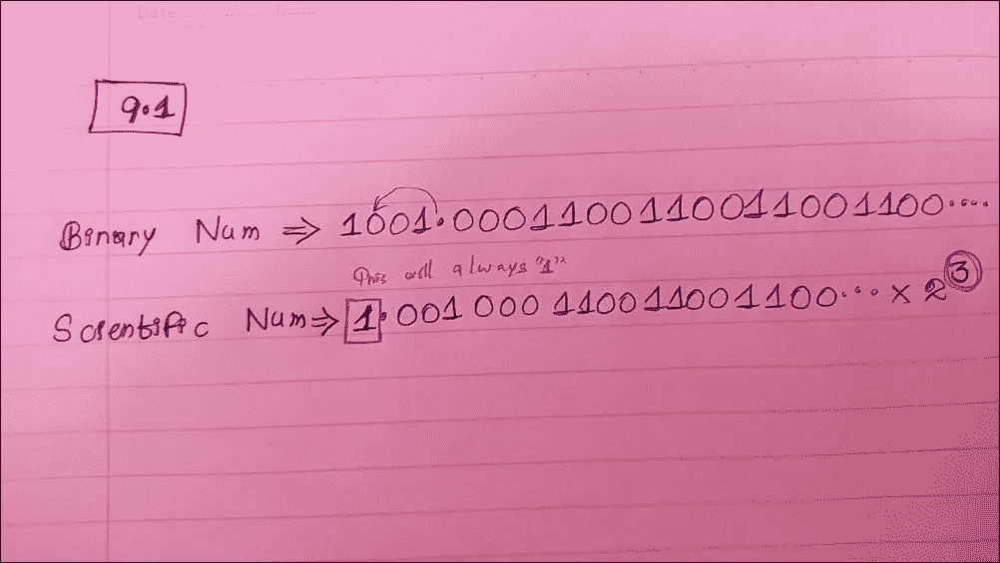
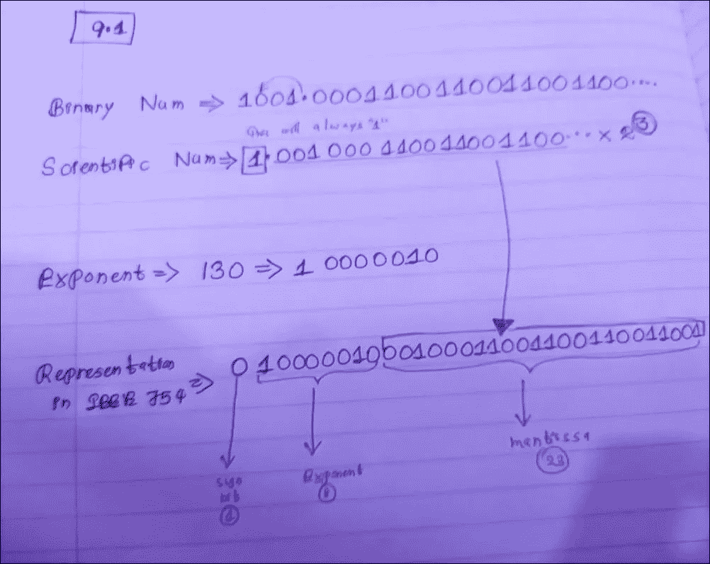

# 浮点错误 1 —计算机如何处理浮点数

> 原文：<https://medium.com/nerd-for-tech/floating-point-error-1-how-computer-deal-with-floating-point-numbers-60d04bed99a?source=collection_archive---------4----------------------->

通常，当我们用计算机工作时，会有一些与现实世界相冲突的情况。

有时候。这些可能会导致编程界的一个巨大问题。因此，有一个关于计算机如何处理事物的好主意是值得的。

最好的例子之一是计算机如何处理浮点数。

计算机遵循名为“IEEE 754”的标准来表示浮点值。

它接受这个数字，这个数字将被分成 3 个部分。

1.  **符号**
2.  **指数**
3.  **尾数**

在这里，我们将以 9.1 为例，看看它如何根据 IEEE 754 进行显示，以及与现实世界有何不同。

首先，我们需要有一个二进制格式和一个科学格式来取 IEEE 表示法。然后，我们可以找到 9.1 的符号、指数和尾数，并获得 IEEE 表示。

在这里，你需要记住一件事，在科学中，第一个数字总是 1，所以我们在寻找尾数时会避开这个数字。

## 让我们找出 9.1 的符号、指数和尾数:

**符号:**

我们得到这个数字，然后检查这个值是负一还是正一。

如果是**负数**，你的星座就是 **1** 。

如果是**正数**，你的星座就是 **0** 。

> 在我们的例子中，9.1 是正数，所以符号是 0。

**指数:**

为了找到这个，你也需要科学的表示，在这里你有 2。当你找到指数时，你会考虑 2 的 3。

首先，您将看到指数有多少位。它显示 8，这意味着你有从-128 到 127 的 2⁸时报。

得到指数的方法是，取 127，从科学部分得到 3，然后将两者相加。

> 在这种情况下，答案是 127+3 = 130。
> 
> 现在你需要 130 的二进制形式。那就是 10000010。
> 
> 那么我们的指数是 10000010。

**尾数:**

为了得到尾数，我们考虑一下科学表示法。

在这里，第一个数字总是 1，所以我们避免。

尾数有 23 位。所以我们会在避开第一个数字后取前 23 个数字。

最后，我们可以用 IEEE 754 来表示 9.1

# ???

但是有一个问题我们需要考虑。这里我们的 IEEE 表示是人工计算的。但是如果我们从 IEEE 计算器得到这个，它会给出一个稍微不同的答案。

9.1:

人力计算->**010000010001000110011001100110011001**

IEEE 计算器计算->

所以，现在你可以看到这是不同的。这意味着，我们可能做编程并有一些期望，但有时这些并不符合我们的期望，这可能会导致我们的程序出错。

在下一部分，我们可以看到一个用例，展示这将如何影响编程。