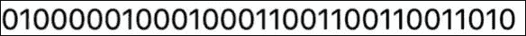
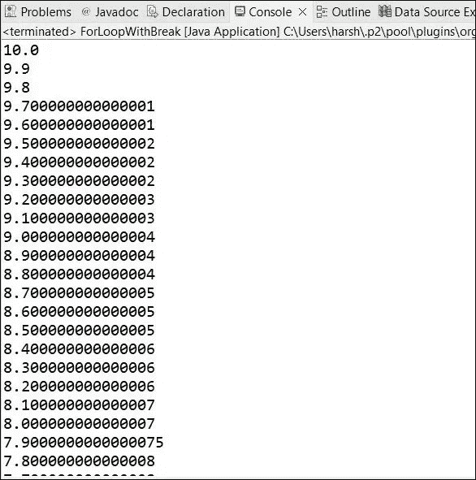
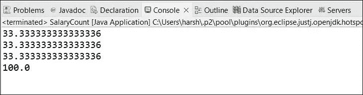

# 浮点误差 2-计算机中的浮点舍入误差

> 原文：<https://medium.com/nerd-for-tech/floating-point-error-2-floating-point-rounding-error-in-computer-b81e944906c6?source=collection_archive---------6----------------------->

在上一篇文章中，我们研究了计算机如何处理浮点数，并试图得到 9.1 的 IEEE 754 表示。

最后，我们发现我们的计算和 IEEE 计算器的计算有些许不同。

9.1:

人力计算->**010000010001000110011001100110011001**

IEEE 计算器计算->

今天，我们将看到一个例子，并了解计算机中的浮点舍入误差。

如果我们试图把这种 IEEE 表示法再计算成一个十进制数，我们将得到 9.10000038 而不是 9.1。

原因是这是什么计算器，当它试图从科学格式得到 IEEE 表示，有一些更多的值，而不是我们得到 23 个值。它会对值进行舍入，并将其作为计算值，也就是说，

由于舍入，当我们试图从 IEEE 1.0 获取十进制值时，我们将得到不同值。

事实是否如此，我们需要知道。

对于这个问题，我将采用两个用例。

**例一:**

在这种情况下，我们希望我们会得到像 10.0，9.9，9.8，9.7，9.6 这样的答案。但是实际上会产生无限的结果，因为这些浮点误差。

从一开始就有一些结果:

你可以看到它与我们的期望不同。

**例二:**

在这种情况下，我们希望答案会给我们 99.9999 的东西。但它会显示答案为 100.0。现在你完全可以看到浮点舍入误差是如何影响我们的程序的。

## 我们能为此做些什么？？？

你可以了解计算机如何处理浮点数，以及它将如何影响我们的程序。此外，在这种情况下，您可以使用一些合适的数据类型。

使用合适的数据类型，举个例子，在 java 中，你可以在 Java 中使用**大小数**。