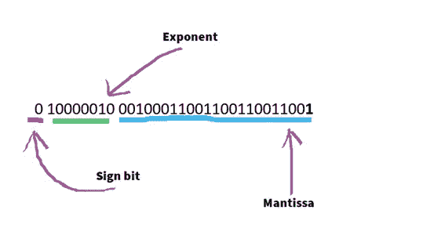
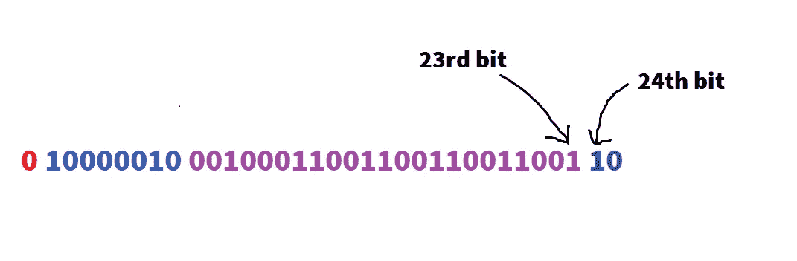
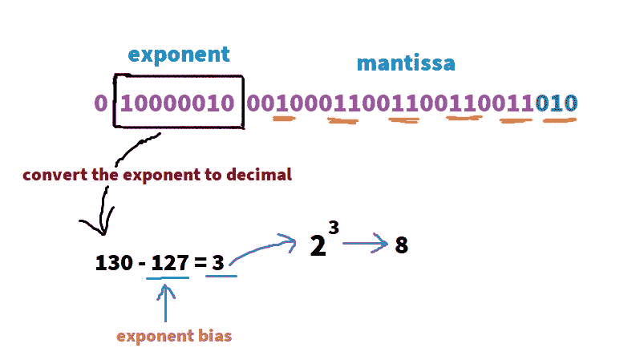
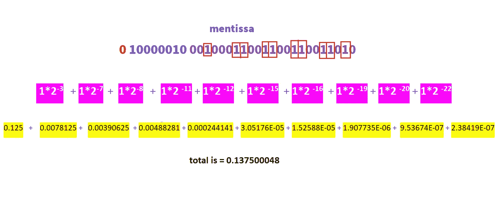

# 计算机中的浮点舍入误差

> 原文：<https://medium.com/nerd-for-tech/floating-point-rounding-error-in-computers-6485cc26f5e8?source=collection_archive---------10----------------------->


[https://news.sky.com/](https://news.sky.com/)

海湾战争期间，1991 年 2 月，美国在沙特阿拉伯的爱国者导弹系统未能跟踪和拦截伊拉克的飞毛腿导弹。飞毛腿导弹击中了美国军营，造成 28 名士兵死亡，100 多人受伤。后来发现这是由时间转换中的舍入误差引起的。

> 在进一步阅读之前，我建议你阅读我的关于**[**计算机如何处理浮点数**](https://hasithas.medium.com/how-computers-handle-floating-point-numbers-bfe9b08b4bc?source=your_stories_page-------------------------------------)**的文章，以理解我在这里谈论的一些事情。****

****停止向下滚动，并尝试猜测以下代码的答案。嗯，应该不会太难😅。(这些代码没有语法问题。他们完全执行得很好；你只需要猜测输出)。****

******问题 01:******

****问题 02:****

****好的。所以我希望你花时间去猜测上面两个代码的输出。****

****所以，如果你期待问题 1 的答案是`99.99`，我不得不说你错了…！实际输出如下所示。****

****问题 1 的输出:****

```
**Salary of 1st month: 33.333333333333336
Salary of 2nd month: 33.333333333333336
Salary of 3rd month: 33.333333333333336
Totoal: 100.0**
```

****(你一定想知道`100 / 3.0` 怎么会是 `33.333333333333336`。别急，我来告诉你怎么做)。****

****对于问题 2，如果你认为答案是类似`99, 100, or 101`的东西，那你就完全错了。这段代码只会给你一个无限循环(如下)。****

****问题 2 的输出:****

```
**-26447.799999895626
-26447.899999895624
-26447.999999895623
-26448.09999989562
-26448.19999989562
-26448.29999989562
-26448.399999895617
-26448.499999895615
-26448.599999895614
-26448.699999895613
-26448.79999989561
-26448.89999989561
-26448.99999989561
-26449.099999895607
-26449.199999895605
-26449.299999895604
-26449.399999895602**
```

****在[我之前的文章](https://hasithas.medium.com/how-computers-handle-floating-point-numbers-bfe9b08b4bc?source=your_stories_page-------------------------------------)中，当我们将 9.1 转换为 IEEE 754 标准时，我们得到了答案。`0100000100010001100110011001100**1**`。****

********

****IEEE 754 标准中的 9.1****

****但是一个计算机/ IEEE-754 浮点转换器的回答是`010000010 0010001100110011001101**0**`和我们预想的不一样。****

> ****希望你注意到两者的最后一点是不一样的。****

****这是如何发生的，当计算机有 23 位的空间时，它寻找第 24 位。如果第 24 位是 1，计算机将截掉其余的位，并将这个 1 加到第 23 位上。(如果第 24 位是 0，反正无所谓)。****

****(如果这是一个双精度浮点数，也会发生同样的情况。如果你第 54 位有 1，电脑会在第 53 位加 1)。****

****因此，根据我们在前一篇文章中的计算，第 24 位是`1`，因为`1100`是循环的。****

********

****当第 24 位(`1`)加到第 23 位(`0`)时，9.1 的 IEEE 754 标准值变为`01000001000100011001100110011010`。所以舍入问题是我们的答案和计算机的答案不同的原因。****

****现在，让我们看看这个二进制数是如何转换回原来的浮点值的。****

****作为该过程的第一步，指数(`10000010`)被转换成十进制，答案是`130`。现在应该从 130 中减去指数偏差(`127`)以获得指数值(`130 - 127 = 3`)。****

********

****接下来，我们需要将尾数转换回它的浮点值。如果您还记得在上一篇文章中我们是如何将浮点转换成二进制的，那么现在我们只需要做相反的事情。****

****如果位值为 0，不影响回答。因此，您可以忽略它，只计算 1。****

********

****现在我们已经计算了`exponent = 8`和`mantissa = 0.137500048`****

****所以在上一篇文章中，我们把尾数转换成 IEEE 754 标准时，省略了前导“1”。所以省略的“1”现在应该加到尾数上。****

****`1.137500048 = 0.137500048 + 1`****

****现在，尾数的新值应该乘以指数值****

****`9.10000038 = 1.137500048 * 3`****

****所以当我们把 9.1 转换成 IEEE 754，再把它转换回浮点时，我们没有得到 9.1；我们得到的是`9.10000038`****

****因此，每当计算机将浮点转换为 IEEE 754 标准并将其转换回浮点时，由于这种舍入问题，我们总是会将它与其他值一起返回。****

****现在让我们回到问题 2 中的循环，做一些修改。****

****输出:****

```
**0.9000000000000187
0.8000000000000187
0.7000000000000187
0.6000000000000187
0.5000000000000188
0.4000000000000188
0.3000000000000188
0.2000000000000188
0.1000000000000188
1.8790524691780774E-14**
```

****现在你可以看到，它将停止，而不是无限循环。所以纵观这些值，你会发现`i` 并没有达到 0，但是由于舍入问题而增加的额外值，它超过了 0。****

## ****那么 Java 中这个问题的解决方法是什么呢？****

****您可以使用 Java BigDecimal 类，而不是使用 double 或 float 或财务任务、军事用途和科学计算。BigDecimal 类可以非常精确地处理非常大和非常小的浮点数。****

****看看问题 1 和 2 中的问题是如何用 Java BigDecimal 类解决的。****

## ****参考****

****[](https://dzone.com/articles/never-use-float-and-double-for-monetary-calculatio) [## 为什么在货币计算中不应该使用浮点数和双精度数

### 浮点数和双精度数对金融(甚至军事)世界都是有害的，永远不要把它们用于货币计算。如果…

dzone.com](https://dzone.com/articles/never-use-float-and-double-for-monetary-calculatio) [](https://www.geeksforgeeks.org/bigdecimal-class-java/) [## Java 中的 BigDecimal 类- GeeksforGeeks

### BigDecimal 类提供了对双精度数的运算，用于算术、小数位数处理、舍入、比较、格式…

www.geeksforgeeks.org](https://www.geeksforgeeks.org/bigdecimal-class-java/)****