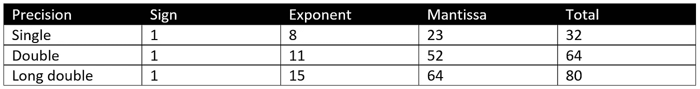
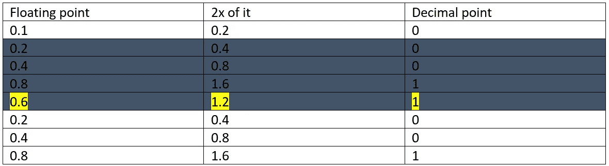
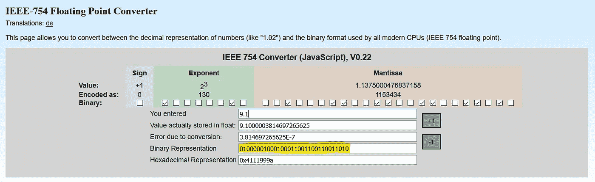
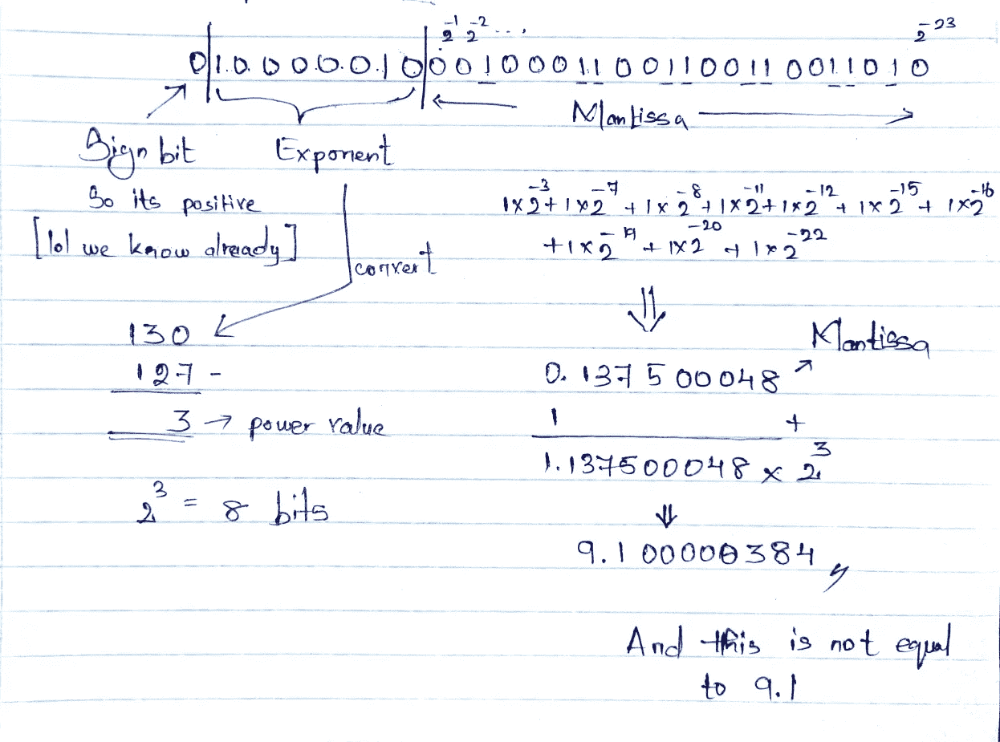

# 编程世界中的浮点舍入问题

> 原文：<https://medium.com/nerd-for-tech/floating-point-rounding-problem-in-programming-world-86c5639c102c?source=collection_archive---------14----------------------->


由[沃尔坎·奥尔梅斯](https://unsplash.com/@volkanolmez?utm_source=medium&utm_medium=referral)在 [Unsplash](https://unsplash.com?utm_source=medium&utm_medium=referral) 拍摄的照片

在开始任何事情之前，请看下面的 java 程序，

如何看待这段代码，当我打到 0 的时候会结束吗？。让我们看看输出，

```
10.0                                                                                                                    9.9                                                                                                                     9.799999                                                                                                                9.699999                                                                                                                9.599998                                                                                                                9.499998                                                                                                                9.399998                                                                                                                9.299997                                                                                                                9.199997                                                                                                                9.099997                                                                                                                8.999996                                                                                                                8.899996                                                                                                                8.799995                                                                                                                8.699995                                                                                                                8.599995                                                                                                                8.499994                                                                                                                8.399994                                                                                                                8.2999935                                                                                                               8.199993                                                                                                                8.099993                                                                                                                7.999993                                                                                                                7.899993                                                                                                                7.799993                                                                                                                7.699993                                                                                                                7.599993                                                                                                                7.4999933                                                                                                               7.3999934                                                                                                               7.2999935                                                                                                               7.1999936                                                                                                               7.0999937                                                                                                               6.999994                                                                                                                6.899994                                                                                                                6.799994                                                                                                                6.699994                                                                                                                6.599994                                                                                                                6.4999943                                                                                                               6.3999944                                                                                                               6.2999945                                                                                                               6.1999946                                                                                                               6.0999947                                                                                                               5.9999948                                                                                                               5.899995                                                                                                                5.799995                                                                                                                5.699995                                                                                                                5.599995                                                                                                                5.499995                                                                                                                5.3999953                                                                                                               5.2999954                                                                                                               5.1999955                                                                                                               5.0999956                                                                                                               4.9999957                                                                                                               4.899996                                                                                                                4.799996                                                                                                                4.699996                                                                                                                4.599996                                                                                                                4.499996                                                                                                                4.3999963                                                                                                               4.2999964                                                                                                               4.1999965                                                                                                               4.0999966                                                                                                               3.9999967                                                                                                               3.8999968                                                                                                               3.7999969                                                                                                               3.699997                                                                                                                3.599997                                                                                                                3.4999971                                                                                                               3.3999972                                                                                                               3.2999973                                                                                                               3.1999974                                                                                                               3.0999975                                                                                                               2.9999976                                                                                                               2.8999977                                                                                                               2.7999978                                                                                                               2.699998                                                                                                                2.599998                                                                                                                2.499998                                                                                                                2.3999982                                                                                                               2.2999983                                                                                                               2.1999984                                                                                                               2.0999985                                                                                                               1.9999985                                                                                                               1.8999984                                                                                                               1.7999984                                                                                                               1.6999984                                                                                                               1.5999984                                                                                                               1.4999983                                                                                                               1.3999983                                                                                                               1.2999983                                                                                                               1.1999983                                                                                                               1.0999982                                                                                                               0.9999982                                                                                                               0.8999982                                                                                                               0.79999816                                                                                                              0.69999814                                                                                                              0.5999981                                                                                                               0.49999812                                                                                                              0.39999813                                                                                                              0.29999813                                                                                                              0.19999814                                                                                                              0.09999814                                                                                                              -1.861155E-6                                                                                                            -0.100001864                                                                                                            -0.20000187                                                                                                             -0.30000186                                                                                                             -0.40000185                                                                                                             -0.50000185                                                                                                             -0.6000019                                                                                                              -0.7000019                                                                                                              -0.8000019                                                                                                              -0.90000194                                                                                                             -1.0000019                                                                                                              -1.1000019
.
.
.
.
```

这应该是 10.0，9.9，9.8，…对吗？。然后发生了什么？。这一跑不停。我刚刚复制了几行输出显示在这里。这是因为 IEEE 754 浮点表示法。

## IEEE 754 浮点表示法

在计算机中，有一个技术标准叫做 IEEE 754 ，用来表示浮点数。它有以下三个主要组成部分:

**符号—** 仅由二进制符号的一位组成，如果为 1，则值为负，0 为正。

**指数** —表示指数时，应包括正值和负值。并且可以用 2⁸位数来表示。
范围是-128 到 127(这个 127 被称为**指数偏差**)，这意味着，如果科学记数法值中 2 的幂是正的，那么它必须加上 as 指数偏差并接受指数。

**尾数—** 尾数是以 2 为基数的科学记数法的二进制表示。在这里，只有科学记数法小数点后的值会被去掉。


IEEE 的组件



让我们看一个例子，

我将把 **9.1** 转换成二进制，因为我们已经把 **9** 转换成二进制，这给出了值 **1001。**现在让我们转换 0.1，这就是事情变得有趣的地方。它需要乘以 2，直到两次变成 1.0，所以让我们看看它是如何进行的，(这应该重复，直到你在系列中找到一个模式)。



将 0.1 转换为二进制

正如我在上面的图中所示，它永远不会结束。所以阴影部分将作为一个集合重复。所以让我们写二进制格式，

对于 0.1👇

```
0001100110011001100…………
```

对于 9👇

```
1001
```

所以对于 9.1👇

```
1001.0001100110011001100…………
```

这就是它在科学记数法中的样子，

```
1.0010001100110011001100…… x 2³
```

现在让我们用 IEEE 表示法来展示它。根据理论，如果功率为正，则应加上**指数偏差(127)** 。在我们的例子中，它是 3，也是正的。那么如果我们加上 3+127 就是 130。现在让我们把它转换成二进制来得到指数部分。

```
10000010
```

现在让我们看看尾数，它只需要 23 位，所以 9.1 的二进制值是 1.0010001100110011001100……x ^ 2，尾数是`00100011001100110011001`

现在让我们写这个值，因为 9.1 是正数，所以符号位是零

```
**0 | 10000010 | 00100011001100110011001**
```

因此，根据 IEEE 标准的表示是**010000010001100110011001100110011001。**但计算机做的是，如果第 24 位是 1，它会在第 23 位加 1(如果是 0 没关系)并存储。

因此答案将是**01000001000100011001100110011010**(因为在我们的例子中，第 24 位是 1，所以它被添加到第 23 位)。即使你用计算器检查，你也会得到这个答案。



现在让我们看看，当我们把这个值转换回十进制时，答案是什么，



二进制到十进制转换

所以这就是浮点舍入问题。这个问题有多种解决方案，一种是使用合适数据类型。在 Java 中(因为我是 Java 开发人员😏)我们可以用 **BigDecimal** 来讨论一下。

# Java 中的 BigDecimal

`BigDecimal`类是一个任意精度的有符号十进制数，提供算术、小数位数操作、舍入、比较、散列和格式转换等操作。这由两部分组成，

*   未缩放的值—任意精度的整数。
*   小数位数—一个 32 位整数，表示小数点右侧的位数。

我们使用 ***BigDecimal*** 进行高精度运算。我们还将它用于需要控制比例和舍入行为的计算。在处理大浮点值和小浮点值时，它也有很好的准确性。为了初始化 BigDecimal，它有许多构造函数。要构建 BigDecimal 对象，可以将整数、字符串或双精度值作为参数传递。

```
BigDecimal(int val)
BigDecimal(String val)
BigDecimal(double val)
BigDecimal(BigInteger val)and more
```

它有很多我们可以使用的方法，

```
add(BigDecimal augend)
divide(BigDecimal divisor)
compareTo(BigDecimal val)and more
```

现在让我们用 BigDecimal 来解决这个问题，

在这里，我导入了`math`库，因为它有 BigDecimal 类。所以当我运行这个程序时，我得到了如下的输出，

```
10
9.9
9.8
9.7
9.6
9.5
9.4
9.3
9.2
9.1
9.0
8.9
8.8
8.7
8.6
8.5
8.4
8.3
8.2
8.1
8.0
7.9
7.8
7.7
7.6
7.5
7.4
7.3
7.2
7.1
7.0
6.9
6.8
6.7
6.6
6.5
6.4
6.3
6.2
6.1
6.0
5.9
5.8
5.7
5.6
5.5
5.4
5.3
5.2
5.1
5.0
4.9
4.8
4.7
4.6
4.5
4.4
4.3
4.2
4.1
4.0
3.9
3.8
3.7
3.6
3.5
3.4
3.3
3.2
3.1
3.0
2.9
2.8
2.7
2.6
2.5
2.4
2.3
2.2
2.1
2.0
1.9
1.8
1.7
1.6
1.5
1.4
1.3
1.2
1.1
1.0
0.9
0.8
0.7
0.6
0.5
0.4
0.3
0.2
0.1
```

哒哒🥳.我们得到了答案。

# 参考

我参考了下面的 YouTube 播放列表来写这篇文章，它是由 [Krishantha Dinesh](https://medium.com/u/26403c4bd160?source=post_page-----86c5639c102c--------------------------------) 制作的。

我还引用了以下内容来完成这篇文章，

 [## BigDecimal (Java 平台 SE 8)

### 为了简洁明了，在 BigDecimal 方法的描述中使用了伪代码。的…

docs.oracle.com](https://docs.oracle.com/javase/8/docs/api/java/math/BigDecimal.html) [](https://www.baeldung.com/java-bigdecimal-biginteger) [## Java 中的 BigDecimal 和 big integer | bael dung

### 在本教程中，我们将演示 BigDecimal 和 BigInteger 类。我们将描述这两种数据类型，它们的…

www.baeldung.com](https://www.baeldung.com/java-bigdecimal-biginteger)