# 从前端到后端的数据流/[测试文章系列第 4 部分中的软件开发工程师]

> 原文：<https://medium.com/nerd-for-tech/flow-between-frontend-and-backend-software-developer-in-test-article-series-part-4-8a8d6db27e10?source=collection_archive---------4----------------------->

这是我的“如何成为一名测试中的软件开发工程师”文章系列的第四篇文章。所有这些文章都是以问答的形式写的。正如我从我的一些菲律宾朋友那里了解到的，这个方法是苏格拉底为了更好地解释事物而发明的。因此，我希望技术和非技术的家伙将受益于这些文章。

你可以在这里找到第一篇****第二篇 [**这里**](https://kicchi.medium.com/agile-methodology-and-scrum-framework-software-developer-in-test-article-series-part-2-af5f2dd3e6ac) ，第三篇 [**这里**](https://kicchi.medium.com/evaluation-from-requirement-to-user-story-software-developer-in-test-article-series-part-3-4602ff86959f) 。强烈推荐在这篇之前先看前面的文章。****

****由于我已经做了 11 年多的软件开发人员，我将提供一些真实的和可行的示例代码。这些代码样本源自移动应用程序、桌面应用程序、web 应用程序、web 服务以及各种数据库过程。****

****为了更好地说明问题，我在文章中大量使用了 Q 女士和索比作为例子。****

*******女士 Q:*** 一位女商人，也是索比 app 的客户。她付钱给一家软件开发公司开发索比应用程序。****

*******索比:*** 一款用于创建和分享民调的 android 应用。在本系列文章中，以 SorBi 为例。这款应用在 [**Google Play**](https://play.google.com/store/apps/details?id=com.lespania.sorbi) 上可用，支持英语和土耳其语。****

****让我们享受学习令人兴奋的数据数据流步骤吧！****

> ******问题:**你答应解释索比 app 的底层系统是什么。你可以吗？****

******回答:**可以，当然可以。如你所知(从前面的会话中), SorBi 是一个 Android 应用程序，是由客户 Lady Q 请求的。尽管它是一个 Android 应用程序，但它有一个巨大的底层系统。你想从哪一部分开始？前端还是后端？****

******问:**😕****

****我看你有点困惑。让我展示一个图像来解释它们是什么。****

****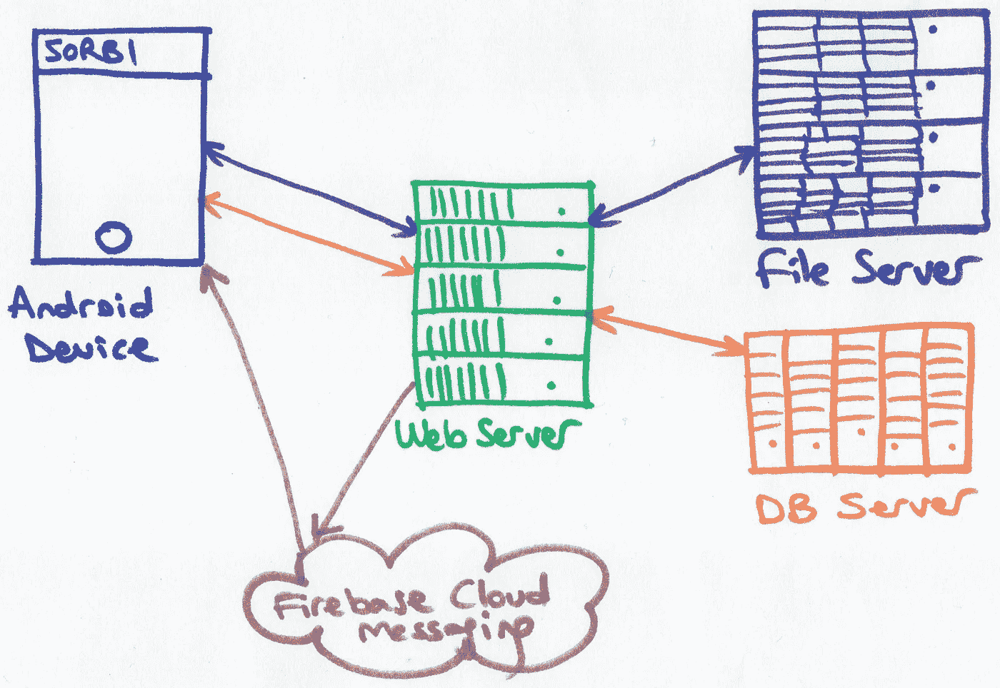****

****SorBi 的基本流程图****

****如您所见， **frontend** 是最终用户与之交互的用户界面。它可以是移动应用程序、网站或桌面应用程序。****

******后端**是**大部分**应用的底层系统。我的意思是有很多应用程序不需要后台系统也能运行。一旦它们被安装，它们不需要任何数据库或 web 服务来运行。考虑一个简单的闹钟应用程序。一旦你安装了它，你可以在没有互联网连接的情况下使用它。此外，你不需要数据库服务器或网络服务器，甚至文件服务器。您没有要保存到数据库或文件服务器的内容。****

****但是，如果你运行一个像 SorBi 这样的应用程序，你就会被严格地绑定到 web 服务、数据库(DB)和 FireBase 云消息系统(FCM)上。我的意思是，SorBi 使用的数据来自于数据库服务器，而它使用的文件来自于文件服务器。此外，作为它们之间桥梁的网络服务运行在网络服务器上。这些都叫后端。****

> ******问:**坚持住哥们。坚持住。保持冷静。你总是说 bla bla 服务器，bla bla 服务器等等。看在上帝的份上，请解释一下。****

****是的，我有点兴奋。实际上，服务器是一台为客户服务的计算机(硬件&软件)。客户端可以是移动应用程序、网站或桌面应用程序。服务器是一台运行特殊操作系统(如 Windows Server 2016、RedHat)和特殊应用程序(IIS、Apache)的强大计算机，为这些客户端提供服务。很明显，这些机器几天甚至几年不间断地工作。它们可以同时处理成百上千个来自客户端的请求。****

****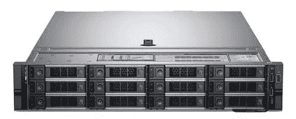****

****一个服务器****

> ******问:**好吧，但是拥有这么多不同服务器的目的是什么？****

******答:**有些服务器是专门为存储/共享文件而生产的(文件服务器)，有些是用于运行数据库应用程序的(数据库服务器)，有些是专门针对游戏的(游戏服务器)等。****

> ****问:向服务器发送数据。这是什么意思？目的是甚麽？****

****答:非常好的问题。数据可以是用户名、密码、城市名称、安全问题/答案、电子邮件等。这些都存储在数据库中，以便在需要时检索。****

****让我们分析一下 SorBi 的注册模块，以便**跟踪用户名和密码数据**。它们是从注册模块中收集的，最后保存到数据库中。****

# ******检查客户端/图形用户界面(GUI)/前端******

****如下图所示，这是索比应用程序的注册模块代码。****

****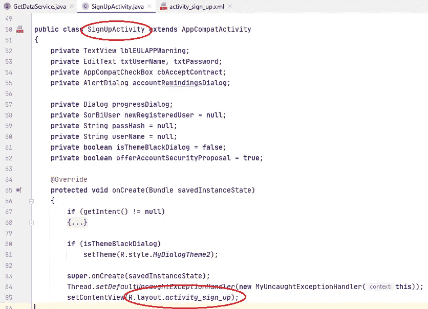****

****注册活动代码(IDE: Android Studio)****

****从下面的红圈可以看出，该模块相关的用户界面设计(布局)是:****

****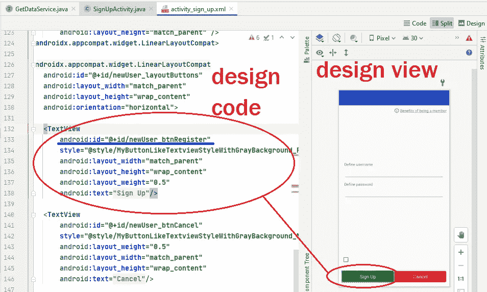****

****注册布局****

****K **EEP 跟踪从注册屏幕文本文件中获取的**用户名**和**密码**的******

**正如我们从上图看到的，“注册”按钮的 ID 是“newUser_btnRegister”。现在让我们从相关的代码类中找到那个按钮。我指的是注册活动类:**

**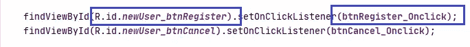**

**分配 OnClickListener**

**这段代码告诉我们:当单击“newUser_btnRegister”按钮(注册按钮)时，将会触发“btnRegister_Onclick”事件。现在让我们来看看这个事件:**

**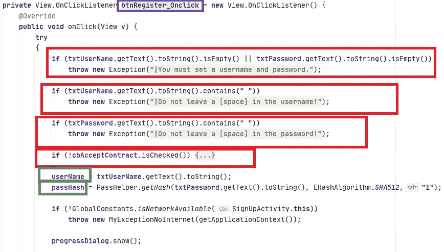**

**btnRegister_Onclick 事件代码**

**如您所见，此点击事件首先检查是否提供了用户名和密码，如果是，则检查用户名和密码是否包含空格，如果是，则检查是否选中了“成员协议”、“隐私和 Cookie 政策”、“启示和同意文本”的“理解和接受”复选框。**

**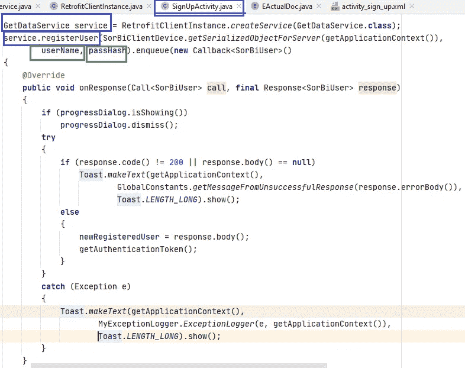**

**btnRegister_Onclick 事件代码(续)**

**就在那之后，正如您在上面看到的，如果所有的**客户端验证**都使用用户名和密码完成，那么注册按钮的 click 事件处理程序从一个名为 GetDataService 的接口调用“registerUser”函数(如下所示)。**

**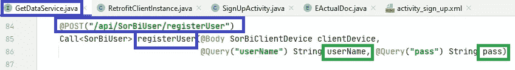**

**GetDataService 接口的“registerUser”函数**

**这个函数负责向 web 服务(API)发送用户名和密码。**

> ****问:**应用程序如何知道 web 服务在哪里？**

**答:首先你得租一个**域名**比如“bisor.org”。然后你必须购买一个 web **主机**计划**发布**并运行你的 web 服务。在客户端设备中，我指的是 Android 应用程序，有一个名为 **BASE_URL** 的变量保存着 web 服务的域名地址:**

**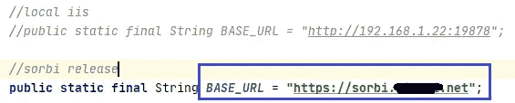**

**Web 服务域名**

# **检查服务器端/应用程序编程接口(API)/后端**

****问:**据我所知，Android 应用程序 SorBi，我指的是客户端，将用户名和密码发送到 Web 服务，我指的是 API，并从服务请求将它们保存到数据库以供将来处理。正确吗？**

**答:绝对可以。我们为索比 app 提供的 web 服务是一个 RestFul 服务。而且我们可以称之为 Restful **应用编程接口** (API)，即 Restful API。RESTful API 是应用程序编程接口(API)的一种架构风格，它使用 HTTP 请求来访问和使用数据。没必要迷惑我们自己。总而言之，web 服务是客户端和服务器之间的桥梁。**

**这是注册新用户的 **SorBi API** 的相关代码:**

**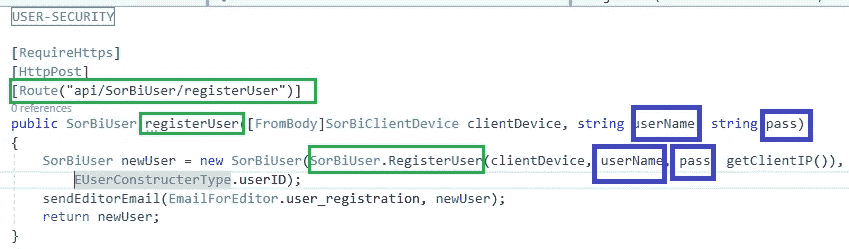**

**索比用户 API 控制器(IDE: Visual Studio)**

**正如你看到的，当 API 从客户端(无论是移动应用还是网站)获得用户注册**请求**时，从 SorBiUser 类调用了**函数**“register user”。**

**这是“注册用户”功能:**

**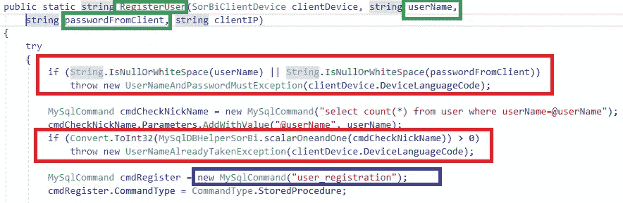**

**API 的“RegisterUser”函数**

**如你所见，红色矩形中的代码再次检查用户名和密码是否有空格。此外，该功能检查用户名是否已被占用。如果所有的**服务器端验证**都通过了，如蓝色矩形所示，将使用用户名和密码参数调用一个名为“user_registration”的**存储过程**。**

> ****问:**易小子，易！什么是存储过程？它在哪里？**

****答:**存储过程是数据库中存在的函数。您可以在几乎所有流行的数据库中创建存储过程，如 MSSQL、MYSQL、Oracle 等。我们使用 MySQL 作为我们 SorBi 后端的数据库。数据库运行在与 web 服务器不同的物理服务器上。**

> ****问:**好的。那么，web 服务如何知道数据库在哪里呢？**

****答:**我们在 API 中定义了一个**连接字符串**，如下所示:**

**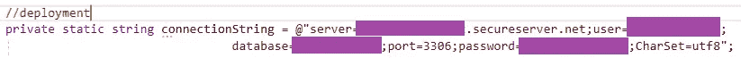**

**API 的数据库连接字符串**

# **检查服务器端/数据库/后端**

**使用指定的数据库域地址和凭证，我们的 API 可以与 SorBi MySQL 数据库建立连接。**

**让我们看看我们的数据库中的“user _ registration”**存储过程**:**

**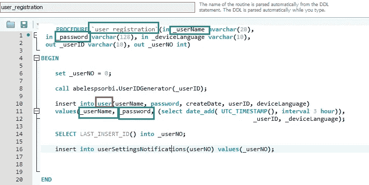**

**存储过程“用户注册”(GUI: MySQL 工作台)**

**最后，在此过程的帮助下，我们可以将新用户信息注册到“user”**表**中，如红圈所示。让我们看看 MySQL 数据库中的“用户”表:**

**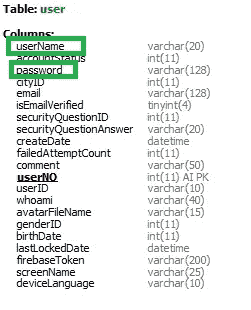**

**“用户”表列**

**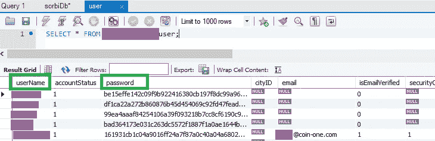**

**来自“用户”表的数据**

**这是我们所做工作的总结:**

**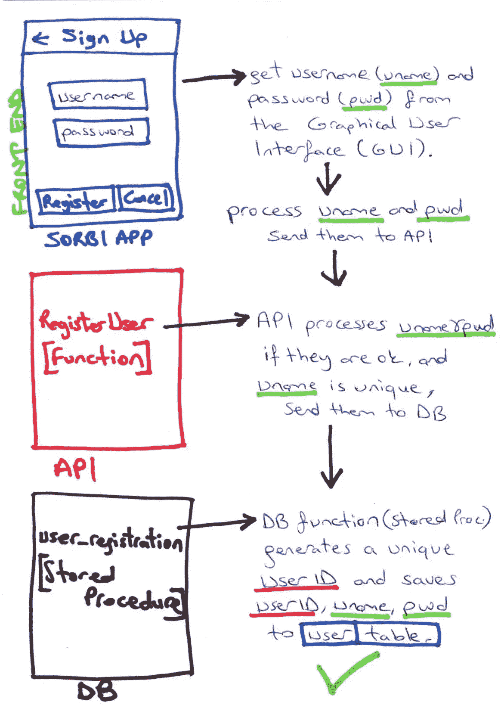**

**用户名密码数据流摘要**

> **问:我觉得我解决了一个大问题。现在更清楚了。从用户界面到数据库的数据流步骤是正常的。然而，我不明白数据库中的数据是如何传递到用户界面的？**

**答:这很正常。因为我对此只字未提。下一节课的主题是数据如何从数据库传输到用户界面或前端程序。**

**注册后我们会跟踪用户数据。一旦在 SorBi 应用程序中创建了用户帐户，后端会立即将新用户的信息发送到前端。因此，前端将一些重要的设置应用于应用程序首选项。**

****问:**爽。🤓**

**注:你可以在这里 找到第五篇 [**。**](https://kicchi.medium.com/data-flow-from-backend-to-frontend-software-developer-in-test-article-series-part-5-f4c68e907609)**