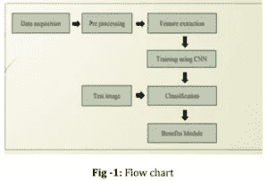
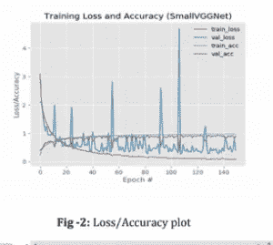
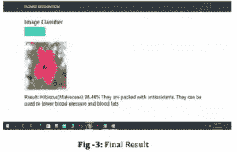

# 卷积神经网络中的花朵识别和准确性

> 原文：<https://medium.com/nerd-for-tech/flower-recognition-and-accuracy-in-convolutional-neural-networks-8d6ac364b47a?source=collection_archive---------2----------------------->

## 介绍

卷积神经网络(CNN)是深度学习中的一类人工神经网络。PlantNet 植物识别通常用于探索视觉图像。大多数卷积神经网络反对不变量，反对平移。他们有演示；

*   在图像和视频识别中
*   推荐系统
*   图像分类
*   图象分割法
*   医学图像分析
*   自然语言处理
*   脑机接口
*   金融时间序列

CNN 是用多层感知器标准化的。这些是完全连接的网络。一层中的每个神经元都与下一层中的所有神经元相连。这种完全的连通性使他们倾向于过度拟合数据。

## 描述

在这篇文章中，我们将尝试引入卷积神经网络，通过公平地输入要识别的花的图像来熟练地识别花。花是大自然可爱的创造之一。它们以数百万种不同的种类和颜色出现。鉴别每一种都需要一个拥有丰富知识和技能的植物学家。

在这个持久和新兴技术的时代，通过将人工智能融入现实世界的问题，不可能的记录成为可能。通过结合机器学习算法，例如仅用一幅图像对花卉进行分类的卷积神经网络，将为制药和化妆品等行业提供过度支持。

## 程序

*   CNN 模型主要通过在标签旁边输入一组花的图像来训练。
*   这些图像在那时通过具有卷积层、ReLU 层、池层和完全连接层的一堆层。
*   这些图像被批量使用。

推荐系统包括:

*   已知批量大小为 32。
*   该模型使用 150 个历元进行训练。
*   首先，模型提取小特征。
*   随着训练过程的发展，将提取更全面的特征。
*   最好的预处理是自动完成的。这是 CNN 的主要好处之一。
*   此外，输入图像被调整大小。
*   通过应用例如旋转、剪切等操作，增加数据集的大小。
*   该模型实现特征和模式，并在训练过程中学习它们。
*   当新的花图像被设置为输入时，该信息然后被用于寻找花的名称。
*   使用确定的交叉熵作为损失函数。
*   起初，损失值会非常高。然后，随着过程的进行，通过修改权重值来降低损失函数。
*   CSV 文件被导入，一旦分类完成，该植物最重要的用途就会显示出来。
*   该模型被部署到一个 web 应用程序中，以增加用户友好性。

## 应用

推荐的系统应用如下:

阶段 1:图像获取:

*   这个阶段包括收集图像。这些图像可用于训练模型。
*   它可以以系统训练期间学习的知识为中心对花卉进行分类。

阶段 2:图像预处理:

*   在这一阶段，对前一阶段的图像一起进行尺寸调整和放大，以提高模型的效率。
*   数据集的大小将通过在扩充期间进行操作来扩充，例如旋转、剪切等。
*   届时，图像将被分为 75%的训练集和 25%的测试集。

第三阶段:培训水平:

*   在这个阶段，模型的真正训练开始了。
*   在此期间，模型提取用于训练的特征，例如花的颜色和形状。
*   每个训练图像将在一堆层上传递。
*   这些层包含卷积层、Relu 层、池层和全连接层。

第 4 阶段:验证阶段:

*   当模型从训练集中完成其训练时，它试图通过调整其权重值来开发该训练集。
*   使用的损失函数是确定的交叉熵。
*   使用的优化器是随机梯度背景。

第五阶段:产量计算:

*   一旦验证阶段结束，该模型准备拍摄一朵花的未知图像。
*   它根据通过训练和验证级别获得的知识来计算其名称。
*   一旦模型完成分类，它将显示该花的通用名和姓。

第 6 阶段:福利模块:

*   当花的身份被设置时，先前创建的 CSV 文件被导入。
*   等价花的好处将被发现并展示给使用者。

第 7 阶段:Web 应用程序:

*   最后，将建立的模型部署到 web 应用程序中。
*   该应用程序使系统更加用户友好。

## 数据集、结果和分析

*   用于训练 CNN 模型的数据集是 Oxford 102 flowers 的子集。
*   这个独特的数据集由 102 个类组成，每种花有 40 到 200 张图像。
*   其中的 24 朵花的子类(每类 150 幅图像)用于训练模型。
*   为了实现无偏训练，提供每一类的相等数量的图像。
*   该模型通过批量大小 32 和 150 个时期来训练。
*   训练和验证期后获得的分类报告如图 2 所示。
*   该图设计了每个时期的训练损失、验证损失、训练精度和验证精度。

## 决赛成绩

*   该模型实现了 90%的总体准确性。
*   当该模型提供有在移动相机上拍摄的木槿的实时图像时，获得了 98.46%准确度的正确预测。

更多详情请访问:[https://www . technologiesinindustry 4 . com/plant net-plant-identificati on/](https://www.technologiesinindustry4.com/plantnet-plant-identification/)