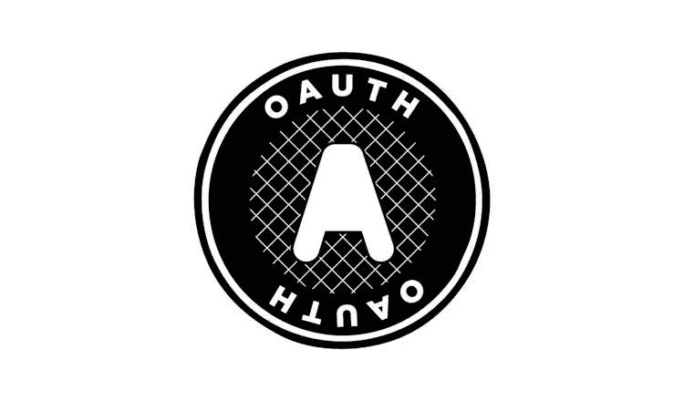
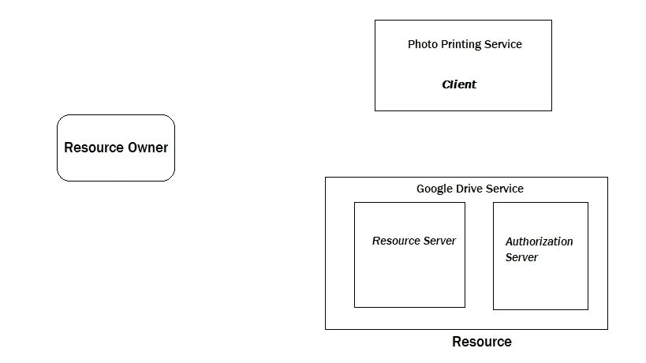
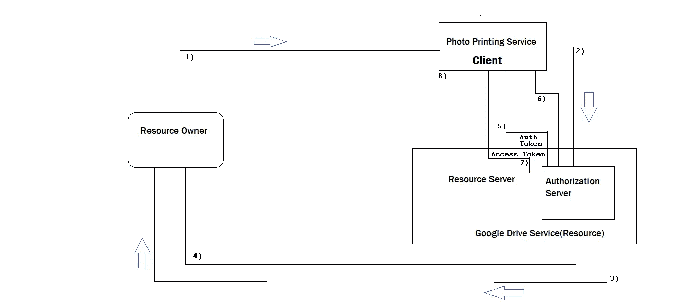
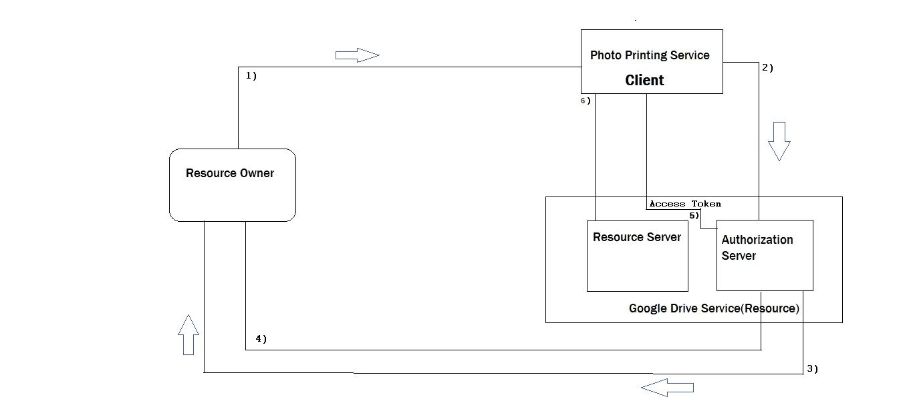
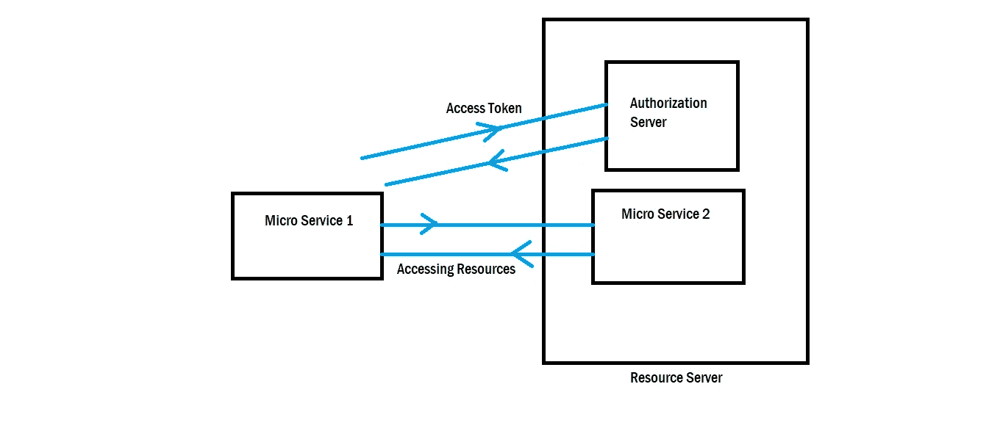

# OAuth 的流程和术语

> 原文：<https://medium.com/nerd-for-tech/flows-and-terminologies-of-oauth-4eaa3a38dc0b?source=collection_archive---------22----------------------->

在本教程中，您将了解 OAuth 的工作原理、OAuth 的基本术语以及各种重要的流程。让我们从头开始了解。

OAuth 是 Open Authorization for access delegation 的缩写，通常用于从另一个服务访问数据或资源的服务中。想要对 OAuth 有更详细的了解，可以参考[这个](https://rampotabatti.medium.com/basics-of-oauth-open-authorization-93acd75a3d58)。

现在，让我们了解术语的重要方面。这里有一些术语是 OAuth 流开始时所必需的，让我们一个一个地看一下

1.  资源-

我们都知道，资源是一个术语或服务，它能够为特定用户提供对数据或服务的访问。Google Drive 将是这里最合适的服务或资源。

2.资源所有者-

这里的资源所有者是唯一的所有者，他可以从特定的资源访问所有的资源。从这里的意义上来说，理解资源即服务，也认为你是谷歌驱动帐户的所有者，需要授权客户端进一步讨论。

3.授权服务器-

授权服务器是帮助资源服务器授权特定用户的服务器，由资源服务器管理。您可以理解资源服务器和授权服务器是同一个服务器。这里，授权服务器适用于 Google drive 可访问的服务器。

4.客户-

客户机是希望从另一个资源或服务访问资源的人。这里，您可以将打印服务类比为一个客户端，该客户端希望访问资源，即 Google Drive。

借助这张图片，更好地理解术语

一旦您对术语有了清晰的理解，您就可以熟悉更深一步的内容

在这里，我将研究 OAuth 的 3 个最重要的流程，即 OAuth 实际上是如何在幕后工作的。这里，仔细看，这听起来很有趣—

# 1.授权代码流程-

最初，授权代码流从资源所有者开始，让我们一步一步地谈-

1.  正如我们之前所说，资源所有者是对特定资源具有访问权和所有权的人，他请求客户端(照片打印服务)从 Google Drive 访问所有者的照片。
2.  客户端收到所有者的请求后，会将请求传递给授权服务器，无论客户端服务是否可以代表资源所有者访问图像或数据。事实上，这个请求是由授权服务器接收的。
3.  授权服务器发现提供对匿名服务的访问是不合适的，因此，授权服务器将询问资源所有者，是否代表您向客户端(打印服务)提供访问权限。它要求所有者提供给客户端的所有权限。一旦资源所有者允许客户端访问数据的请求。
4.  授权服务器将识别这一点，然后服务器将向客户端发送 [**授权令牌**](/swlh/understand-the-concept-of-jwt-json-web-tokens-4ee18682a583) 以进行进一步的授权过程。这个令牌无非是 JWT 想了解更多 JWT 的访问[这里](/swlh/understand-the-concept-of-jwt-json-web-tokens-4ee18682a583)。
5.  然后，客户端使用该授权令牌，并将其发送回授权服务器。
6.  一旦授权服务器验证了授权令牌，授权服务器就会发送一个访问令牌，这是每次客户端向资源服务器发送请求时访问资源所必需的。

现在，在这个流程的帮助下，客户端可以在每次需要时通过使用访问令牌更容易地访问资源服务器上可用的数据。

# 2.隐式流程-

简而言之，隐式流的工作方式与授权代码流完全相同，但是这里授权服务器不发送授权令牌，而是将访问令牌直接发送给客户端。让我们一步一步来-

1.  正如我们之前所说，资源所有者是对特定资源具有访问权和所有权的人，他请求客户端(照片打印服务)从 Google Drive 访问所有者的照片。
2.  客户端收到所有者的请求后，会将请求传递给授权服务器，无论客户端服务是否可以代表资源所有者访问图像或数据。事实上，这个请求是由授权服务器接收的。
3.  授权服务器发现提供对匿名服务的访问是不合适的，因此，授权服务器将询问资源所有者，是否代表您向客户端(打印服务)提供访问权限。它要求所有者提供给客户端的所有权限。
4.  一旦资源所有者允许客户端访问数据的请求。
5.  授权服务器将识别这一点，然后服务器将向客户端发送访问令牌，客户端使用该令牌来发出对可用图像和数据的某些请求。
6.  客户端可以使用该访问令牌来访问资源服务器中存在的图像和各种数据格式。

这说明了隐式流的整个过程，这在处理 OAuth 过程中更好。但是，隐式流程有一个很大的缺点，即无论授权服务器传递的访问令牌是交给第三方还是任何不公正的一方，第三方都将代表资源所有者访问所有的资源。这听起来不安全。

3.客户端凭证流程-

在客户端凭证流中，这里的客户端非常值得信任，因此授权过程以非常简单和安全的方式执行。请看下图，我们将详细讨论它。

如上图所示，假设有两个微服务，其中微服务 1 想要从微服务 2 调用 API。

最初，微服务 1 要求访问令牌以从资源服务器访问特定资源。因此，这个请求被进一步传递到授权服务器，在那里服务器授权这个人是否允许访问特定的资源。

在这里，客户端是非常值得信任的，因此授权服务器向微服务-1 提供访问令牌，该令牌保存微服务-1 所需的特定信息。例如简档信息。在这种情况下，授权服务器提供的访问令牌只能用于访问配置文件细节或信息。因此，微服务-1 使用授权服务器提供的访问令牌来访问关于简档的信息。

正如所假设的，这个过程以简单得多的方式执行，因此这个流程也被称为大用例流程。

这里，我们将介绍 OAuth 的流程和术语章节。

谢谢大家！