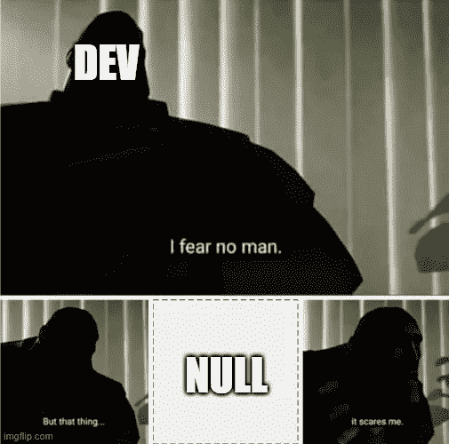
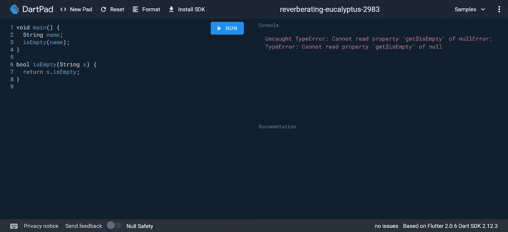
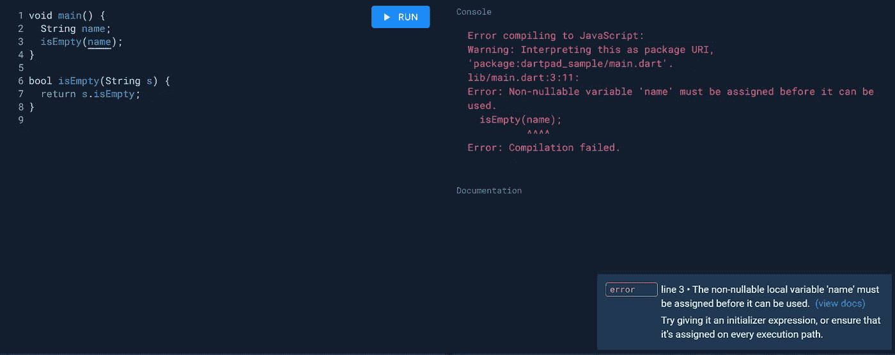
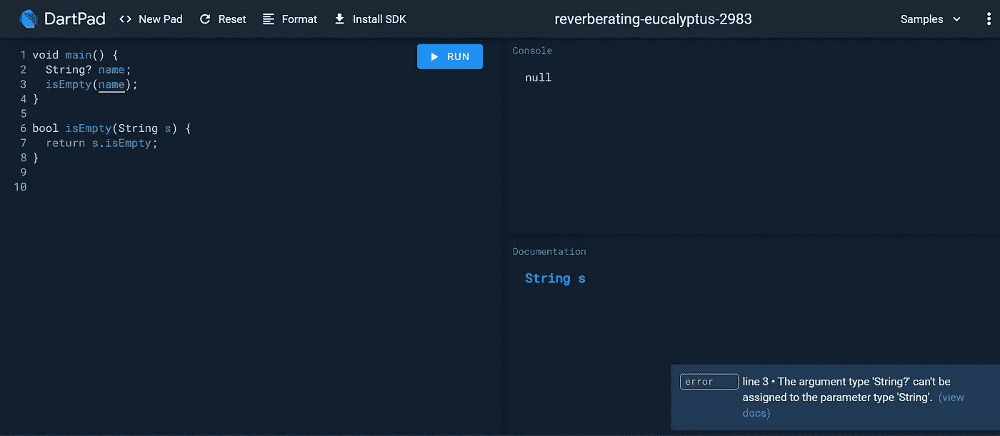
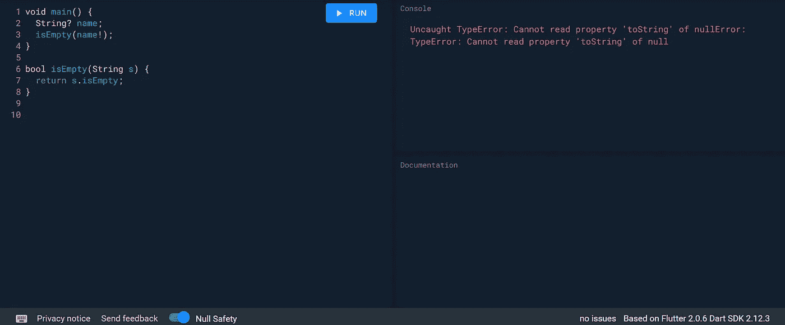

# 扑 2:简而言之，零安全

> 原文：<https://medium.com/nerd-for-tech/flutter-2-null-safety-in-a-nutshell-f20aeb74772?source=collection_archive---------5----------------------->

文章封面:简而言之，零安全

> 你的 flutter 应用程序听起来不安全！

在编程中处理空值是一项单调乏味的任务。当一个函数期望一个输入，但结果却是 null 时，就会导致运行时错误，程序就会崩溃。

零模因

Flutter 2 发布了一种处理空值的新方法。准确的说，并不是 Flutter 发布了这个规范。新的 Dart 语言规范增加了一个新特性，叫做**编译时空安全**。这个想法是强迫所有变量用某个值初始化。在这种情况下，不会有任何由空值解引用导致的运行时错误。这就是所谓的“零安全”。

您可以使用 [dartpad](https://dartpad.dev/?null_safety=true) 来尝试空安全，但我也会在本文中向您展示它是如何工作的。通过将 URL **null_safety** 中的查询参数设置为 false，可以在 dartpad 中启用或禁用 Null 安全。

要*启用*镖靶零位安全，请前往[https://dartpad.dev/?null_safety=true](https://dartpad.dev/?null_safety=true)要*禁用*镖靶零位安全，请前往[https://dartpad.dev/?null_safety=false](https://dartpad.dev/?null_safety=false)。

# 快速浏览零安全

首先，我将*禁用 dartpad 中的*空安全。当您运行上面的脚本时，它会抛出一个错误，因为变量`**name**` 没有初始化并且为 null。

`**Uncaught TypeError: Cannot read property ‘get$isEmpty’ of nullError: TypeError: Cannot read property ‘get$isEmpty’ of null**`

非空安全

当我*在 dartpad 中启用*空安全时，编译器会抛出一个错误，指出我们的变量没有初始化。该程序将不会编译和运行，如下图所示。

`**Error: Non-nullable variable ‘name’ must be assigned before it can be used. isEmpty(name);**`

零安全

这是非常方便的！因为它会在我们运行程序之前引发错误，这样开发人员就会注意到并在将程序提交给最终用户之前修复它们。

# 如果值实际上是可空的呢？

因为 Dart 假定所有变量都必须初始化。任何未初始化的变量都会引发错误。但是如果真的有一个值实际上可能是 null 呢？我们如何解决这个问题？

要在 Dart 中允许可空类型，必须添加一个**"？**(引号)在类型标识符处。此操作告诉 dart 此值可为空。它可能有也可能没有值。

从上面的要点可以看出，变量`**name**` 的类型是 `**String?**`。这个变量允许它的值为空，并且不会引发任何编辑器错误。

然而，请考虑以下要点。

这将导致一个编辑器错误，因为函数`**isEmpty**` 需要一个`**String**` 类型的参数，但我们为它提供了一个`**String?**`。

`**line 3 • The argument type ‘String?’ can’t be assigned to the parameter type ‘String’.**`

可空误差

你能看到那根**弦**和**弦？**不一样。一个需要非空值，而另一个不需要。下一个问题是，我们如何在 **isEmpty** 函数中使用可空值？

# 抛弃可空性

要将可空值转换为非空值，必须添加**"！"**(感叹号)在变量之后。(嗯，我知道这很可怕。将可空值转换为非空值可能会失去静态安全性，最终必须检查是否为空。但是，嘿，这是一种方法。)

上面的要点不会导致任何编辑器错误，因为我们在第 3 行的变量`**name**` 上添加了一个*感叹号*。现在，dart 将其识别为静态非空变量。然而，当您试图运行代码时，它将导致运行时错误，因为变量`**name**` 为空。所以请*小心*丢弃空值！

`**Uncaught TypeError: Cannot read property ‘toString’ of nullError: TypeError: Cannot read property ‘toString’ of null**`

铸造误差

# 抱歉，我迟到了。请在运行时检查我！

考虑以下要点。这是一个使用空安全的错误例子。从代码中，您可以看到变量`**model**` 不是空的，但是没有初始化，将会引发一个错误。由于我们不应该初始化变量`**model**` ，因为我们不知道汽车的初始模型是什么。应该是空字符串吗？还是应该是特斯拉？我们不知道。变量`**model**` 应由用户指定。

您可以想出一个解决这个问题的方法，将`**model**`的标识符从`**String**` 改为`**String?**`。并将 drive()方法的参数从`**model**` 改为`**model!**`。这将纠正错误，但可能会使未来的代码维护者感到困惑，如以下要点所示。

Dart 有一种新的方法来处理这种情况。您可以像这样在类型标识符前面指定一个`**late**` 修饰符。

在第 2 行，您可以看到我们将变量`**model**` 标识为一个非空字符串。并且我们还指定它是一个`**late**` 变量。late 修饰符告诉 flutter 这个变量不为空，但也没有初始化。

灾难援助反应队的文件表明

> `late`修饰符的意思是“在运行时而不是编译时强制这个变量的约束”。当强制变量的保证时，这几乎就像单词“late”描述了*。*

在这种情况下，变量`model`没有明确初始化。它将在运行时被检查，如果出现任何错误，它将抛出一个异常。总而言之，`late`修改器告诉**何时**强制变量约束。

## 惰性初始化

你可以在一个有初始化器的字段上添加`late`,就像这样。

有了一个`late`修饰符，私有变量`**_model**`不会在构造 Car 对象时初始化，而是在第一次访问它时初始化。在晚期变量从未被使用过的情况下，它可能是有用的，这样初始化器就不会被调用。这可以为我们节省一些处理资源。

## **后期最终变量**

您也可以将 late 添加到 final 修饰符，以便稍后初始化变量。它与普通变量的不同之处在于，晚期 final 变量只能初始化一次，以后在运行时不能赋值。

# **如何在颤振中启用零位安全**

当你第一次创建你的 Flutter 应用时，flutter SDK 会为你生成一个模板文件夹结构。要启用空安全，您必须转到您的 **pubspec.yaml** 文件，然后导航到环境标签。你会看到在标签下面，有一个 SDK 标签版本。空安全符合 SDK 版本 2.12 及更高版本。请根据以下要点更改您的环境 SDK。

之后，在你的终端中运行 **flutter pub get** 来应用新的配置。你去那里，你的颤振应用程序听起来零安全！

## 参考

*   了解零安全:[https://dart.dev/null-safety/understanding-null-safety](https://dart.dev/null-safety/understanding-null-safety)
*   **Dart 中的零安全—简介**:[https://www.youtube.com/watch?v=iYhOU9AuaFs](https://www.youtube.com/watch?v=iYhOU9AuaFs)