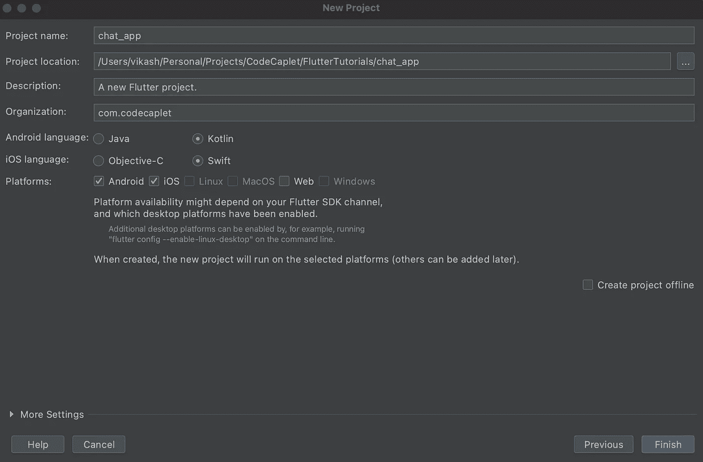
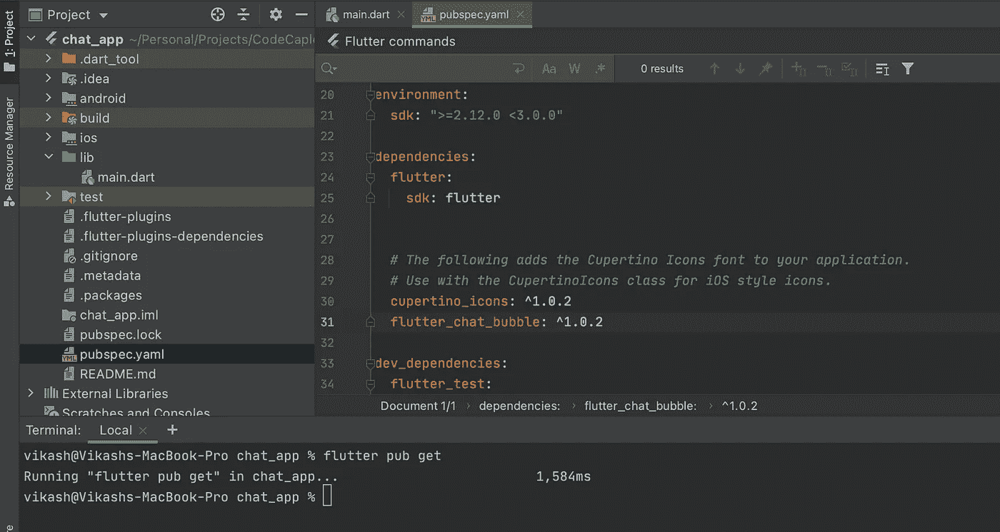
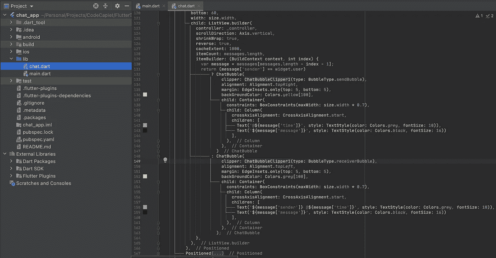
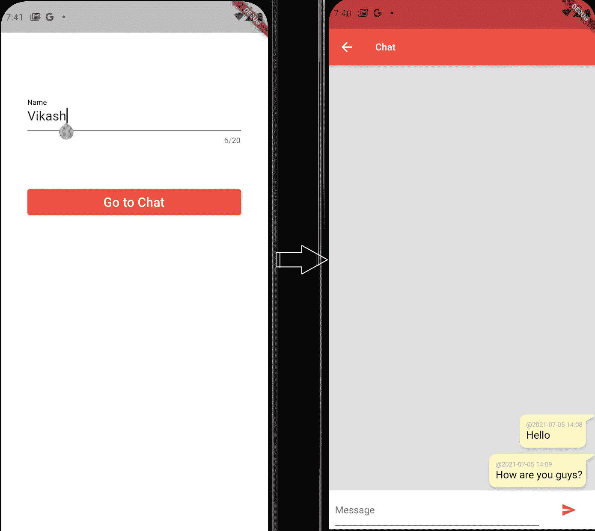
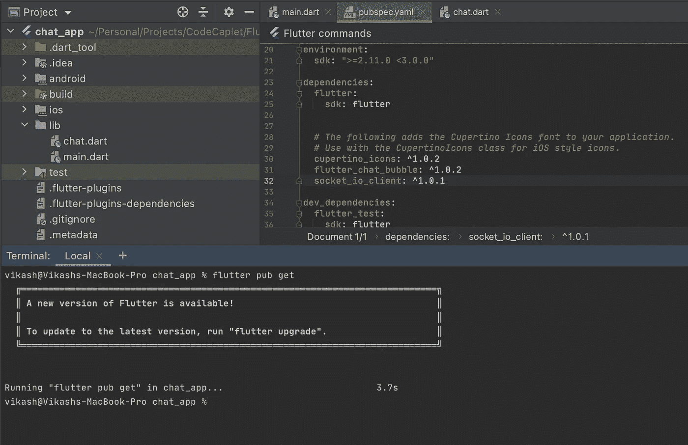
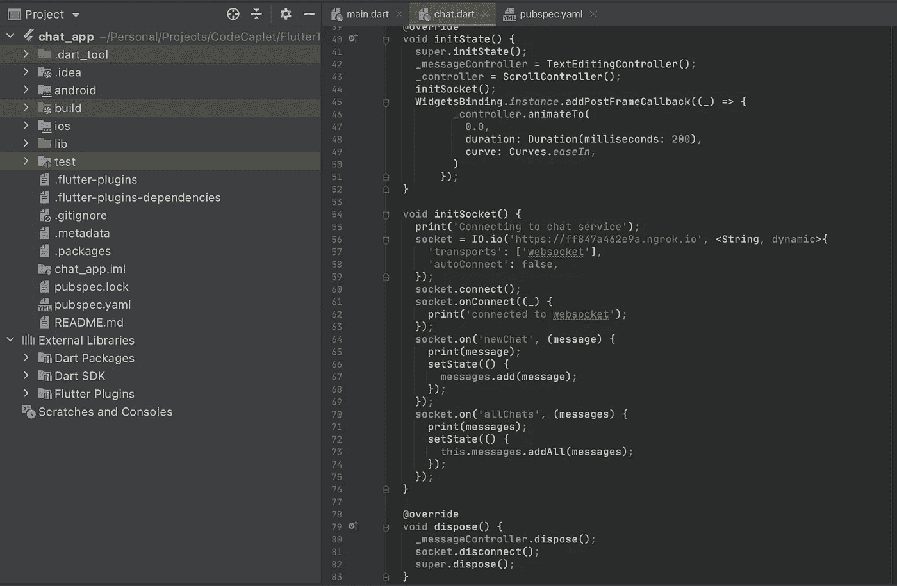
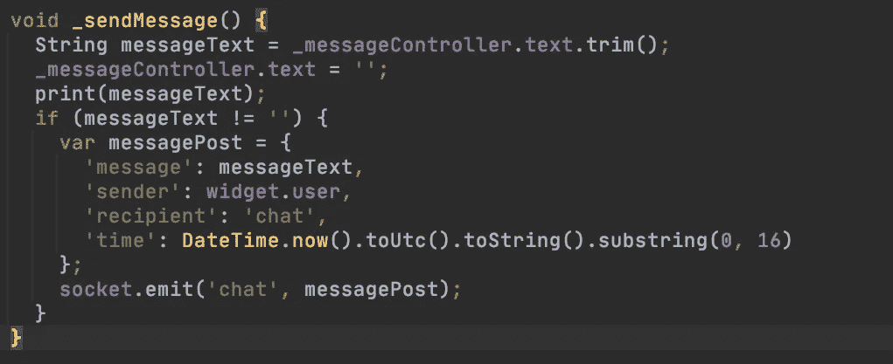
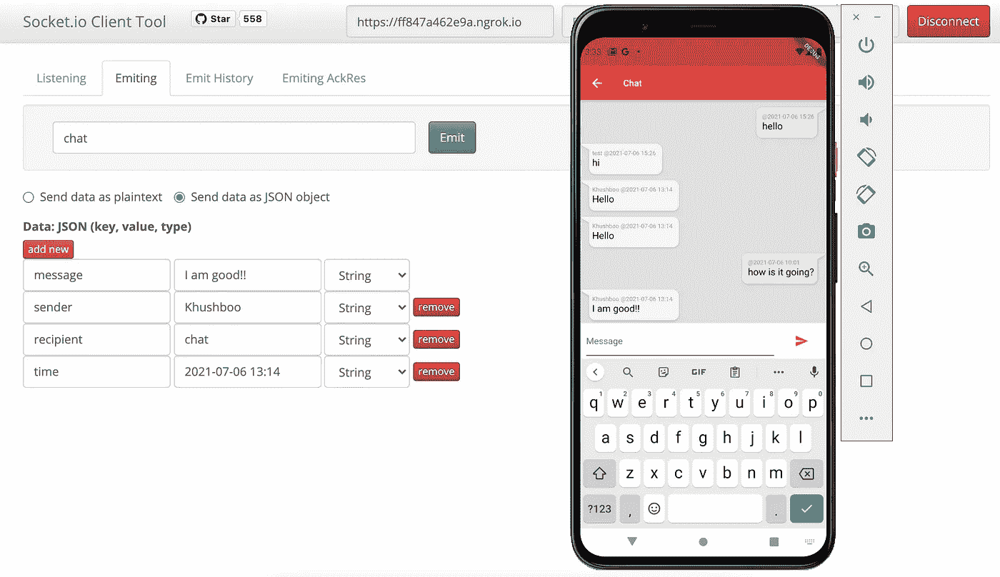

# flutter:flutter 中使用套接字的聊天应用。IO 服务

> 原文：<https://medium.com/nerd-for-tech/flutter-a-chat-app-in-flutter-using-a-socket-io-service-88be02a388d6?source=collection_archive---------0----------------------->


Flutter 很快就成为了移动应用开发框架的首选。毫无疑问，它非常简洁、富于表现力、灵活且快速。在 flutter 中，有很多预构建的包可以用来创建几乎任何类型的布局。在本教程中，我将帮助您在 flutter 中创建一个与套接字通信的聊天应用程序。用 NodeJs 写的 IO 聊天服务。

# **先决条件**

1.  下载并安装 OpenJDK 1.8。不幸的是， **JDK 1.8** 预计将为 flutter 构建 Android 应用。
2.  下载并安装 [**颤振**](https://flutter.dev/docs/get-started/install) 。此步骤还将指导您下载和/或配置:
    ***a)*******Dart***:Dart 与旋舞捆绑在一起，不需要显式安装。
    ***b)*******安卓工作室***
    ***c)*******安卓模拟器******
3.  **通过在命令窗口中运行“flutter doctor”来确保为 Android 成功配置了 flutter。**

```
****$ flutter doctor****
```

# **步骤 1:创建新的颤振应用**

**启动 Android Studio 并创建一个新的 flutter 应用程序(步骤[此处](https://flutter.dev/docs/get-started/test-drive?tab=androidstudio))。我已经创建了一个应用程序“*聊天应用程序*”。这个步骤可以在 VS 代码中完成，也可以在 flutter 扩展的帮助下完成。**

****

**新的颤振应用程序**

# **第二步:创建一个聊天窗口。**

**我的应用程序的[主页](https://github.com/codecaplet/FlutterTutorials/blob/master/chat_app/lib/main.dart)在将用户带到聊天页面之前接受一个用户名。这是为了模拟真实世界的场景，其中用户与用户名相关联。这个用户名被转发到聊天小部件。
为了创建聊天小部件，我使用了一个 [flutter_chat_bubble](https://pub.dev/packages/flutter_chat_bubble) 包来创建消息气泡。**

****

**添加 flutter_chat_bubble 依赖**

**我创建了一个 StatefulWidget [聊天](https://github.com/codecaplet/FlutterTutorials/blob/master/chat_app/lib/chat.dart)。它维护一个状态变量“messages ”,该变量列出了聊天中的所有消息。我使用 ListView 显示了泡泡中的信息。如果当前用户是左边的发送者，则气泡出现在右边。
注意:‘**widget . user**’持有用户的用户名。**

****

**聊天窗口代码**

**让我们验证一下这个应用程序到目前为止是否有效。**

****

**聊天流程**

# **步骤 3:设置一个套接字。IO 聊天服务**

**我在本地经营这个聊天服务。我还使用了 [**ngrok**](https://ngrok.com/) 从一个公共 URL 到这个服务。这项服务:**

1.  **打开 web 套接字连接@[http://localhost:3000/](http://localhost:3000/)**
2.  **收听新消息@ channel ' *chat* '。**
3.  **向频道' *newChat* '广播新消息。**
4.  **在新连接上向频道' *allChats* '广播所有旧消息。**

# **步骤#4:配置套接字。IO 客户端**

**我正在使用 [socket_io_client](https://pub.dev/packages/socket_io_client) 包来连接套接字。IO 服务。**

****

**套接字 _ io _ 客户端**

**我将初始化套接字。widget *initState* 上的 IO 连接和 widget *dispose* 上的断开连接。
注意:**

1.  **它连接到 ngrok 公共 url，后者通过隧道连接到我的本地服务。**
2.  **它监听' *newChat* '频道的新消息，并在到达时添加到' *messages* '状态变量中。**
3.  **它监听所有旧消息的' *allChats* '信道，并在到达时将它们添加到'*消息*'状态变量中。**

****

**连接/断开 socket.io**

**最后，我们为发送消息按钮引入一个 *onPressed* 处理程序' *_sendMessage* '。在这个方法中，我们将用户的任何新消息发送到'*聊天*'通道。任何聊天消息都被期望(由聊天服务)具有 4 个属性:*消息、发送者、接收者&时间*。**

****

**发送消息**

# **步骤#5:运行并验证**

**我在 android 模拟器中运行这个应用程序。我还使用 [socket.io 客户端工具](https://amritb.github.io/socketio-client-tool/v1/#)连接到聊天服务，以模拟消息传递。**

****

**运行并验证**

> **代码库:
> [https://github.com/sharmavikashkr/chat_app_flutter](https://github.com/sharmavikashkr/chat_app_flutter)
> 【https://github.com/sharmavikashkr/chat-service-nestjs】T4**