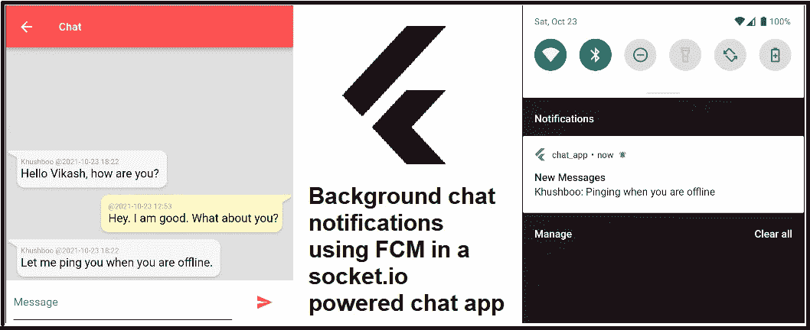
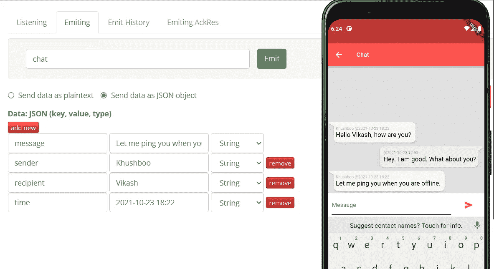
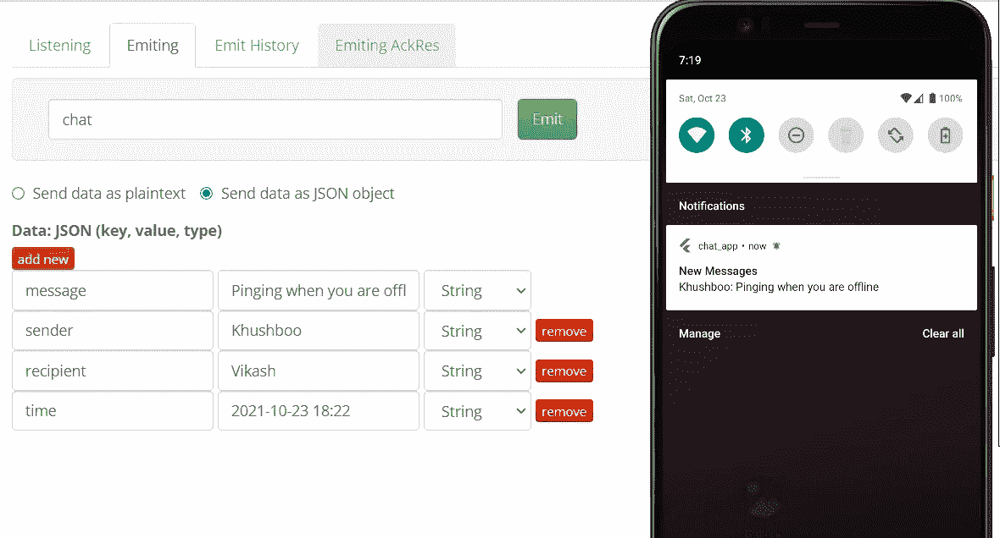

# Flutter:在 socket.io 支持的聊天应用中使用 FCM 的聊天通知

> 原文：<https://medium.com/nerd-for-tech/flutter-chat-notifications-using-fcm-in-a-socket-io-powered-chat-app-7fabe6a3d912?source=collection_archive---------1----------------------->



前阵子写了一篇[文章](/nerd-for-tech/flutter-a-chat-app-in-flutter-using-a-socket-io-service-88be02a388d6)关于如何在 flutter 中使用 socket.io 服务创建聊天 app。该应用程序将用户连接到 websocket 服务，并支持实时对话。虽然用户可以在线聊天，但当他们离开应用程序时，应用程序会将他们与 websocket 断开连接。这个限制将我们带到了聊天应用的下一个主要需求:当应用在后台运行时接收聊天通知。
受我上一篇文章的启发，这里我将添加使用 FCM (Firebase Cloud Messaging)接收聊天通知的功能。

> 注意:在这篇文章中，我只讲述了 ANDROID 设备的变化。

# 先决条件

本文是我上一篇文章的延续:[*Flutter:一款在 Flutter 中使用 Socket 的聊天 app。IO 服务*](/nerd-for-tech/flutter-a-chat-app-in-flutter-using-a-socket-io-service-88be02a388d6)。请按照那里的步骤前进。

# 步骤 1:创建一个新的 Firebase 应用程序

按照这里的步骤[创建一个新的 Firebase 应用程序。不要忘记下载生成的 *google-services.json* 并将 Firebase SDKs 添加到您的 android 项目中。](https://sharma-vikashkr.medium.com/firebase-how-to-setup-an-app-in-firebase-9ddbacfe8ad1)

# 步骤 2:添加所需的依赖项

在 flutter *chat_app* 中，在项目的 *pubspec.yaml* 中添加特性所需的新依赖项。

```
**firebase_core: ^1.7.0** *# required for initializing firebase app* **firebase_messaging: ^10.0.8** *# required for sending/receiving messages through FCM* **flutter_local_notifications: ^6.0.0** *# required to show chat notifications*
```

下载上面添加的新依赖项。

```
**$ flutter pub get**
```

# 第 3 步:让你的应用程序接收通知

为了创建本地通知，您需要在您的*Android/app/src/main/Android manifest . XML*中添加所需的意图过滤器。

```
<intent-filter>
    <action android:name="FLUTTER_NOTIFICATION_CLICK" />
    <category android:name="android.intent.category.DEFAULT" />
</intent-filter>
```

# 步骤 4:初始化 Firebase 消息传递和本地通知

在 lib 中创建一个新的 dart 文件*firebase/messaging . dart*，并在其中初始化 FCM 和本地通知。

```
import 'package:firebase_core/firebase_core.dart';
import 'package:firebase_messaging/firebase_messaging.dart';
import 'package:flutter_local_notifications/flutter_local_notifications.dart';

final FirebaseMessaging _fcm = FirebaseMessaging.*instance*;
FlutterLocalNotificationsPlugin _flutterLocalNotificationsPlugin;

**initializeMessaging**() async {
  **await Firebase.*initializeApp*();**
  _flutterLocalNotificationsPlugin = FlutterLocalNotificationsPlugin();
  const AndroidInitializationSettings initializationSettingsAndroid = AndroidInitializationSettings("@mipmap/ic_launcher");
  final InitializationSettings initializationSettings = InitializationSettings(android: initializationSettingsAndroid);
  await **_flutterLocalNotificationsPlugin.initialize**(initializationSettings, onSelectNotification: selectionNotification);

  **FirebaseMessaging.*onMessage*.listen**((RemoteMessage message) async {
    print("onMessage: $message");
    await **handleMessage**(message);
  });
}

Future<dynamic> selectionNotification(String payload) async {
  print('payload: $payload');
}

**handleMessage**(RemoteMessage message) async {
  const AndroidNotificationDetails androidPlatformChannelSpecifics =
      AndroidNotificationDetails('CHAT', "CHAT", 'CHAT', importance: Importance.*max*, priority: Priority.*high*, showWhen: true);
  const NotificationDetails platformChannelSpecifics = NotificationDetails(android: androidPlatformChannelSpecifics);
  await _flutterLocalNotificationsPlugin.show(0, "New Messages", message.data['sender'] + ": " + message.data['message'], platformChannelSpecifics,
      payload: 'CHAT');
}

Future<void> **firebaseMessagingBackgroundHandler**(RemoteMessage message) async {
  **await initializeMessaging();**
  const AndroidNotificationDetails androidPlatformChannelSpecifics =
      AndroidNotificationDetails('CHAT', "CHAT", 'CHAT', importance: Importance.*max*, priority: Priority.*high*, showWhen: true);
  const NotificationDetails platformChannelSpecifics = NotificationDetails(android: androidPlatformChannelSpecifics);
  await _flutterLocalNotificationsPlugin.show(0, "New Messages", message.data['sender'] + ": " + message.data['message'], platformChannelSpecifics,
      payload: 'CHAT');
}Future<String> **getFCMToken**() async {
  return await _fcm.getToken();
}
```

*Firebase . initialize app()*使用您在 android 项目中下载的 *google-services.json* 初始化 Firebase 应用程序。

firebase messaging . on message . listen()监听 FCM 消息并调用 *handleMessage()* 在您的设备中显示通知。这将在应用程序处于前台时处理通知。

*firebasemesagingbackgroundhandler()*当应用在后台时处理 FCM 消息。

getFCMToken()返回 FCM 注册令牌。websocket 服务将使用此令牌向离线(未连接到 websocket)设备发送 FCM 消息。

> 注意:不要在 firebase/messaging.dart 中创建任何类，因为 firebasemesagingbackgroundhandler()是一个匿名函数。

最后，从 *main.dart* 初始化 FCM。

```
void main() async {
  **WidgetsFlutterBinding.*ensureInitialized*();
  initializeMessaging(); FirebaseMessaging.*onBackgroundMessage*(firebaseMessagingBackgroundHandler);**
  ...
  runApp(MyApp());
}
```

# 步骤 5:在连接时向 websocket 服务发送 FCM 令牌

在这一步，我们将让 websocket 服务知道用户的 FCM 令牌。在 chat.dart 中，当连接到 websocket 时，添加查询以发送用户名和 FCM 令牌。

```
**String registrationToken = await getFCMToken();**
socket = IO.io('<websocket_url>', <String, dynamic>{
  'transports': ['websocket'],
  'autoConnect': false,
  **'query': {
    'userName': widget.user,
    'registrationToken': registrationToken
  }**
});
socket.connect();
```

颤振变化完成。我们现在将讨论文章中讨论的 websocket 服务: [NestJs:由 MongoDB](/nerd-for-tech/nestjs-chat-server-in-nestjs-backed-by-mongodb-687da9aa30bb) 支持的 NestJs 中的聊天服务器。

# 步骤#6:维护服务器上的所有连接用户

在 *src/chat/chat.service.ts* 中，维护一个所有用户和连接用户的并发列表。

```
 private **allUsers** = [];
  private **connectedUsers** = []; **userConnected**(userName: string, registrationToken: string) {
    let user = { userName: userName, registrationToken: registrationToken };
    const filteredUsers = this.allUsers.filter(u => u.userName === userName);
    if (filteredUsers.length == 0) {
      this.allUsers.push(user);
    } else {
      user = filteredUsers[0];
      user.registrationToken = registrationToken;
    }
    this.connectedUsers.push(userName);
    console.log("All Users", this.allUsers);
    console.log("Connected Users", this.connectedUsers);
  } **userDisconnected**(userName: string) {
    let userIndex = this.connectedUsers.indexOf(userName);
    this.connectedUsers.splice(userIndex, 1);
    console.log("All Users", this.allUsers);
    console.log("Connected Users", this.connectedUsers);
  }
```

*userConnected()* 在 *allUsers* 和 *connectedUsers* 列表中添加一个用户(带有 FCM 令牌)。

*userDisconnected()* 从 *connectedUsers* 列表中删除用户。

# 步骤 7:从 websocket 处理程序调用相应的方法

在*src/chat/chat . gateway . ts*中，提取 flutter app 发送的查询参数*userName*&*registration token*(上面的步骤#5)，调用上面添加的相应方法。

```
 **handleConnection**(socket: any) {
    **const query = socket.handshake.query;**
    console.log('Connect', query);
    **this.chatService.userConnected(query.userName, query.registrationToken);**
    process.nextTick(async () => {
      socket.emit('allChats', await this.chatService.getChats());
    });
  } **handleDisconnect**(socket: any) {
    **const query = socket.handshake.query;**
    console.log('Disconnect', socket.handshake.query);
    **this.chatService.userDisconnected(query.userName);**
  }
```

# 步骤 8:设置 Firebase 管理

在项目的 *package.json* 中添加 firebase-admin 依赖项。

```
 "dependencies": {
    ...
    **"firebase-admin": "^10.0.0",**
    ...
  },
```

安装新的依赖项:

```
**$ npm install**
```

在 tsconfig.json 中，添加以下编译器选项以允许解析 json 模块:

```
"resolveJsonModule": true,
"allowJs": true,
```

按照这里的步骤在同一个 firebase 项目中设置一个 firebase 服务帐户。下载生成的 *serviceAccountKey.json* 并放置在 *src/auth* 中。在同一个路径 *src/auth* 中，创建另一个文件 *firebaseAdmin.ts* 来初始化 firebaseAdmin 并导出初始化后的 app。

```
import * as firebase from 'firebase-admin';
**import * as serviceAccount from './serviceAccountKey.json';**const firebase_params = {
    type: serviceAccount.type,
    projectId: serviceAccount.project_id,
    privateKeyId: serviceAccount.private_key_id,
    privateKey: serviceAccount.private_key,
    clientEmail: serviceAccount.client_email,
    clientId: serviceAccount.client_id,
    authUri: serviceAccount.auth_uri,
    tokenUri: serviceAccount.token_uri,
    authProviderX509CertUrl: serviceAccount.auth_provider_x509_cert_url,
    clientC509CertUrl: serviceAccount.client_x509_cert_url
}**const defaultApp = firebase.initializeApp({
    credential: firebase.credential.cert(firebase_params),
    databaseURL: "**[**<**](https://fir-auth-bd895.firebaseio.com)**firebase_db_url>"
});**export {
    defaultApp
}
```

# 步骤 9:向断开连接的用户发送 FCM 消息

在*src/chat/chat . service . ts*中，创建一个向断开连接的用户发送 FCM 消息的方法。

```
async **sendMessagesToOfflineUsers**(chat: any) {
    var messagePayload = {
      data: {
        type: "CHAT",
        title: 'chat',
        message: chat.message,
        sender: chat.sender,
        recipient: chat.recipient,
        time: chat.time
      },
      **tokens: []**
    };
    **const userTokens = this.allUsers.filter(user => !this.connectedUsers.includes(user.userName)).map(user => { return user.registrationToken });**
    if (userTokens.length == 0) {
      return;
    }
    **messagePayload.tokens = userTokens;**
    try {
      **await defaultApp.messaging().sendMulticast(messagePayload);**
    } catch (ex) {
      console.log(JSON.stringify(ex));
    }
  }
```

最后，当新的聊天到达*src/chat/chat . gateway . ts*时调用这个方法。

```
 @Bind(MessageBody(), ConnectedSocket())
  @SubscribeMessage('chat')
  async handleNewMessage(chat: Chat, sender: any) {
    console.log('New Chat', chat);
    await this.chatService.saveChat(chat);
    sender.emit('newChat', chat);
    sender.broadcast.emit('newChat', chat);
    **await this.chatService.sendMessagesToOfflineUsers(chat);**
  }
```

# 步骤 10:让我们验证一下

我已经在本地启动了聊天服务，并使用 [**ngrok**](https://ngrok.com/) 从一个公共 URL 到这个服务。
我使用 [socket.io 客户端工具](https://amritb.github.io/socketio-client-tool/v1/#)连接到聊天服务，使用虚拟查询参数模拟消息传递:

```
{“query”: {“userName”: “Khushboo”, “registrationToken”: “”}}
```

我正在 android 模拟器中运行 flutter 应用程序，并访问与另一个用户的聊天。

当两个用户都连接时，用户可以通过 websocket 进行对话。



当 android 用户离开聊天时，它可以通过 FCM 接收聊天通知。



> 代码库:[https://github.com/sharmavikashkr/chat_app_flutter](https://github.com/sharmavikashkr/chat_app_flutter)
> [https://github.com/sharmavikashkr/chat-service-nestjs](https://github.com/sharmavikashkr/chat-service-nestjs)