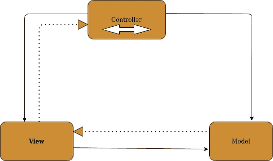
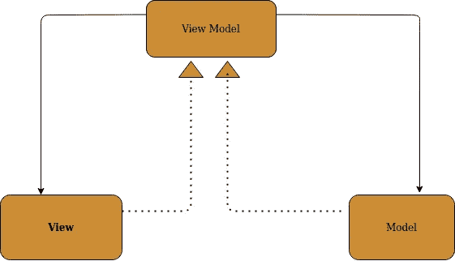
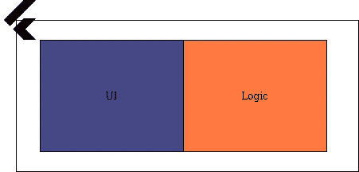
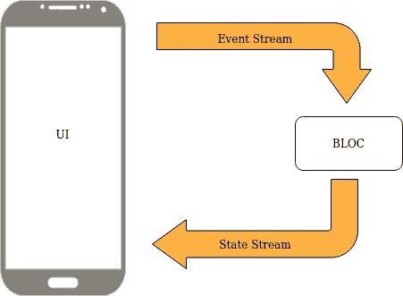
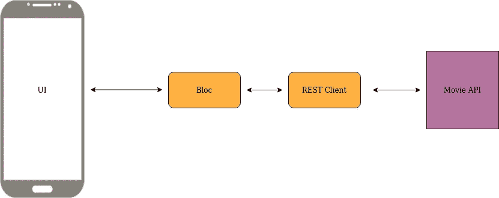
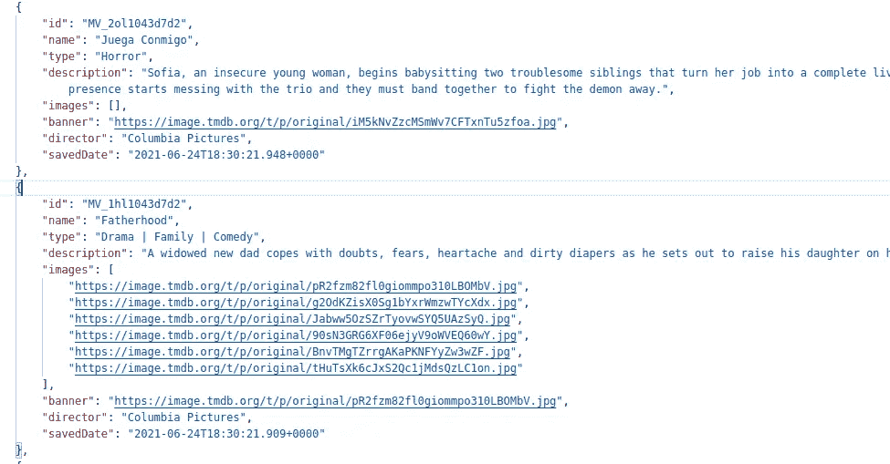
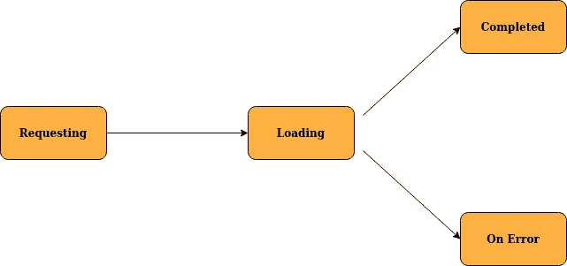
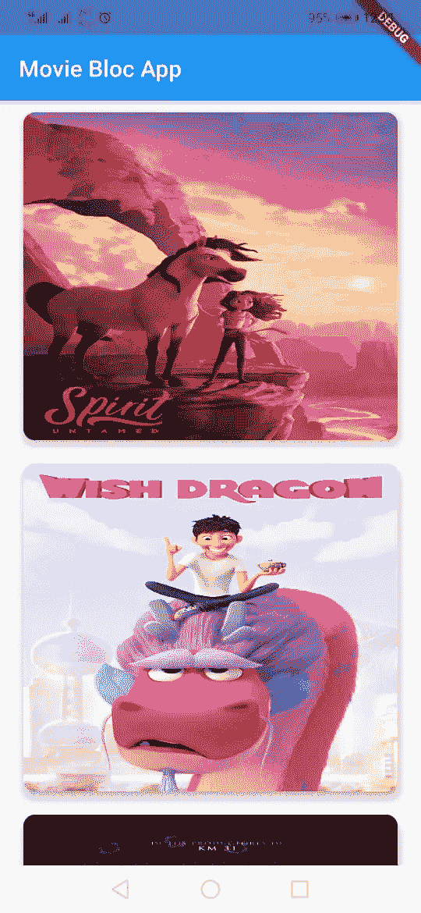

# 带网络层的颤振设计模式[Bloc]

> 原文：<https://medium.com/nerd-for-tech/flutter-design-patterns-bloc-with-rest-api-90fd95d93e52?source=collection_archive---------1----------------------->

## 为什么我们需要设计模式

首先，我们检查为什么我们在移动开发中需要设计模式。现在，移动开发框架支持不同种类的设计模式。这些是移动框架中最常用的设计模式。

*   **MVC -(模型视图控制器)**

*   **MVVM(模型视图-视图模型)**

MVVM 模式是如何运作的

设计模式使得 UI 设计更加灵活。它将支持增强功能，而不必担心破坏现有产品。

## 为什么在颤振中需要设计模式？

不像我们在原生 android 或 IOS 开发中所做的改变，flutter 在单个类文件中有 UI 和代码库。有时候理解代码真的很难。由于这个原因，Flutter 开发者在开发时需要遵循最佳实践。另外，应用程序需要遵循一种设计模式，以提高可读性和灵活性。

## 模块化设计模式

业务逻辑组件(BLoC)是简单的状态管理设计模式。Bloc 支持将业务逻辑与 UI 分离。在 Bloc 模式中，它消耗事件流，执行逻辑，给出状态流。使用独立的逻辑和 UI 组件真的很容易

区块模式如何工作

## 电影列表应用程序

我们将编写一个简单的应用程序，显示电影数据库 API 中的电影列表，并在应用程序中显示为列表。

## 应用程序所需的依赖关系

项目的相关性

这是我们将要检索电影列表信息的 API。

网址:【https://movie-booking-api.herokuapp.com/movies/all 

我们必须编写域对象类、api 提供者类和存储库类。

第一步。创建电影项目类

第二步。创建 API 提供程序类

第三步。创建存储库类

然后，当用户请求加载电影列表时，我们必须识别应用程序中的状态变化。

第四步。对于上面的流程图，我们必须创建状态。

下一步，我们必须确定该状态所需的用户事件。

第五步。为获取电影事件创建抽象类。

第六步。创建块类

第六步。最后集成到 flutter UI

和创建小部件。

和创建电影状态页面类。

主省道

最后，它会显示 API 中可用的电影列表。

这个项目将在[这里](https://github.com/sajith4u/flutter-bloc-movie)可用。欢迎分享&把你的评论放在这里。